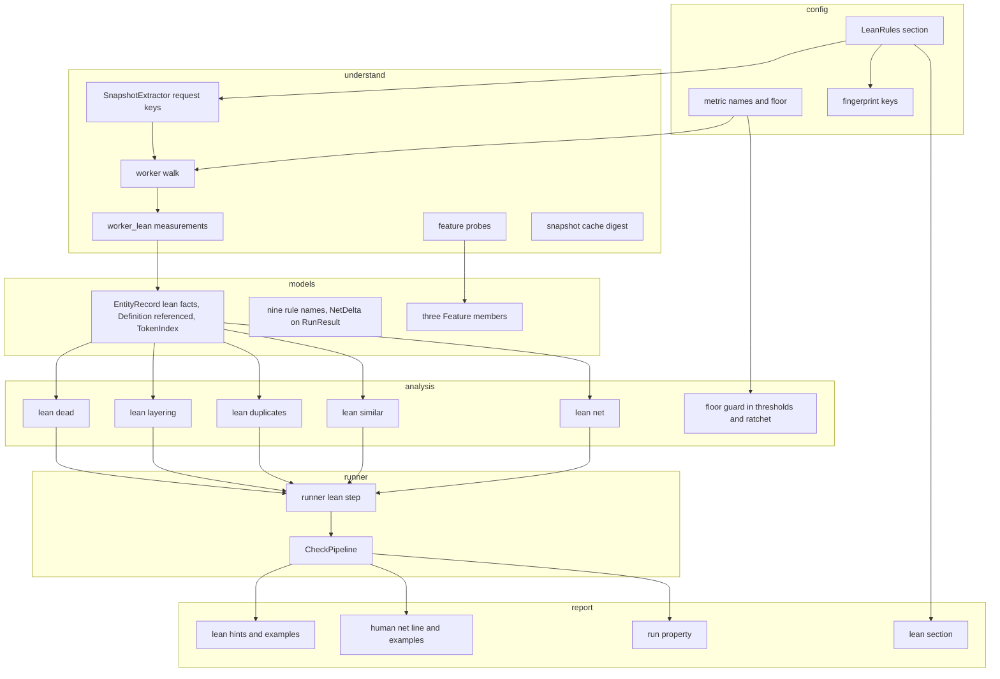
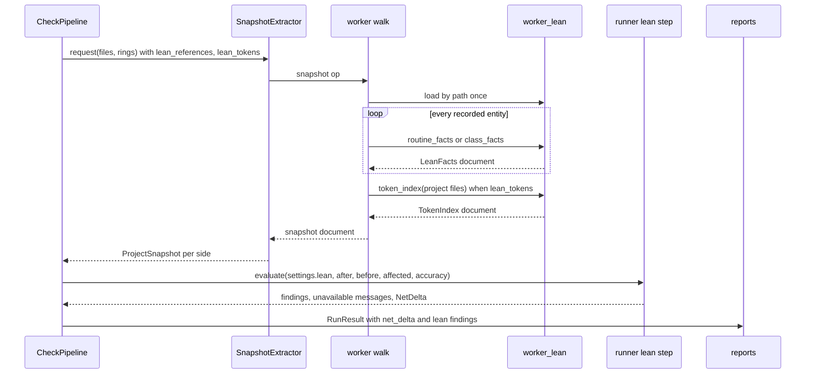
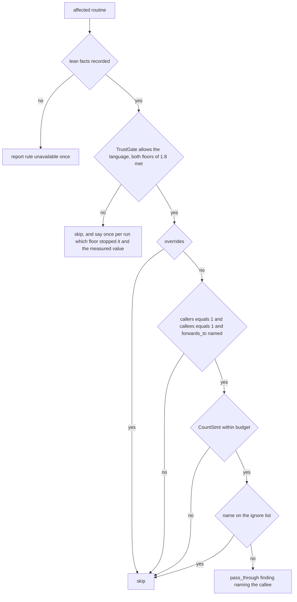

# Design Document: lean-code-rules

## Overview

**Purpose**: This feature gives the Gate a family of rules whose finding is not "too complex" but "should not exist" or "should be shorter": dead parameters, classes and variables; routines that only forward; abstractions with one implementation; files that hold one definition for one importer; copied blocks and renamed twins; comment volume and verbosity; and a net logical-lines figure per change. Each rule is answered from Understand's references, metrics and token streams, so one rule holds for every language Understand parses, and each finding carries a hint in ponytail's one-line tag form with a worked example of the shorter form.

**Users**: Coding agents checking their own change before staging, the reviewers reading the Gate's report, and the operator who turns rules on from measurement.

**Impact**: Extends the configuration with one `[lean]` section, the worker with a sibling measurement module loaded by path, the snapshot with per-entity lean facts and an optional token index, the analysis layer with a `lean` package of six rule modules and one delta, the reports with a net line and examples, `agent-rules` with a lean section (and the four structural rules it omits today), `doctor` with three rows, and the four shipped skills. The dependency direction of `tech.md` is unchanged; every rule ships off or as a warning.

### Goals
- Dead code beyond routines, with the routine rule's three-state discipline (1.x).
- Pass-through routines, single-implementation abstractions and over-exporting files as structural findings naming their counterpart (2.x, 3.x, 4.x).
- Exact duplicate blocks and similar routines over the whole project, reported against the change (5.x).
- A comment-ratio maximum, a per-routine comment-line metric and a guarded verbosity ratio as ordinary thresholds (6.x).
- `net: ±N lloc` in every output when a before side exists (7.x).
- Hints that open with `delete:`, `yagni:` or `shrink:`, one example per rule, a lean section in `agent-rules`, skills that use it (8.x).
- Availability rows, configuration-time refusal, zero cost while off, a measured cost ceiling (9.x); documentation (10.x).

### Non-Goals
- `stdlib:` and `native:` findings; applying fixes; CodeCheck; semantic clones; duplication across repositories; changing any existing default severity; ponytail as a dependency.
- A per-routine form of Understand's `DuplicateLinesOfCode` (it has none); replacing `structure.unused_routines` or `structure.duplicate_definitions`.

## Boundary Commitments

### This Spec Owns
- The `[lean]` configuration section, its defaults, its template block and its three fingerprint keys, `lean_references`, `lean_tokens` and `lean_statements` (`config/models.py`, `config/defaults.py`, `config/template.py`, `config/fingerprint.py`). The third was two when this list was written; task 7.1 added it, see `LeanRules` below.
- The lean measurement module and its call sites in the extractor (`understand/worker_lean.py`, `understand/worker.py`), the request keys (`understand/snapshot.py`, `models/understand.py`), and the snapshot fields they fill (`models/snapshot.py`).
- The nine rule names and the six rule modules plus the net delta (`models/findings.py`, `analysis/lean/*`), and the floor guard on synthetic metrics (`config/metric_names.py`, `analysis/thresholds.py`, `analysis/ratchet.py`).
- The two shrink metrics: `CountLineComment` in the catalogue path and the `LinesPerStatement` synthetic (`config/metric_names.py`, `understand/worker.py`).
- The two plugin-metric declarations for the duplicate-lines solution (`config/metric_names.py`).
- The lean hints and examples and their rendering (`report/hints.py`, `report/lean_examples.py`, `report/human.py`, `report/sarif.py`), the `NetDelta` field of `RunResult`, the lean section of `agent-rules` and the repair of its structure section (`report/agent_rules.py`).
- The three feature probes and their `doctor` rows (`understand/features.py`, `models/understand.py`).
- The pipeline step that runs the rules and the delta (`runner/lean.py`, `runner/check.py`).
- The four skills, the documentation pages and the contract fixtures for the family.

### Out of Boundary
- The threshold, ratchet, affected-set, cycle, fan, layer and coupling engines of the base specification: consumed unchanged except for the floor guard.
  **Amended 2026-09-11 by task 1.4, from measurement.** This line first called the floor guard "a two-line read of a declaration" reaching the threshold evaluator and the ratchet. It reaches four consumers, and the two the line named were the easy ones: `analysis/thresholds.py` (the absolute check), `analysis/ratchet.py` (the comparison, and `attach_before`, which fills the `before` value `analysis/classify.py` reads to call a violation pre-existing), `analysis/baseline.py::capture` (the worst value per rule) and `analysis/recommend.py` (the population a ceiling is priced over). Each answered a different question from the gate until floored: `recommend` proposed `raise 3 -> 4` over 5 940 routines where the floored answer is `keep 3` over 2 963; an unfloored capture recorded `routine.LinesPerStatement = 22.5` against a floored maximum of 7.2, which `apply` would have narrowed a configured limit of 30 down to; and an `attach_before` taken below the floor excused a violation the change introduced (a routine of four statements at ratio 8.0 growing to six at 5.0 read `preexisting=True, blocking=False`). The rule task 1.4 recorded for any later floor: any place a value decides severity is a place the floor applies, not only the places that raise findings. The measurements are in `tasks.md`, implementation notes 1.4.
- `structure.unused_routines` and `structure.duplicate_definitions`: unchanged; the design records them as the family's elder members.
- Understand's own duplicate-lines algorithm: adopted as the definition of a duplicate line, not re-implemented as a plugin.
- The Gate's SARIF result schema: one run-level property is added; results are untouched.
- Licensing, the network boundary, the release process, the hook shim, `init --detect`'s exclusion logic (a `[scope.tests]` proposal is documented, not built).

### Allowed Dependencies
- Layer order from `tech.md`: `config -> models -> understand, git -> analysis -> report -> runner -> cli`; `analysis/lean/*` imports only `config`, `models` and, for the net delta's signature pairing, `analysis/ratchet`.
- `understand/worker.py` and `understand/worker_lean.py` import nothing from the package; the sibling is loaded by path and receives the two helpers it needs (`project_path`, the `understand` module) as arguments. Both files are hashed into the snapshot cache's worker digest.
- `report/` and `analysis/` stay free of filesystem, git and `understand` access.
- External: Understand 8.0 (Build 1262) reference kinds, `Lexer`/`Lexeme`, `Metric.lookup`, as recorded in `research.md`.

### Revalidation Triggers
- A change to `EntityRecord`, `Definition` or `ProjectSnapshot` (new optional fields here) requires re-running the base specification's snapshot contract suite and the snapshot cache tests.
- A change to `RunResult` (the `net_delta` field) requires re-running the JSON, SARIF and e2e output tests; `schema_version` stays 2 because the field is additive.
- A change to `StructureRuleName` requires re-running the severity-map, SARIF rule-id and hint tests.
- A change to the worker digest inputs (a second file) invalidates every cached before snapshot once, by design.
- A change to `SyntheticMetric` (the `floor` field) requires re-running the threshold and ratchet suites.

## Architecture

### Existing Architecture Analysis
- Structural rules are pure functions over `ProjectSnapshot` and `AffectedSet`, called from `CheckPipeline._structure`, named through `StructureRuleName`, hinted through a flat catalogue, and configured as `Severity | None` fields. Every layer has a fixture-backed test and a contract test.
- The worker is the only module that touches the API; it walks every entity once per side and records per-entity facts. It measures 1 060 of 1 200 code lines and 119 of 130 functions and may import nothing from the package.
- Snapshot metrics are only what the configured thresholds request; the before side is served from a cache keyed on the analysis fingerprint and the worker's source digest.
- `agent-rules` describes six structural rules and omits four.

### Architecture Pattern & Boundary Map



**Architecture Integration**:
- Selected pattern: the existing one. A rule is a pure function over the snapshot; measurement is the worker's; configuration is a typed section; reporting reads `RunResult`. The one new shape is the worker sibling loaded by path, chosen because the worker has 140 lines of budget when this was written, 26 lines and 0 functions at HEAD after tasks 2.6, 3.3, 5.2 and 5.5, measured by task 5.2 by lowering the threshold and a second op would cost a second database walk.
- Domain boundaries: `worker_lean.py` measures and never judges; `analysis/lean/*` judges and never measures; `runner/lean.py` orders the calls and carries the "not measured" messages; `report/` renders.
- Existing patterns preserved: `Severity | None` is off; three-state facts; whole-project decision, affected-entity report; hint by rule name; feature probe then refusal; fingerprint keys for extraction switches.
- New components rationale: `worker_lean.py` (budget), `analysis/lean/` (six rules and a delta are a package, not a module), `runner/lean.py` (keeps `CheckPipeline` under its own limits), `report/lean_examples.py` (examples are text, kept apart from the hint logic).
- Steering compliance: layer order unchanged; `analysis` and `report` remain pure; the worker rule is extended to two files rather than broken.

### Technology Stack

| Layer | Choice / Version | Role in Feature | Notes |
| --- | --- | --- | --- |
| Analysis engine | SciTools Understand 8.0 Build 1262, Python API | references (`callby`, `useby`, `setby`, `modifyby`, `overrides`, inheritance kinds), `Ent.ref("end")`, `Ent.lexer(False)`, `Metric.lookup` | no CodeCheck; kinds per language in `research.md` |
| Runtime | Python 3.14 (`uv`), `upython` for the worker | unchanged | `worker_lean.py` runs under both, stdlib only |
| Data | JSON snapshot documents in the cache | lean facts and token index ride on the snapshot | additive fields; cache schema unchanged, digest changes |
| Output | JSON (`schema_version` 2), SARIF 2.1.0, human text, Markdown rules snippet | `net_delta` field, run property, net line, examples | additive |

## File Structure Plan

### Directory Structure
```
src/scitools_hook/
├── understand/
│   ├── worker_lean.py          # NEW: every lean measurement; zero package imports; loaded by path
│   ├── worker.py               # + load sibling when asked; call it per record and once for tokens; LinesPerStatement synthetic
│   ├── snapshot.py             # + lean_references / lean_tokens request keys from settings.lean
│   ├── snapshot_cache.py       # + worker digest covers worker_lean.py
│   └── features.py             # + three probes, ASKED_BY entries
├── analysis/
│   ├── lean/
│   │   ├── __init__.py         # NEW: package marker, re-exports nothing
│   │   ├── dead.py             # NEW: unused_parameter, unused_class, unused_variable
│   │   ├── layering.py         # NEW: pass_through, single_implementation, over_export
│   │   ├── duplicates.py       # NEW: duplicate_block over the token index
│   │   ├── similar.py          # NEW: similar_routine over the token index
│   │   └── net.py              # NEW: NetDelta over affected files, net_growth finding
│   ├── thresholds.py           # + floor guard
│   └── ratchet.py              # + floor guard
├── config/
│   ├── models.py               # + LeanRules, Settings.lean, DEFAULT_LEAN_* ignore lists
│   ├── metric_names.py         # + SyntheticMetric.floor, LinesPerStatement, two PLUGIN_METRICS
│   ├── defaults.py             # + shrink threshold defaults (warning), no comment maximum
│   ├── template.py             # + [lean] block
│   └── fingerprint.py          # + lean_references, lean_tokens
├── models/
│   ├── snapshot.py             # + LeanFacts, TokenIndex, EntityRecord.lean, Definition.referenced, ProjectSnapshot.tokens
│   ├── change.py               # + NetDelta
│   ├── findings.py             # + nine StructureRuleName members, RunResult.net_delta
│   └── understand.py           # + ExtractRequest keys, Feature members
├── report/
│   ├── lean_examples.py        # NEW: the worked examples, keyed <rule>/example
│   ├── hints.py                # + _LEAN_HINTS, HintCatalogue.example()
│   ├── human.py                # + net line, lean-already line, example in verbose output
│   ├── sarif.py                # + runs[0].properties.net_delta
│   └── agent_rules.py          # + _lean_section, _structure_section lists all structural rules
├── runner/
│   ├── lean.py                 # NEW: runs the six rules and the delta; carries unavailable messages
│   └── check.py                # + one call into runner/lean, net_delta into RunResult
├── analysis/
│   ├── baseline.py             # + floor guard in capture (task 1.4; see Out of Boundary)
│   └── recommend.py            # + floor guard over the priced population (task 1.4)
├── config/validate.py          # + arch-scope refusal, NO_ARCH_METRIC_HINT (task 5.6)
├── understand/features.py      # + three probes, ASKED_BY from REFERENCE_RULES and TOKEN_RULES
├── cli/doctor.py               # + NO_PROBE row text (task 1.2): "no change expected" was wrong, see below
├── cli/app.py, cli/check.py, cli/common.py   # + --verbose resolves to Verbosity.VERBOSE on stdout (task 7.1, req 8.2)
├── runner/baseline_cmd.py, runner/recommend.py  # + pass lean.verbosity_min_statements to the floored consumers
└── skills/*/SKILL.md           # four edits
docs/
├── reference/rules.md          # + the family, per rule: reports, does not report, default, measurement
├── reference/features.md       # + rows
├── reference/cli.md            # + doctor rows, net line
├── guide/configuration.md      # + [lean] keys and template excerpt
├── guide/lean-code.md          # NEW: the ladder, the tags the Gate emits and the two it does not, tests policy
└── guide/agents.md             # + lean section of the snippet
tests/
├── understand/api_fakes.py     # + FakeLexer, FakeLexeme, FakeEnt.lexer()
├── understand/test_lexer_fake.py, test_worker_lean.py, test_worker_lean_records.py, test_worker_lean_tokens.py, worker_projects.py
├── analysis/lean/test_dead.py, test_layering.py, test_pass_through.py, test_single_implementation.py,
│                 test_duplicates.py, test_similar.py, test_similar_nesting.py, test_net.py, similar_shapes.py
├── analysis/test_baseline_rules.py, test_recommend.py, test_ratchet.py, test_thresholds.py   # + the floor in all four consumers
├── config/test_lean_settings.py, test_shrink_metrics.py, test_fingerprint.py, test_validate.py, test_template.py
├── models/test_lean_models.py
├── report/test_lean_hints.py, test_lean_human.py, test_lean_machine_output.py, test_agent_rules.py
├── runner/test_check_lean.py, test_doctor_features.py, test_feature_refusal.py, test_feature_refusal_context.py, doctor_stubs.py
├── cli/test_verbosity_precedence.py
├── contract/contract_project.py            # + cases per rule, Python and C++
├── contract/test_lean_references_contract.py, test_lean_reference_kinds_contract.py, lean_references.py   # kinds and counts
├── contract/test_token_index_contract.py, test_token_rules_contract.py, token_index_project.py           # index coverage, the two token rules
├── contract/test_lean_cost_contract.py, test_docstring_lines_contract.py                                  # req 9.5, req 6.5
├── perf/lean_defaults.py, test_lean_defaults.py
├── docs/lean_docs.py, test_docs_site.py, test_lean_*.py   # one per documentation page
├── e2e/lean_fixture.py, test_lean_human_report.py, test_lean_machine_output.py, test_lean_doctor_and_all_off.py
├── skills/test_packaged_skills.py
└── test_import_direction.py                # + worker_lean entry and isolated-interpreter test
```

**The test entries above are what exists at HEAD (`git diff --name-only 498d0b5 39077c3`), not what the plan first listed.** The plan named one module per rule module, one `runner/test_lean_step.py` and one `contract/test_lean_contract.py`; none of the last two exists. The modules were split by subject because this repository's own gate holds a test module to seven new dependencies and a routine to 60 lines, and the modules as first written did not fit: task 6.1/6.2's note records nine and ten new dependencies against seven, split with every assertion intact (33 and 5 tests before and after), and task 7.1's note records two tests moved out of a module at 140 functions against 80 rather than adding to it. The split is by subject once, which is why the layering tests are `test_layering.py`, `test_pass_through.py` and `test_single_implementation.py`, and the contract tests are one per question asked of the licensed build.

`cli/doctor.py` was listed as "no change expected" and did change: task 1.2 added `NO_PROBE`, the row text for a `Feature` member the stored report has no entry for, because the previous text blamed the fixture seam for a feature that simply had no probe yet.

### Modified Files
- `understand/worker.py`: in `_plan`, two booleans; in `_Extractor.build`, a token pass when asked; in `_record`, a `lean` key from the sibling; `_definitions` fills `referenced` when asked; one synthetic in `SYNTHETICS["routine"]`. Budget: the additions are calls, not logic; the sibling holds the logic.
- `config/models.py`: `LeanRules` and `Settings.lean`; the file is in `[scope.schemas]` for this reason.
- `analysis/thresholds.py`, `analysis/ratchet.py`: read the floor before judging an entity. **Amended 2026-09-11 by task 1.4:** `analysis/baseline.py::capture` and `analysis/recommend.py` read it too, and `ratchet.attach_before` as well as `ratchet._compare`; the floor travels as `EffectiveThreshold.floor`, stamped by `thresholds.with_floor`, and `runner/baseline_cmd.py` and `runner/recommend.py` pass `settings.lean.verbosity_min_statements` through. The measurements are under Out of Boundary above.
- `runner/check.py`: `run` gains one call to `runner.lean.evaluate`, passing the after side's accuracy figure; `run` sets `net_delta`.
- `cli/doctor.py`: `NO_PROBE` (task 1.2); the plan had it as unchanged.
- `cli/app.py`, `cli/check.py`, `cli/common.py`: `--verbose` resolves to `Verbosity.VERBOSE` on stdout, quiet first (task 7.1), so requirement 8.2's worked example is reachable.
- `config/validate.py`: the `arch` scope refused at configuration time with `NO_ARCH_METRIC_HINT` (task 5.6, under Plugin metric declarations below).
- `report/agent_rules.py`: `_structure_section` names `unused_routines`, `duplicate_definitions`, `call_cycles`, `reachable_complexity` (8.5).

## System Flows

### A check with lean rules on



Flow decisions: `accuracy` is the after side's `und analyze -accuracy` figure, which `runner/check.py` has from `_figures(analyses)` and the snapshot does not carry; the runner section below says why `None` refuses. The sibling is loaded only when either request key is true, so a run with every lean rule off never touches it (9.4); `doctor`'s lexer probe is the one other load, through the catalogue op, and it opens a scratch database rather than the operator's (see worker_lean below). The token pass runs after the entity walk so routine line ranges are known. The before side comes from the cache when its key matches, and the fingerprint keys make a switched-on rule a cache miss (9.6, no stale "unavailable" path).

### Deciding a routine under the layering rules



**Redrawn 2026-09-11 to the order task 4.2 established** (`analysis/lean/layering.py::_reported_forwarder`). The first drawing had no trust gate and asked the ignore list second; the rule asks the gate first, because a routine excused by its name or its facts before the gate is asked would fall silent about an analysis the run never judged, and requirement 2.6 wants "not evaluated" said. Task 4.2 spent three review rounds on this one property, each round finding the gate pinned above one more guard than the last, and the lesson its note records is that a guard-order property needs one test per position, counted from the code: `test_the_floor_is_asked_before_the_facts_are_believed` pins the gate above `overrides`, `..._before_the_shape_is_read` above `_forwards_one_call`, `..._before_the_body_is_measured` above `_within_budget`, and `..._before_the_ignore_list_is_consulted` above `name_excused`. The four guards after the gate commute and stand in the order requirement 2.1 reads in. A record whose `CountStmt` is absent is not judged rather than judged as empty (see `analysis/lean/layering` below).

## Requirements Traceability

| Requirement | Summary | Components | Interfaces | Flows |
| --- | --- | --- | --- | --- |
| 1.1 | unused classes and module variables | worker_lean.class_facts, worker `_definitions`, analysis/lean/dead | `LeanFacts.referrers`, `Definition.referenced` | check flow |
| 1.2 | unused parameters located at the routine | worker_lean.routine_facts, dead | `LeanFacts.unused_parameters` | check flow |
| 1.3 | whole-project decision | worker_lean (refs of the entity, project files only) | `project_path` argument | |
| 1.4 | override and receiver exclusion, and the structural-typing exclusion the amendment added | worker_lean (`overrides`, `method_declarations`), `DEFAULT_LEAN_PARAMETER_IGNORE`, dead (`INTERFACE_DECLARERS = 2`) | `LeanFacts.overrides`, `ProjectSnapshot.method_declarations` | |
| 1.5 | off, warning, ignore lists | `LeanRules`, template | `unused_*`, `*_ignore` | |
| 1.6 | not measured reported once | runner/lean | `LeanOutcome.unavailable` | check flow |
| 1.7 | deleted entities never reported | dead (after-side records only) | | |
| 1.8 | both floors before any dead-code finding | `dead.Trust`/`TrustGate`, built in runner/lean from the settings, `CallResolution`, `AnalyzeResult.accuracy` | `lean.resolution_floor`, `lean.accuracy_floor` | check flow |
| 1.9 | interface methods excluded without an inheritance edge | worker_lean.method_declarations, dead | declaring-class count per method name | |
| 1.10 | each dead-code rule measured on two repositories before shipping enabled | tasks 6.3, 6.4 | | |
| 2.6 | pass-through gated on the same two floors, applied in the rule as the dead-code rules apply them | layering (`dead.TrustGate`), runner/lean | `CallResolution`, `Trust` | |
| 2.1 | pass-through naming the callee it forwards to (amended: the snapshot keeps a caller *count*, never a name) | layering | `LeanFacts.callers/callees/forwards_to`, `pass_through_max_statements` | layering flow |
| 2.2 | one caller alone is not a finding | layering | `callees == 1` and statement budget | layering flow |
| 2.3 | external caller, overrides, ignore | worker_lean, layering | `overrides`, `pass_through_ignore` | |
| 2.4 | off, warning | `LeanRules.pass_through` | | |
| 2.5 | unavailable once | runner/lean | | |
| 3.1 | single derived, no other referrer | worker_lean.class_facts, layering | `LeanFacts.derived`, `referrers` | |
| 3.2 | evaluated when base or derived affected | layering | affected keys joined with `derived` | |
| 3.3 | exclusions and ignore list | layering, `single_implementation_ignore` | | |
| 3.4 | off, warning | `LeanRules.single_implementation` | | |
| 4.1 | one definition, one dependant | layering.over_export | file metrics, `file_edges`, `definitions` | |
| 4.2 | exclusions | layering, `DEFAULT_LEAN_OVER_EXPORT_IGNORE` | | |
| 4.3 | off, warning | `LeanRules.over_export` | | |
| 5.1 | duplicate blocks with other locations | worker_lean.token_index, analysis/lean/duplicates | `TokenIndex.files`, `duplicates_min_lines`, `NAMED_LOCATIONS` | |
| 5.2 | families by transitive similarity, one finding per family | worker_lean.token_index, analysis/lean/similar | `TokenIndex.routines`, `similar_threshold`, `similar_min_statements` | |
| 5.9 | configurable family size and threshold | `LeanRules.similar_min_family`, `similar_threshold` | | |
| 5.10 | idiom families excluded by routine name | `LeanRules.similar_name_ignore`, shipped as `DEFAULT_LEAN_FAMILY_IGNORE` (task 5.4); `similar_ignore` is the path list of 5.5 | `SimilarLimits.name_ignore` | |
| 5.11 | one finding per family per run, not per member | analysis/lean/similar | | |
| 5.3 | whole project, affected report | duplicates, similar | affected keys as the only query set | |
| 5.4 | normalisation | worker_lean.token_index | token class map | |
| 5.5 | configurable, off, warning, path ignore | `LeanRules` | `duplicates_ignore`, `similar_ignore` | |
| 5.6 | duplicate-lines metric as threshold | `PLUGIN_METRICS`, catalogue, arch-scope decision (task 5.6) | `DuplicateLinesOfCode`, `DuplicateLinesOfCodePercent` | |
| 5.7 | measured defaults recorded | contract test, docs | measurement task | |
| 5.8 | unreadable token stream | worker_lean (skip and note), runner/lean | `TokenIndex.unreadable` | |
| 6.1 | comment maximum accepted, off | `Limit.max` on `file.RatioCommentToCode`, defaults | | |
| 6.2 | `CountLineComment` per routine | catalogue path (native metric) | threshold name | |
| 6.3 | verbosity ratio with floor | `LinesPerStatement` synthetic, floor guard | `SyntheticMetric.floor` | |
| 6.4 | warnings by default | `_SOFT_THRESHOLDS` | | |
| 6.5 | docstring accounting recorded | research.md, docs | measured: docstrings are comment lines | |
| 6.6 | unavailable per language | existing catalogue path | | |
| 7.1 | delta in human, JSON, SARIF | analysis/lean/net, human, sarif | `RunResult.net_delta` | check flow |
| 7.2 | deletions negative, additions positive | net | before-only records of affected and deleted files | |
| 7.3 | `net: +N lloc` form with lines and count | human `_net_line` | `NetDelta` | |
| 7.4 | omitted without before side | net returns None | | |
| 7.5 | never blocks; optional maximum | `LeanRules.max_net_growth`, net_growth finding | | |
| 7.6 | lean-already line | human `_lean_already_line` | `RunResult.net_delta`, lean findings, `settings.lean` | |
| 8.1 | tag-form hints | `_LEAN_HINTS` | `hint()` | |
| 8.2 | one example per rule, in verbose and JSON | `report/lean_examples.py`, `HintCatalogue.example`, `_finish` | `Finding.details["example"]` | |
| 8.3 | never `stdlib:`/`native:`; snippet says so | agent_rules `_lean_section` | | |
| 8.4 | lean section in agent-rules | `_lean_section` | | |
| 8.5 | all structural rules listed | `_structure_section` repair | | |
| 8.6 | hint and example overrides | `[hints]` keys `<rule>` and `<rule>/example` | | |
| 8.7 | four skills | `skills/*/SKILL.md` | | |
| 9.1 | off or warning, measured defaults | defaults, docs, contract test | | |
| 9.2 | doctor rows | `Feature.LEAN_REFERENCES/LEAN_TOKENS/DUPLICATE_METRIC`, probes | `_feature_rows` | |
| 9.3 | refusal at configuration time | `ASKED_BY`, `refuse_unavailable` | | |
| 9.4 | nothing extracted while off | request keys false, sibling not loaded | | check flow |
| 9.5 | cost ceiling recorded | contract cost test | 6.5 s bound | |
| 9.6 | scopes, severity map, ignore, ratchet unchanged | rule names in `structure.` category; thresholds path for metrics | | |
| 9.7 | no CodeCheck | worker_lean uses refs, metrics, lexer only | | |
| 10.1 | every rule in the rules reference with its measurement | `docs/reference/rules.md` | | |
| 10.2 | configuration keys and template excerpt | `docs/guide/configuration.md`, `config/template.py` | | |
| 10.3 | feature-list rows | `docs/reference/features.md` | | |
| 10.4 | why `stdlib:` and `native:` are not findings | `docs/guide/lean-code.md` | | |
| 10.5 | per-language blind spots, measured | `docs/reference/rules.md`, contract test | | |

## Components and Interfaces

| Component | Domain/Layer | Intent | Req Coverage | Key Dependencies (P0/P1) | Contracts |
| --- | --- | --- | --- | --- | --- |
| LeanRules | config | the `[lean]` section | 1.5, 2.4, 3.4, 4.3, 5.5, 7.5 | StrictModel (P0) | State |
| LinesPerStatement and floor | config, understand, analysis | verbosity metric with a statement floor | 6.3, 6.4 | SYNTHETIC_METRICS (P0) | Service |
| worker_lean | understand | every lean measurement | 1.1–1.4, 2.1, 2.3, 3.1, 5.1, 5.2, 5.4, 5.8, 9.4, 9.7 | understand API (P0), worker walk (P0) | Batch |
| Snapshot lean fields | models | carry the facts | 1.6, 2.5 | ProjectSnapshot (P0) | State |
| analysis/lean/dead | analysis | three dead-code rules, and the family's shared primitives: `LeanOutcome`, `Trust`, `UNMEASURED`, `TrustGate`, `unavailable`, `affected_records`, `compiled_patterns`, `name_excused` | 1.1–1.7 | LeanFacts, Definition (P0) | Service |
| analysis/lean/layering | analysis | pass_through, single_implementation, over_export | 2.x, 3.x, 4.x | LeanFacts, file_edges (P0), analysis/lean/dead's shared primitives (P0) | Service |
| analysis/lean/duplicates | analysis | duplicate_block | 5.1, 5.3, 5.5 | TokenIndex (P0) | Service |
| analysis/lean/similar | analysis | similar_routine | 5.2, 5.3, 5.5 | TokenIndex (P0) | Service |
| analysis/lean/net | analysis | NetDelta and net_growth | 7.1–7.5 | ratchet.record_of pairing (P1) | Service |
| runner/lean | runner | order the rules, carry unavailable messages | 1.6, 2.5, 5.8, 7.4 | CheckPipeline (P0) | Service |
| Hints and examples | report | tag-form hints, examples, overrides | 8.1, 8.2, 8.6 | HintCatalogue (P0) | State |
| Reports | report | net line, lean-already line, run property, snippet | 7.1, 7.3, 7.6, 8.3–8.5 | RunResult (P0) | State |
| Feature probes | understand | availability and refusal | 9.2, 9.3 | features.py (P0) | Service |
| Plugin metric declarations | config | duplicate-lines metric as threshold | 5.6 | catalogue (P1) | State |

### config

#### LeanRules

| Field | Detail |
| --- | --- |
| Intent | One typed section holding every lean rule's switch, severity, numbers and ignore list |
| Requirements | 1.5, 2.1, 2.3, 2.4, 3.3, 3.4, 4.2, 4.3, 5.5, 7.5 |

**Responsibilities & Constraints**
- Follows `StructureRules.unused_routines`: a rule is `Severity | None`, `None` is off. Ignore lists are validated with `compile_patterns` (names) or `compile_path_pattern` (paths).
- Exposes two derived booleans the extractor reads: `wants_references` (any of the **five** rules that need the per-entity reference walk: `unused_parameters`, `unused_classes`, `unused_variables`, `pass_through`, `single_implementation`) and `wants_tokens` (either token rule on). **`over_export` is deliberately not among them**: it is answered from file metrics, `file_edges` and the definitions walk that today's snapshot already carries, so it asks for no reference walk and has no feature of its own. An `over_export`-only configuration that flipped `wants_references` would pay for a per-entity `refs` call on every recorded entity and read none of it, which requirement 9.4 forbids and requirement 9.5 charges for. What `over_export` does turn on is the definitions walk, through the fingerprint's `definitions` key below.

##### State Management
```python
class LeanRules(StrictModel):
    unused_parameters: Severity | None = None
    unused_parameters_ignore: list[str]      # default DEFAULT_LEAN_PARAMETER_IGNORE: r"^(self|cls|this)$", r"^_", r"^(args|kwargs)$"
    # A decorator-registered handler is the fourth shape requirement 1.5 names and no pattern
    # here covers it, because the name of such a routine or class says nothing. Task 4.1 owns
    # the answer: it is a reference the decorator makes, so it is visible to the reference walk
    # where the decorator is in the project, and invisible where it is not.
    unused_classes: Severity | None = None
    unused_classes_ignore: list[str]         # default: r"(^|\.)Test", r"Error$", r"Exception$"
    unused_variables: Severity | None = None
    unused_variables_ignore: list[str]       # default: r"^__\w+__$", r"^(log|logger|pytestmark)$", r"^_$" (the discard, added by task 6.4 from measurement)
    # requirement 1.8's two floors: the only [lean] keys no rule owns, which is why they ship
    # set while every rule in the block ships off -- runner.lean.evaluate reads them on every
    # run whatever the switches say. Every other set key below belongs to one rule (that
    # rule's limit, its exception list or its severity) and does nothing until that rule is
    # on, with one exception: verbosity_min_statements is read by [thresholds.routine]
    # LinesPerStatement, which does ship on.
    resolution_floor: float = Field(default=0.75, ge=0.0, le=1.0)
    accuracy_floor: float = Field(default=0.75, ge=0.0, le=1.0)
    pass_through: Severity | None = None
    pass_through_max_statements: int = Field(default=2, ge=1)
    pass_through_ignore: list[str]           # default: DEFAULT_UNUSED_IGNORE (entry points, tests, dunders)
    single_implementation: Severity | None = None
    single_implementation_ignore: list[str]  # default: r"Error$", r"Exception$"
    over_export: Severity | None = None
    over_export_ignore: list[str]            # path patterns; default: "**/__init__.py", "**/index.*", "**/mod.rs", "**/__main__.py"
    duplicates: Severity | None = None
    duplicates_min_lines: int = Field(default=12, ge=3)
    duplicates_ignore: list[str]             # path patterns; default []
    similar_routines: Severity | None = None
    similar_min_statements: int = Field(default=6, ge=2)
    similar_min_family: int = Field(default=2, ge=2)   # 2 = a plain twin still reports
    similar_threshold: float = Field(default=0.9, gt=0.0, le=1.0)
    similar_ignore: list[str]                # path patterns; default []
    similar_name_ignore: list[str]           # routine-name patterns; default DEFAULT_LEAN_FAMILY_IGNORE (task 5.4, req 5.10)
    max_net_growth: int | None = Field(default=None, ge=0)
    net_growth_severity: Severity = "warning"

    @property
    def wants_references(self) -> bool: ...
    @property
    def wants_tokens(self) -> bool: ...
    @property
    def wants_statements(self) -> bool: ...  # pass_through is not None (task 7.1)
```
- **`similar_name_ignore` is a field of its own, added by task 5.4.** This block first gave the family rule one list, `similar_ignore`, "over names as well as paths". The two lists compile differently, regular expressions over long names against globs over paths, and one list cannot be validated both ways, so the name list is its own key, shipped as `DEFAULT_LEAN_FAMILY_IGNORE` (`(^|[.:])__\w+__$` and the xUnit and pytest fixture names) and validated with the other name lists. `similar_ignore` stays the path list requirement 5.5 asks for and ships empty.
- **`wants_statements`, added by task 7.1, is the third derived boolean and requests `CountStmt` when `pass_through` is on.** Follow-up 11 in `tasks.md` found that the rule read the statement count off the entity record and the metric reached the record only because the shipped `routine.CountStmt` threshold asked for it; a configuration dropping that threshold left every routine unjudged with no unavailable note, the silent no-op this project refuses. The extractor merges the metric into the routine request from this property (`understand/snapshot.py`) and `config/fingerprint.py` carries it as `lean_statements`, its own key rather than an entry in the fingerprint's `metrics` list, because that list is read off the thresholds and a snapshot cached with the reference walk on and this rule off carries no statement count on any record. Only this rule: the similar-routine rule takes the same metric off the token index, where the worker records it for every routine of the project without being asked (`RoutineShape.statements`, under models).
- Invariants: every default severity is `None`; the numbers above were the design's starting values and were re-measured with Understand's lexer on two repositories before the docs record them (5.7, 9.1) -- the outcome is the table below.

##### The shipped defaults after the two-repository measurement (task 6.4, 2026-09-11)

Task 6.3 ran every rule at its shipped numbers over this repository (319 files, accuracy 19.1%) and facdrone (945 files, 25.9%), with a second pass at both floors zero; task 6.4 read the whole lists, built whole-project snapshots with the reference walk on for the tally, and decided each default. Every number below is in `research.md` under task 6.4 with its sample and method.

| Default | Measured | Decision |
| --- | --- | --- |
| `similar_threshold` 0.9, `similar_min_statements` 6, `similar_min_family` 2 | 163 / 129 families; first ten 6 and 7 genuine, rest same-shape, no noise | kept |
| `duplicates_min_lines` 12 | 48 / 152 findings; 6 and 30 are name lists (`__all__`, import blocks), the rest code; 15 would keep 16 of 42 and 59 of 122 code findings | kept; name-list exclusion is the rule's, recorded |
| `pass_through_max_statements` 2 | `CountStmt` counts the `def`: 56 of 274 and 86 of 459 one-caller-one-callee routines at 2, none at 1; first ten 1 and 2 forwarders | kept; the predicate, not the number, is what admits comprehensions |
| `unused_parameters_ignore` | 68 / 58 findings: 56 and 39 in `test_` routines, 4 and 16 overload stubs, 8 and 3 left | kept; a parameter-name list cannot reach a routine shape |
| interface-method tally (1.9) | excuses 36 of 95 candidate routines here (3 free functions) and 159 of 193 on facdrone (2 free functions) | kept at 2 declaring classes |
| `unused_variables_ignore` | 17 / 55 findings: 5 and 1 are the discard `_`; `_SAMPLE_EVERY`, `_MAX_LEVERAGE_STEPS` genuine | **`^_$` added**; not `^_` |
| `unused_classes_ignore` | 0 of 338 / 18 of 1 809, 8 of 10 named nowhere else | kept |
| `single_implementation` (no floor) | 5 and 12 classes with one subclass, referrers 3..144 and 3..18, none zero; 0 findings on both | kept off, no floor added: nothing to calibrate one on |
| `over_export_ignore` | 0 / 1 (genuine, `panel_coverage.py`) | kept |
| `resolution_floor`, `accuracy_floor` 0.75 | 45.9% / 32.0% resolution, 19.1% / 25.9% accuracy; gated rules 0-8 genuine of first ten; no corpus above the floor | kept, uncalibrated above 26% and said so |
| `routine.LinesPerStatement` 3.0 | 57 of 3 467 (1.6%) / 442 of 5 085 (8.7%); the 3-4 band is the formatter's wrapping on both | **raised to 4.0**: 13 (0.4%) / 204 (4.0%) |
| `routine.CountLineComment` 20 | 23 of 6 969 / 11 of 9 450 | kept |
| `verbosity_min_statements` 5, `max_net_growth` unset | as measured in tasks 1.3-1.4; no number to measure | kept |
- The five names `wants_references` reads are `config.models.REFERENCE_RULES`, a module constant, and `understand.features.ASKED_BY` builds its five `lean.*` keys from the same tuple. An earlier draft of this document said six in one place and five in another; three written-out copies would agree on the day they were written and never again, and the failure is silent — a rule missing from the extractor's list reads its facts as "not asked" and reports itself unavailable on every run.

##### The two accuracy floors, and why they are two

`analysis.accuracy_floor` already exists (`AnalysisSettings`, read by `analysis/accuracy.py::evaluate_accuracy` at `runner/check.py`), and it reads **the same measurement** `lean.accuracy_floor` reads: the share of files `und analyze -accuracy` parsed without an error or a warning. They are not redundant, because they do opposite jobs, and the decision is to **keep them separate**:

| | `analysis.accuracy_floor` | `lean.accuracy_floor` |
| --- | --- | --- |
| ships | unset | 0.75 |
| effect | **raises** one non-blocking finding per side saying the run is less trustworthy (understand-8-features 7.3) | **suppresses** the three dead-code rules and the pass-through rule, which say which floor stopped them at what measured value (1.8) |
| blocks | never | n/a — it produces no finding at all |

- **Sharing one key would make the safety floor a side effect of tuning a report.** An operator whose third-party headers do not resolve lowers the reporting floor to stop the warning nagging, and would thereby unlock the dead-code rules at that accuracy — which is exactly the configuration this repository's own measurement was taken in: at 19% accuracy, all sixteen module bindings the snapshot answers `referenced: false` for are in fact read, a hundred per cent false-positive rate. A number whose job is to refuse must not be movable by someone who believes they are silencing a report.
- **Merging the other way is no better.** Giving `analysis.accuracy_floor` the default 0.75 would start a new warning on every repository below it, changing the shipped behaviour of a deliberately-unset feature this family does not own.
- **What binds them.** This family's recurring defect is two artefacts that must agree with nothing binding them. These two must *differ*, so the binding artefact is a pair of tests that fail if either ever starts reading the other: `test_lowering_the_analysis_floor_does_not_license_a_dead_code_claim` (a run at 10% accuracy with the reporting floor at 0.05 still reports no dead code) and `test_moving_the_lean_floor_raises_no_analysis_accuracy_finding`. Both were shown to fail against a shared-floor implementation. Each field's docstring names the other and says which job it does, each lives in the section that names its subject, and the generated `[lean]` block's own line says `NOT [analysis] accuracy_floor`.
- The same reasoning gives `lean.resolution_floor` its own key rather than a constant: requirement 1.8 asks for *configurable* floors, and the one number is owned by `config.models.DEFAULT_RESOLUTION_FLOOR`, which `analysis.lean.dead.Trust` imports for its default so a unit test and a run cannot judge one snapshot by two floors.
- `analysis_fingerprint` gains `"lean_references": settings.lean.wants_references`, `"lean_tokens": settings.lean.wants_tokens` and, from task 7.1, `"lean_statements": settings.lean.wants_statements`. Its existing `definitions` key becomes `structure.duplicate_definitions is not None or lean.over_export is not None`, because over-export reads the definitions walk.
  **Amended 2026-09-11 by task 6.1, from measurement.** The `definitions` key has three readers, not two, and is read from one property, `Settings.wants_definitions`: `structure.duplicate_definitions`, `lean.over_export`, and `lean.unused_variables`, which reads the `referenced` flag the definitions walk writes on each binding. With `unused_variables` on and neither of the other two, the request asked for no definitions, the snapshot carried an empty list and the rule reported nothing and said nothing, because an empty list is indistinguishable from a project without module bindings; on the contract project that was both planted cases lost in silence. Task 6.1's contract test caught it because it asserts the planted case is reported, not merely that nothing false is. The property sits on `Settings` rather than beside `LeanRules.wants_references` because the three rules live in two sections, and it is a property rather than an expression at each site because the extractor and the fingerprint disagreeing is a defect this feature had already shipped once (task 2.6's note).
- `config/template.py` gains `_lean_body`, one commented line per off rule, in the style of `_unused`.

#### LinesPerStatement and the floor

| Field | Detail |
| --- | --- |
| Intent | `CountLineCode / CountStmt` per routine, judged only above a statement floor |
| Requirements | 6.3, 6.4 |

```python
@dataclass(frozen=True, slots=True)
class SyntheticMetric:
    id: str
    scope: Scope
    description: str
    requires: tuple[str, ...] = ()
    floor: tuple[str, int] | None = None   # (metric, DEFAULT minimum): below it the entity is not judged on this metric

# Requirement 6.3 asks for a *configurable* minimum, so the declaration carries the default
# and the operator can move it. The key lives in `[lean]` beside the other numbers of this
# family rather than in `[thresholds.routine]`, because it is not a limit on anything: it
# says which routines the ratio is meaningful for at all.
class LeanRules(StrictModel):
    ...
    verbosity_min_statements: int = Field(default=5, ge=1)

SYNTHETIC_METRICS["LinesPerStatement"] = SyntheticMetric(
    id="LinesPerStatement", scope="routine",
    description="Source lines per statement: CountLineCode / CountStmt, undefined when CountStmt is 0.",
    requires=("CountLineCode", "CountStmt"), floor=("CountStmt", 5))
```
- Worker: `SYNTHETICS["routine"]["LinesPerStatement"]` answers the ratio, `None` only when `CountStmt` is absent or zero (then the existing unavailable path applies, which is the truthful answer).
- Guard: `analysis.thresholds._judge` and `analysis.ratchet._compare` call `below_floor(record, metric, minimum) -> bool` from `config.metric_names`, and return without a finding and without an unavailable record when it is true. The `minimum` is resolved from `settings.lean.verbosity_min_statements`, falling back to the declaration's default when no settings are in hand, so an operator whose routines are legitimately small can move it (requirement 6.3). An earlier draft hard-coded it, which task 1.3's review caught: the requirement says *configurable* and a constant would have shipped it unsatisfied.
- Defaults: `routine.LinesPerStatement = 4.0` (3.0 until task 6.4 measured it on a second repository, see the table under `LeanRules`) and `routine.CountLineComment = 20`, both in `_SOFT_THRESHOLDS` (warnings); `file.RatioCommentToCode` keeps `{"min": 0.1}` and accepts `max` (6.1); no `max` is shipped (docstrings are comment lines, `research.md`).

#### Plugin metric declarations

| Field | Detail |
| --- | --- |
| Intent | Offer `DuplicateLinesOfCode` and `DuplicateLinesOfCodePercent` as file and project thresholds where the build's tags allow; the arch scope is refused at configuration time for every metric (task 5.6, below) |
| Requirements | 5.6 |

- **Arch scope is declared and not yet served, and that is a silent no-op this design must not ship.** Measured during task 1.3: file scope is served end to end, project scope is served through the population path `CorePercentage` already takes, and arch scope is never requested at all, because `ArchNode` carries no metrics and `_population_metrics` excludes `arch` by design. The hole is pre-existing and metric-agnostic rather than anything this family introduced, but requirement 5.6 names architecture, and accepting a threshold that is never evaluated is exactly the "read, ignored and quietly measured as something else" behaviour the Understand 8.0 specification refused. Task 5.6 owns the decision: extract arch metrics, or refuse an arch-scope threshold at configuration time with a reason.
- **Decided in task 5.6: refuse, at configuration time.** `config.validate._check_threshold` raises `ConfigError` (exit 2) for any `[thresholds.arch]` metric, naming the metric and the scope, with `NO_ARCH_METRIC_HINT` carrying the reason. The refusal is of the *scope*, not of a metric, because the hole is metric-agnostic. Measured on 2026-09-11 before the guard: a `DuplicateLinesOfCode` ceiling at arch scope produced **no finding** and one `reducer_failures` note (`the arch population of DuplicateLinesOfCode is empty`), and `scitools-hook config` on that file exited **0**. Extraction was rejected on three measurements: a useful arch finding must name the node, which the population path cannot do (`entity=None`, `path=""`) and which would need arch records in the snapshot, the evaluator, the ratchet and the affected set; `understand/worker.py` declares 130 functions against the 130 its `[scope.worker]` ceiling allows, so the walk has nowhere to live; and all 136 contract tests skip without a licensed install, so the acceptance that branch asks for -- a finding on the contract project -- is unmeasurable and `Arch.metric("DuplicateLinesOfCode")` stays unverified. `config.models.PathScope` already refuses an `arch` table, so no accepted-and-ignored architecture threshold remains.
- Two `PluginMetric` entries with `scopes=("file", "arch", "project")` and the language tuple the tags name (`Language: Any`); the catalogue's tag check decides per build. The `Feature.DUPLICATE_METRIC` probe asks `Metric.lookup("DuplicateLinesOfCode")` through the existing `catalogue` op and reports `not on this build` when it answers nothing, with the detail that the solution may be present but disabled in the Plugin Manager.

### understand

#### worker_lean

| Field | Detail |
| --- | --- |
| Intent | Every lean measurement, as plain functions over API objects, in a file the worker loads by path |
| Requirements | 1.1–1.4, 2.1, 2.3, 3.1, 5.1, 5.2, 5.4, 5.8, 9.4, 9.7 |

**Responsibilities & Constraints**
- Imports only the standard library. Receives the `understand` module and the worker's `_project_path` as arguments in a small context object, so nothing is duplicated between the two files.
- Never judges: it counts, lists and hashes. Thresholds and ignore lists are the analysis layer's.
- Loaded by `worker._lean_module()` through `importlib.util.spec_from_file_location` on `worker.LEAN_PATH`, once per process, when the plan asks for references or tokens, and by the catalogue op when `doctor` asks for the lexer probe.
  **Amended 2026-09-11 by task 5.5, and the placement was forced rather than chosen.** The lexer probe requirement 9.2 needs (`Feature.LEAN_TOKENS`) lives in the sibling as `worker_lean.lexer_probe(api, db_path)`, and `worker._op_catalogue` reaches it through `_lean_module()` when the request carries a `lexer_probe` key. `understand/worker.py` stands at 130 functions against the 130 its `[scope.worker]` ceiling allows (its own docstring records 1 174 of 1 200 code lines beside it); task 5.5 wrote the probe as two functions in `worker.py`, the gate blocked the commit at 132, and the probe went into the sibling where that file's docstring had said the next thing would have to go. Raising the ceiling was not available, since it would be this tool adapting its own limits to a feature that measures limits. So the load rule above is no longer "only when the plan asks for references or tokens": `doctor` loads the sibling too, on a scratch database of one file, and a run with every lean rule off still never loads it (9.4). The probe takes `api` and a path rather than a `LeanContext` because it has no project and no root, only one database and one question about the build that opened it; it opens and closes the database itself, as `worker._op_archs` does, because the API crashes the process when entities outlive their database.

**Dependencies**
- Inbound: `worker._record`, `worker._definitions`, `worker._Extractor.build` (P0); `worker._op_catalogue` for `lexer_probe`, reached from `understand/features.py::_probe_lexer` on `doctor`'s scratch database (P0, task 5.5).
- External: Understand API (`refs`, `ents`, `ref("end")`, `lexer(False)`, `Lexeme.token/text/line_begin`) (P0).

**Contracts**: Batch [x]

##### Batch Contract
```python
class LeanContext:            # built by worker.py, plain attributes
    api: Any                  # the understand module
    project_path: Callable[[Any, str], str | None]
    root: str

REFERENCE_KINDS = (                                              # what counts as use, any language
    "callby, useby, setby, modifyby, typedby, "
    "inheritby, derive, extendby, implementby"                   # inheritance IS use -- see below
)
CALLER_KINDS = "callby"
CALLEE_KINDS = "call"
OVERRIDE_KINDS = "overrides"
DERIVED_KINDS = "derive, inheritby, extendby, implementby"        # 6.1 measured all eight languages
PARAMETER_KINDS = "parameter ~catch"
PARAMETER_USE = "useby, setby, modifyby, callby"                 # a called parameter is used

# **`callby` belongs in PARAMETER_USE, and leaving it out was the same defect as the
# inheritance one, one member set over.** Measured on the contract project: a parameter used
# only as `return cls()` has `useby`, `setby` and `modifyby` all empty and a single `Call`
# reference. Without `callby` it reads as unused. The fixture masks it because the parameter
# is named `cls` and the shipped ignore list excuses that name, but `def apply(fn): return
# fn()` is the same shape with no ignore to hide behind, and a callback parameter reported as
# dead is exactly the false finding that makes an agent delete working code.

def routine_facts(ent, ctx: LeanContext) -> dict[str, object]:
    """{'callers': int, 'callees': int, 'forwards_to': str | None, 'overrides': bool,
        'unused_parameters': list[str]} -- callers and callees are distinct project routines;
    forwards_to is the callee's longname when callees == 1; a parameter is unused when no
    PARAMETER_USE reference to it comes from a project file."""

# **Inheritance counts as a reference, and leaving it out was a defect.** Task 1.6 planted a
# base class whose only inbound project reference is the inheritance reference from its one
# subclass. Without the inheritance kinds above, `unused_class` reports it as dead while
# `single_implementation` reports the same class as an abstraction with one implementation --
# two findings on one class telling the agent to delete it and to fold it into its
# implementation. The rules must not contradict each other, and the honest reading is that a
# class its subclass inherits from is used. `single_implementation` still reports it, because
# `referrers` deliberately excludes the derived class; `unused_class` no longer does.
#
# Two things measured about that fix, recorded so it is not mistaken for more than it is.
# **Which kind fires is per language**, measured on the contract project on Build 1262 once
# task 1.7 gave it a C++ base class as well as a Python one: Python answers `Python Inheritby`
# and C++ answers `C Public Derive`, both recorded ON THE BASE CLASS and naming the derived
# one. `inheritby` matches nothing on the C++ side and `derive` nothing on the Python side, so
# a set holding either alone would answer "dead" for the other language's base class -- which
# is why both are in `REFERENCE_KINDS` and `DERIVED_KINDS` rather than one of them. `extendby`
# and `implementby` match nothing on this fixture at all and are carried for the languages the
# contract project does not build. The C++ derived class carries `C Public Base` back to its
# base, which is in neither set on purpose: it would make a subclass count as a *user* of its
# base and take every base class out of `single_implementation`. Both kinds that do fire are
# OUTBOUND kinds sitting in an otherwise inbound set: on a class they answer that class's
# subclasses rather than its users, which gives the same boolean here only because "has a
# subclass" and "is inherited by something" coincide.
# And the fix has a cost: `unused_class` can now never reach a base class that has any
# subclass, including an abstract base whose whole subtree is dead. That is accepted as the
# cheaper error than two rules contradicting each other on one class.
#
# **`derive` is not one direction, and for two languages these sets read inverted** (task
# 3.2's review, read off the installed kind documentation rather than measured). The kind
# list carries `Derive` in two different pairs: `Base (Derive)` for Basic, C/C++ and C#,
# where `Derive` is the inverse recorded ON THE BASE and naming the derived type -- the
# reading above, measured on C++ by task 1.7 -- and `Derive (Derivefrom)` for ADA and PASCAL,
# where `Derive` is the FORWARD reference a derived type carries to its base. For those two
# languages `derived` therefore lists a class's own base, which is the effect excluding
# `base` prevents elsewhere, and `single_implementation` would name the wrong end; Pascal is
# affected twice, since it also carries `Inherit (Inheritby)`. Neither language is in the
# contract project, so nothing can measure the correction here and the candidates --
# qualifying the string by language, or reading `derivefrom` where the pair is inverted --
# are spellings this machine cannot verify. Task 6.1 owns the decision with the rest of the
# per-language kind table. Two counts corrected in the same reading: `Extendby` is offered
# for Fortran and Web only and `Implementby` for Basic, C#, Pascal, Rust, VHDL and Web, with
# Objective-C carrying its own `ObjC Extendby` / `ObjC Implementby` pairs under the C
# section -- NEITHER is offered for C or C++ itself.
#
# **Measured 2026-09-11 by task 6.1, and the inverted reading above is false.** The contract
# test built Ada, C#, Fortran, Java, Pascal and TypeScript on Build 1262 and read every
# reference on a base, its one derived type and, where the language has one, an interface
# and its implementer (`tests/contract/test_lean_references_contract.py`). `Ada Derive` and
# `Pascal Derive` sit ON THE BASE naming the derived type, as `C Public Derive` does; the
# derived type carries `Derivefrom`, which the word `derive` does not match. The kind list's
# pair order varies by language -- `<on the base> (<on the derived>)` for Ada and Pascal,
# `<on the derived> (<on the base>)` for C and C# -- and the direction of `Derive` does not.
# Java's base carries `Java Extendby Coupleby` and its interface `Java Implementby Coupleby`,
# both matched by the members already in the set; C# answers `Derive` and `Implementby`,
# Fortran `Extendby`, TypeScript `Extendby` and `Implementby`. No per-language spelling is
# needed, and DERIVED_KINDS is unchanged. `overrides` fires on the overriding method in Ada,
# C#, Java, Pascal and a TypeScript `extends`; it does NOT fire on a TypeScript `implements`,
# where the method-declaration tally (1.9) is the only exclusion. Two limits: the extractor's
# class kinds record neither an Ada tagged type nor a Fortran derived type, so `class_facts`
# never runs on them; and an Ada primitive operation's `Self` parameter is `Typedby` the type
# and counts as a referrer, so an Ada base with an operation is never a single implementation.
#
# **`setby` in PARAMETER_USE, measured the same day.** A defaulted parameter's own declaration
# records `Definein` and nothing else in Python and C++; there is no `Set Init` against it, so
# a defaulted, never-read parameter is reported and requirement 1.2 does not under-report. A
# parameter the body reassigns carries `Setby` and is not reported, which is what the member
# is for.

def class_facts(ent, ctx: LeanContext) -> dict[str, object]:
    """{'referenced': bool, 'derived': list[str], 'referrers': int} -- derived are the
    longnames of DERIVED_KINDS targets in project files; referrers counts distinct project
    entities referencing the class other than itself, its members, its derived classes
    and their members; referenced is any project reference at all."""

VARIABLE_USE = "useby, callby, typedby"                          # a WRITE is not a use

def variable_referenced(ent, ctx: LeanContext) -> bool:
    """Whether a project file READS the variable: a VARIABLE_USE reference, not a write.

    **`REFERENCE_KINDS` is the wrong set here, and task 1.7's review caught it.** That set
    holds `setby`, and a module-level binding's own defining assignment is a `Set Init`
    reference to it, so every variable in every project would answer True and the rule would
    report nothing, ever. The contract fixture discriminates only by accident: its dead
    variables happen to have no `Use` either.

    Writes are excluded rather than merely the defining one, which is a deliberate second
    decision. A variable that something assigns and nothing reads is dead too, and this is
    also how Understand defines its own `CountUnusedVariable` -- declare, initialise and
    assign all count as writes, so a write-only variable counts as unused there as well.
    """

MEMBER_KINDS = "define, declare"                 # == worker.MEMBER_REFS, bound by a test

def method_declarations(classes: Mapping[str, tuple[Any, str]]) -> dict[str, int]:
    """{method name: how many project classes declare it} -- the whole project, one entry per
    distinct name, counted once per class however many times that class declares it.

    **A function of its own over the extractor's `class_ents` map rather than a key in
    `class_facts`, and task 3.2 chose that shape deliberately.** Two classes declaring `run`
    is a fact about the pair: neither class can see it, and a per-entity document carrying
    half of it would have to be re-joined by every reader. It takes the extractor's map for
    the same reason `token_index` does -- the walk has already collected every project class,
    and `_remember` keeps them for the whole project rather than for the requested files, so
    the tally is whole-project without a second query. It needs no `LeanContext`: every entity
    in that map is already a located project class, so a second project test would be a guard
    no case can make fail.

    Every count is recorded, not only the counts of two and above: requirement 1.9's threshold
    belongs to the rule that applies it, as every other threshold over this file's output does.

    **This does not fit `LeanFacts`**, which is per entity: it lives on the snapshot as
    `ProjectSnapshot.method_declarations`, filled in `_Extractor.build` beside `tokens`. Task
    3.3 adds the field and the call; task 4.1 applies the threshold of two.
    """

def token_index(file_ents: Mapping[str, Any], routines: Mapping[str, tuple[Any, str]],
                ctx: LeanContext) -> dict[str, object]:
    """{'vocabulary': list[str], 'files': {path: [[line, hash16], ...]},
        'routines': {token: {'path': str, 'start': int, 'end': int, 'shape': [int, ...]}},
        'unreadable': [path, ...]}
    Line hashes: lexeme texts of one line with Whitespace, Comment, Newline, Indent, Dedent
    **and every lexeme whose text is empty** dropped, joined, SHA-256 truncated to 16 hex
    characters; blank results skipped.

    The empty-text rule is not tidiness, and task 1.7 measured what it costs to omit it.
    Clipping a FILE's lexeme stream to a routine's line range picks up a trailing end-of-file
    lexeme carrying the empty string, which is an artefact of reading the stream rather than a
    token of the routine. Kept, it adds one free MATCHING token to both sides of every
    comparison and inflates every ratio: the contract project's cross-language twin pair
    measures 0.637 with it and 0.631 without. The rule is written on text rather than on a
    token-class name because the documented `Lexeme.token()` values do not include such a
    class, so a name-based drop would be guessing at an undocumented spelling.
    Shapes: every remaining lexeme mapped to a vocabulary index, where Identifier -> 'ID',
    String and Literal -> 'LIT', Keyword/Operator/Punctuation -> their text; the routine's
    range is ref('definein').line() .. ref('end').line() in the same file, else absent.
    A file whose lexer raises is listed under 'unreadable' and contributes nothing."""
```
- Preconditions: the database is open; `file_ents`/`routines` are the extractor's own maps.
- Postconditions: documents are JSON-serialisable; no `None` for a fact that was measured; a routine without an `end` reference is absent from `routines` and counted nowhere.
- Idempotency: pure over the database.

**Implementation Notes**
- Integration: `worker._record` adds `"lean": lean.routine_facts(...)` for routines and `class_facts` for classes when `plan.lean_references`, and **omits the key entirely otherwise** — the model's default reads an absent key as `None`, so "not asked" is carried either way, and a run with the family off produces the document it produced before the family existed (requirement 9.4). `_definitions` adds `"referenced"`, spelled out as `None` when nothing measured it because it is a scalar beside `value` and follows `EntityRecord.referenced`; `build` adds `"method_declarations": lean.method_declarations(self.class_ents)` when `plan.lean_references` and `"tokens"` when `plan.lean_tokens`. `snapshot_cache.worker_digest()` hashes both files, reading the sibling's path from `worker.LEAN_PATH` so the file hashed is the file `_lean_module()` executes.
- The loaded sibling and the `LeanContext` its measurements take travel on `_Plan` (`lean`, `lean_ctx`), set by `_op_snapshot` because that is the one place holding both the validated plan and the `understand` module. Measured 2026-09-10 on Build 1262 and this is the reason rather than a preference: `worker._Extractor` stands at 15 instance variables against a default limit of 10 and 14 class couplings against 12, both pre-existing, so any new attribute on it is growth the ratchet blocks; `_Plan` is a frozen slots dataclass, whose fields Understand charges as neither.
- Validation: `tests/understand/test_worker_lean.py` with `FakeLexer`/`FakeLexeme` added to `api_fakes.py`; `tests/test_import_direction.py` gains the sibling with an empty allowance, the parse test, and an isolated-interpreter load test.
- Risks: caller undercount under unresolved calls (recorded in `research.md`); Java inheritance kinds unverified; the token pass cost is measured by the contract cost test against the 6.5 s bound.

#### Snapshot request and feature probes

| Field | Detail |
| --- | --- |
| Intent | Ask for the facts a configuration needs, and refuse a configuration the build cannot serve |
| Requirements | 1.6, 2.5, 9.2, 9.3, 9.4 |

- `ExtractRequest.lean_references: bool = False`, `lean_tokens: bool = False`, set in `SnapshotExtractor.request` from `settings.lean.wants_references/wants_tokens`; `_plan` copies them to `_Plan.lean_references/lean_tokens`.
- `Feature.LEAN_REFERENCES` (hard-coded available, as `UNUSED_RULE` is: every build reports references), `Feature.LEAN_TOKENS` (probe: `file.lexer(False)` on doctor's scratch database, through a `lexer_probe` request on the existing `catalogue` op), `Feature.DUPLICATE_METRIC` (probe: lookup as above). `ASKED_BY` maps `lean.unused_parameters`, `lean.unused_classes`, `lean.unused_variables`, `lean.pass_through`, `lean.single_implementation` to `LEAN_REFERENCES` and `lean.duplicates`, `lean.similar_routines` to `LEAN_TOKENS`; a threshold on `DuplicateLinesOfCode*` goes through the plugin-metric refusal that exists.
- `over_export` asks for no reference walk and has no feature; it needs only `include_definitions`, which the fingerprint's `definitions` key already carries. This is the same statement as the `wants_references` note above, and the two must stay in agreement: an earlier draft said "six reference rules" here and five in `ASKED_BY`, which task 1.1's review caught before the extractor could pay for it.

### models

#### Snapshot lean fields

| Field | Detail |
| --- | --- |
| Intent | Carry the measured facts with the three-state discipline |
| Requirements | 1.6, 2.5, 5.8 |

```python
class LeanFacts(DataModel):
    callers: int | None = None
    callees: int | None = None
    forwards_to: str | None = None
    overrides: bool | None = None
    unused_parameters: list[str] | None = None
    referenced: bool | None = None
    derived: list[str] | None = None
    referrers: int | None = None

class EntityRecord(DataModel):
    ...
    lean: LeanFacts | None = None          # None: not asked

class Definition(DataModel):
    ...
    referenced: bool | None = None         # None: not asked

class RoutineShape(DataModel):
    path: str
    start: int
    end: int
    shape: list[int]
    statements: int | None = None          # CountStmt; None: not measured (task 5.8)

class TokenIndex(DataModel):
    vocabulary: list[str]
    files: dict[str, list[tuple[int, str]]]
    routines: dict[str, RoutineShape]      # keyed by EntityKey.token
    unreadable: list[str] = []

class ProjectSnapshot(DataModel):
    ...
    tokens: TokenIndex | None = None       # None: not asked
    method_declarations: dict[str, int] | None = None   # None: not asked (req 1.9)

class NetDelta(DataModel):                 # models/change.py
    statements: int
    lines: int
    routines: int = Field(ge=0)

class RunResult(DataModel):
    ...
    net_delta: NetDelta | None = None      # None: no before side
```
- **`RoutineShape.statements` was added by task 5.8, from a measurement task 5.5's review made.** The shape carried no statement count when this block was written, and the similar-routine rule read each member's `CountStmt` off `ProjectSnapshot.entities`. The check pipeline hands the lean step an entity table narrowed to the change's files plus one dependency step, while the token index survives narrowing whole, so the family rule's vertex set stopped at that ring rather than at the project's and requirement 5.3 was false of it. Measured on this repository at the shipped threshold of 0.9: over a random sample of 60 single-file commits, a whole-project vertex set reports 41 families and the narrowed one 26, 15 lost outright, 37 per cent, with a second method over one real change agreeing at 8 of 22 (task 5.5); task 5.8 could not retake that sample (of 240 commits, 90 touch one file and one touches a single `.py`) and measured 13 of 31 lost over 60 sampled source files each treated as a one-file change, then 31 of 31 once the shape carried the count. The losses concentrated in cross-file families, the ones worth merging; the rule could not see its own module's twin. So the worker records `CountStmt` on every indexed routine (`understand/worker_lean.py::_statements`, `None` where the build did not measure it, never `0`), and `analysis/lean/similar.py::_routine` takes both the floor and the span off the index, making the whole-project index the vertex set; the entity record is still looked up for the `EntityRef` a finding carries, and its absence is no longer a refusal. An index written before task 5.8 reads back as `statements` absent, and such a routine is left out of the vertex set rather than admitted on a guess. This is the one snapshot-contract change after tasks 5.1 and 5.2 shipped the index, which is why it was its own task.
- `method_declarations` is project-wide and NOT a `LeanFacts` field: the count is a fact about a pair of classes, so no per-entity record can hold it (task 3.2). It is filled from `worker_lean.method_declarations(self.class_ents)` in `_Extractor.build` whenever `plan.lean_references` is set, beside `tokens`, and `analysis/lean/dead` reads it for requirement 1.9's interface-method exclusion. Task 3.3 adds the field and the call; task 4.1 applies the threshold of two.
- `StructureRuleName` gains `unused_parameter`, `unused_class`, `unused_variable`, `pass_through`, `single_implementation`, `over_export`, `duplicate_block`, `similar_routine`, `net_growth`.
- `schema_version` stays 2: additive fields, per the policy in `report/json_out.py`.

### analysis

#### The resolution gate, and why the dead-code rules need one

Measured on facdrone 2026-09-10, 417 source files and about 101 800 lines, analysis resolving
at 26%: the reference-based dead-code predicate answers **830 routines, ~6160 lines**, and it
is wrong almost every time. The names give it away -- `.load`, `.decide`, `.commit`, a
dashboard callback, a CLI subcommand. That codebase uses structural typing, so an
implementation holds **no reference at all** to the interface it satisfies, and exactly **one**
of the 830 carried an `overrides` reference. Requirement 1.4's override exclusion catches
inheritance and misses duck typing entirely.

Two consequences this design must carry, or the rules ship as a machine for deleting working
code:

1. **Two gates, not one, because two different measurements failed in two different ways.**
   No reference-based rule may report while the call resolution for that language is below a
   floor, AND none may report while the analysis accuracy is below its own floor. The
   quantities are not interchangeable and neither covers the other's evidence: call
   resolution bounds whether the Gate knows what calls what, which is the 830-routine failure
   on a structurally typed codebase; accuracy bounds whether a file was read at all, which is
   the failure behind all sixteen module bindings this repository calls unreferenced while
   they are read, their use sites sitting in regions the analysis errored on. The two figures
   were conflated throughout the earlier drafts of this design: 19% and 26% were quoted as
   call resolution and are accuracy, while this repository's call resolution measures 43%.
   The snapshot carries `CallResolution` per language and the run carries the accuracy figure
   the Understand 8.0 work already records. The snapshot already carries `CallResolution` per language.
   Below the floor the rules report **nothing** and say so once per run, exactly as the gate
   already refuses to evaluate a metric Understand has no value for. "Nothing references this"
   is a measurement only when references were mostly resolved; otherwise it is a statement
   about the analysis, and reporting it as a property of the code is the same class of error
   as a below-floor `before` value excusing a violation (task 1.4).

2. **An interface-method exclusion that does not need an inheritance edge.** A method name
   declared on two or more project classes is an interface method under structural typing,
   whether or not any `Overrides` or inheritance reference exists. `worker_lean` must record
   the declaring-class count per method name so `dead` can apply it. It is `method_declarations`
   that records it and not `class_facts`: the count is a fact about a *pair* of classes, so it
   is a project-wide tally carried once on the snapshot rather than a per-entity field (task
   3.2).

The same evidence reorders the family's value. **Duplication needs no reference resolution at
all**: on the same codebase, token-based detection finds 76 exact 12-line windows and 51
mergeable twins, about **1220 lines** that are defensibly reducible, and every one of those
findings is independent of how much the analyser resolved. The largest reliable mass in
model-written code is the same logic written repeatedly under different names, which is
ponytail's reuse rung, not its dead-code rung.

#### analysis/lean/dead

| Field | Detail |
| --- | --- |
| Intent | One finding per affected parameter, class or module variable nothing in the project uses |
| Requirements | 1.1–1.7 |

```python
class LeanOutcome(NamedTuple):
    findings: list[Finding]
    unavailable: tuple[str, ...] = ()      # one message per rule that could not be evaluated

def find_unused_parameters(after: ProjectSnapshot, affected: Collection[EntityKey],
                           severity: Severity, ignore: Sequence[str], trust: Trust) -> LeanOutcome
def find_unused_classes(after: ProjectSnapshot, affected: Collection[EntityKey],
                        severity: Severity, ignore: Sequence[str], trust: Trust) -> LeanOutcome
def find_unused_variables(after: ProjectSnapshot, affected_files: Collection[str],
                          severity: Severity, ignore: Sequence[str], trust: Trust) -> LeanOutcome
```
- `trust` is requirement 1.8's two floors and the run's accuracy figure, as task 4.1 wired them and task 4.3 made them configurable; it defaults to `UNMEASURED`, which refuses, so a rule called without its measurement falls silent and says so rather than reporting. The block above first omitted it, because the floors were added to requirement 1 after the block was written.
- Preconditions: `after` is the after side; the rules read after-side records only, so a deleted entity cannot appear (1.7).
- Postconditions: a routine whose `lean.overrides` is true contributes no parameter finding (1.4); a `lean` of `None` on any affected record of the scope yields the rule's unavailable message and no findings (1.6); a parameter finding is located at the routine with `details["parameter"]` (1.2); a class finding requires `lean.referenced is False`; a variable finding requires `Definition.referenced is False`, and is reported once per definition.
- Hints: `delete:` for all three.

#### analysis/lean/layering

| Field | Detail |
| --- | --- |
| Intent | pass_through, single_implementation, over_export |
| Requirements | 2.1–2.5, 3.1–3.4, 4.1–4.3 |

```python
class PassThroughLimits(NamedTuple):   # max_statements: int, ignore: Sequence[str]

def find_pass_through(after: ProjectSnapshot, affected: Collection[EntityKey], severity: Severity,
                      limits: PassThroughLimits, trust: Trust) -> LeanOutcome
def find_single_implementations(after: ProjectSnapshot, affected: Collection[EntityKey],
                                severity: Severity, ignore: Sequence[str]) -> LeanOutcome
def find_over_exports(after: ProjectSnapshot, affected_files: Collection[str], severity: Severity,
                      ignore: Sequence[str]) -> list[Finding]
```
- `pass_through`: `lean.callers == 1 and lean.callees == 1 and metrics["CountStmt"] <= max_statements and not lean.overrides`, each guard a statement of its own so branch coverage sees it, and `TrustGate` asked **before** any of them (2.6); the finding names `forwards_to` in `details` and **not** the caller, which is requirement 2.1 as task 4.2 amended it — `LeanFacts.callers` is a count, so no name exists to publish, and the caller is the edit site rather than half of the cut-and-replace the hint states. A routine with a body of its own is never reported because `callees == 1` with a budget of 2 leaves no room for one (2.2). A record whose `CountStmt` is absent is unmeasured rather than empty and is not judged, as `over_export` treats its declaration counts. Hint `yagni:`.
  - **`PassThroughLimits` is a grouping this project's own gate forced, not a preference.** The budget and the ignore list started as two parameters, which put `find_pass_through` at **six** against the parameter maximum of five, and `scitools-hook check --worktree` exited 1 on it. They are the two halves of one decision — how short a body must be before it counts as forwarding, and which routines forward on purpose — and both are read from the same two lines of `[lean]`, so they travel as one object. `severity` and `trust` stay parameters of their own: severity says how loud the answer is rather than which routines qualify, and `trust` is the run's, not the operator's.
- `single_implementation`: for every class `c` such that `c` or one of `c.lean.derived` is affected (3.2): `len(derived) == 1 and referrers == 0` (3.1); names the derived class under `details["derived_class"]`, a scalar key of its own rather than `derived`, which `LeanFacts` already publishes as a *list*. The walk is over **every** recorded class rather than the affected ones, because the base a commit should hear about may sit in a file that commit never touched; it follows that an unmeasured class anywhere makes the rule unavailable for the run. **It ships with no floor, and exactly one of the two floors has been argued.** Requirement 2.6 gives the pass-through rule requirement 1.8's floors in as many words and requirement 3 names neither, so no floor is *specified* here. On the merits, the two floors do not stand or fall together:
  - The **call-resolution** floor is not the bounding quantity. `referrers` counts use, type and inheritance references rather than call edges, so a partly resolved *call graph* does not bound it. That much is settled.
  - The **accuracy** floor plausibly is. Requirement 1.8's amendment says analysis accuracy bounds whether a file was read at all, and this repository's own measurement is of exactly this shape: sixteen module bindings reported unreferenced while every one of them is read, because the use sites sit in regions Understand's analysis errored on. `referrers == 0` is an absence-of-references claim of that same shape, so a low-accuracy run can produce it for a class with users. Nothing here refutes that, and no corpus has paired an accuracy figure with a false-positive count for this rule.
  - So the rule ships **off** (3.4) and takes no gate, the question is open rather than settled, and **task 6.4 owns the measurement** that would decide whether an accuracy floor belongs here. Hint `yagni:`.
  - **Measured 2026-09-11 (task 6.4): 0 findings on both repositories, and the zeros are answers.** This repository holds 5 classes with exactly one derived class and facdrone 12, and every one of them is referenced from outside the pair (referrer counts 3 to 144 here, 3 to 18 there). A rule that has never fired cannot be paired with a false-positive rate, so no floor was added; the question stays open on the terms above until a corpus produces a finding.
- `over_export`: from today's snapshot: file record with `CountDeclFunction + CountDeclClass == 1`, no other module-level `Definition` in that file, and exactly one inbound `file_edges` source (4.1); initialisers and ignored paths excluded (4.2). Hint `yagni:`. Needs `definitions` recorded: the extractor sets `include_definitions` when `over_export` is on.

#### analysis/lean/duplicates and analysis/lean/similar

| Field | Detail |
| --- | --- |
| Intent | Duplicate blocks and renamed twins, decided over the project and reported against the change |
| Requirements | 5.1–5.5, 5.8 |

```python
NAMED_LOCATIONS = 3

def find_duplicate_blocks(after: ProjectSnapshot, affected_files: Collection[str],
                          severity: Severity, min_lines: int, ignore: Sequence[str]) -> LeanOutcome
class SimilarLimits(NamedTuple):   # threshold, min_statements, min_family, ignore (paths), name_ignore (routine names)

def find_similar_routines(after: ProjectSnapshot, affected: Collection[EntityKey], severity: Severity,
                          limits: SimilarLimits) -> LeanOutcome
```
- `SimilarLimits` is the same grouping `PassThroughLimits` is, forced by the same gate (task 5.4): spelled out, the five `[lean]` numbers and lists put the function at eight parameters against a maximum of five. Every field is one line of `[lean]` deciding which routines the rule is about; `severity` stays a parameter because it says how loud the answer is.
- `duplicate_block`: builds a map from each `min_lines`-window of line hashes to its locations over every indexed file; for every affected file, each maximal run of windows occurring elsewhere becomes one finding with the file's line range and up to `NAMED_LOCATIONS` other locations in `details["also_at"]`; ignored paths contribute neither side. Hint `delete:`.
- `similar_routine` reports **families, not pairs**, and that was the amendment measurement forced. Pairs are scored with `difflib.SequenceMatcher(None, a.shape, b.shape, autojunk=False).ratio()`, behind two **exact** bounds and no approximation: a length band and a token-multiset overlap ceiling, either of which refuses a pair that could not reach `similar_threshold` whatever the match. Every pair at or above the threshold is a union, and the connected components of those unions are the families.

  **Amended 2026-09-11 by task 5.4, from measurement: the families are grown by breadth-first search from the affected routines, not by union-find over every pair in the project.** The sentence above was the design's first shape and it describes the answer, not the walk. Only families that an affected routine belongs to may be reported (5.3), so `analysis/lean/similar.py::_Graph._component` starts at each affected seed, pops every discovered member in turn and offers it every considered routine, and stops; a project whose change touches no family offers each seed the considered map once. `_families` deduplicates on the anchor, so two seeds in one component yield one finding (5.11). The component BFS reaches is the component a whole-project union would find, because BFS crosses every edge incident to a discovered member; and because every member is offered every routine, every intra-family pair is scored exactly once, so the weakest edge (`_Family.weakest`) is the minimum over all the component's edges and does not move with the order the affected set arrived in. Task 5.4's review verified both claims over 600 randomised projects, and the check was re-taken on 2026-09-11 while this paragraph was written, against the shipped `_Graph` with union-find over every pair as the oracle: 600 random projects of 2 to 14 routines over alphabets of 2 to 4 symbols at thresholds of 0.5 to 0.9, 4 719 seeds, the BFS component equal to the union-find component and the two edge maps identical for every seed, and the reported weakest edge equal to the component minimum for all 3 740 seeds in a family of two or more. The whole-project cost is in item 3 of the module's docstring; the union-find sentence is kept above as what was asked, since it is still the definition of a family.

  **Amended by task 5.9, from measurement.** This design originally put a 4-gram shingle index in front of the scoring, on the reasoning that routines do not all begin with the same eight tokens. On real Python they effectively do: the shape vocabulary collapses every identifier and literal to one of two symbols, leaving an alphabet of about 61 in which a four-token run is the language's own punctuation, and every C-family language collapses the same way. Measured on this repository's whole-project index, the index offered the median routine 2341 of the other 2343 and cost about 46 per cent of the pass to remove 0.78 per cent of the pairs. It was also the rule's only approximation, and the forty lines bounding its loss existed only to justify it. Deleting it left the findings identical, halved the pass, and made the rule lossless outright. One finding per family that an affected routine belongs to, **once per run rather than once per member**, naming the other members with their locations, the family's size, and the lowest similarity holding it together. `details["similarity"]` carries that lowest ratio; `details["construct"] = "same_file"` when every member shares a file, which selects the `shrink:` hint, and otherwise the finding takes `delete:`, because the remedy differs: one is a local rewrite, the other is a module that does not exist yet.

  Measured on a 417-file, ~101 800-line codebase: 69 pairs at 0.9 become 44 families over 98 routines; at 0.8 there are 81 families over 224 routines, about 2144 lines, more than double what pairs at 0.9 reach. The largest is twelve `normalize` methods, one per data provider, 180 lines between them. Sixty-six pairwise findings about twelve routines is noise; one finding naming twelve is a task, and it is the only shape that says the useful thing, which is that they are one routine with a parameter.

  `similar_min_family` defaults to 2, so a plain twin is a family of two and nothing is lost. `similar_name_ignore` takes routine-name patterns and ships as `DEFAULT_LEAN_FAMILY_IGNORE`, covering the shapes where a family is idiom rather than duplication: of those 224 routines, thirty are `__post_init__` validators across unrelated data shapes, one per class on purpose. A rule that told an agent to merge them would be wrong, and would be wrong twelve members at a time. **Corrected 2026-09-11 (task 5.4):** this paragraph first said `similar_ignore` took names as well as paths; `similar_ignore` is the path list of requirement 5.5 and the name list is its own key, for the reason under `LeanRules`. An excused routine, by either list, contributes neither side and is not a link: an idiomatic routine similar to two families that are not similar to each other would otherwise merge them into one finding.

  **A family is anchored at its container when the seed is nested, and a member written inside another member is dropped (task 5.4, from its fourth review round; `tests/analysis/lean/test_similar_nesting.py`).** A closure whose body is nearly all of its enclosing routine scores above any usable threshold against it, measured at 0.95 for a two-token wrapper, and neither can be deleted in favour of the other, so `_nested` refuses the edge between two routines whose spans nest in one file. Refusing the edge is not the whole rule, because a family is a connected component and the pair still meets through a third member: an `outer` at lines 10 to 40, its `inner` at 12 to 38 and a `bridge` in another file similar to both came back as one family anchored at `src/a.py:10` naming `src/a.py:12`, a location inside the span it reports at, which is the harm the guard exists to prevent. So the rule is asked twice, and both halves ask `_inside`: after the component is built, `_held` applies `_unnested` (built on the directed `_supersedes`, since nesting is symmetric and would drop both halves of every pair) to drop every member whose span is contained in another member's in the same file, and the size, the other members and the weakest edge are recomputed from the survivors. Three consequences are decided rather than left to the walk, each asserted: a family seeded at a contained routine is reported at the routine holding it (`_anchoring`; the seed's text is part of the container's, and a dropped seed always has a surviving container because `_supersedes` is a strict partial order on a finite set; where two containers hold the seed without containing each other, the earlier in file order anchors); a member that reached the family only through a dropped one is dropped too, by a second breadth-first walk over the survivors' edges (`_reached`), so every routine a finding names is similar to something else it names and a family of two or more always has an edge for `weakest`; and "once per run" is keyed on the anchor rather than on the routines the walk stepped through, because the earlier draft's member marking silenced a family rather than a duplicate (`x.run` touched alone reported `{x.run, y.run}` at 0.90; with an unrelated routine in another file touched as well it reported nothing). The invariant that falls out: a finding of this rule never names a location inside the span it reports at. The recorded residue is that a cross-file twin of a closure is in a family of three where the enclosing routine is not in the project and in no family where it is, which is the direction this rule accepts: quieter, never wronger.

- Both: `tokens is None` yields the unavailable message; `tokens.unreadable` is reported once per run as a note (5.8).

#### analysis/lean/net

| Field | Detail |
| --- | --- |
| Intent | The net LLOC delta of a change, and the optional `net_growth` finding |
| Requirements | 7.1–7.5 |

```python
def net_delta(after: ProjectSnapshot, before: ProjectSnapshot | None,
              affected: AffectedSet) -> NetDelta | None
def net_growth_finding(delta: NetDelta, limit: int, severity: Severity) -> Finding | None
```
- `None` when `before` is `None` (7.4). Otherwise, over every routine record whose path is in `affected.files | affected.deleted_files`, on either side, paired by `EntityKey` and then by signature family (the ratchet's `pair_changed_signatures`): `statements += after.CountStmt - before.CountStmt`, `lines` likewise for `CountLineCode`, a missing side counting as 0 (7.2). `routines` counts the paired set.
- `net_growth`: `delta.statements > limit` yields a project-scope structural finding at `severity`, never blocking unless the operator chose `error` (7.5).

### runner

#### runner/lean

| Field | Detail |
| --- | --- |
| Intent | Run the six rules and the delta in one place, and hand `CheckPipeline` findings, notes and the delta |
| Requirements | 1.6, 2.5, 5.8, 7.1, 7.4, 9.6 |

```python
class LeanResult(NamedTuple):
    findings: list[Finding]
    notes: list[str]
    net_delta: NetDelta | None

def evaluate(rules: LeanRules, after: ProjectSnapshot, before: ProjectSnapshot | None,
             affected: AffectedSet, accuracy: float | None = None) -> LeanResult
```
- Calls each rule only when its severity is set; concatenates unavailable messages into `notes`, which `CheckPipeline._report` prints once per run as it does for the unused rule. `CheckPipeline._structure` appends `findings`; `run` stores `net_delta`. Scope overrides, `[ignore]` and the severity map apply afterwards in `_finish` exactly as to any structural finding (9.6).
- One `if` per rule, each a statement of its own rather than a clause in a boolean, because branch coverage records no arc for an `and` short circuit. Split into `_dead_rules` and `_layering_rules` so neither routine passes this project's own limits; the test that stands on them (`test_one_reference_rule_off_is_the_only_one_missing`) is parametrised over the five, one case per guard, counted from the code.
- `accuracy` is the **after** side's `und analyze -accuracy` figure, which `runner/check.py::run` has in hand from `_figures(analyses)` two lines above the call. The snapshot carries no accuracy, so this is how it reaches the analysis layer, exactly as it reaches `evaluate_accuracy`. `None` — a 6.5 install, a build that was not asked, a caller that wired nothing through — **refuses**: the figure is the licence to say a name is unused, and a licence nobody produced is not a licence. This step is the one place `settings.lean` becomes a `dead.Trust`, so the five rules hold one opinion about what "trusted" means in a run.

### report

#### Hints and examples

| Field | Detail |
| --- | --- |
| Intent | One-line tag-form hints and one worked example per rule, overridable |
| Requirements | 8.1, 8.2, 8.6 |

- `_LEAN_HINTS` in `hints.py`, keyed `structure.<rule>`, each beginning with `delete:`, `yagni:` or `shrink:`, stating what to cut and what replaces it, one line. `structure.similar_routine` carries `delete:` and its variant `structure.similar_routine/same_file` carries `shrink:` (the rule sets `details["construct"] = "same_file"` when the twin is in the same file, and the catalogue's existing variant lookup selects it); `structure.net_growth` carries `shrink:`.
- `report/lean_examples.py`: `EXAMPLES: dict[str, str]` keyed `structure.<rule>/example`, merged into `DEFAULT_CATALOGUE`; `HintCatalogue.example(rule) -> str | None` reads the merged dict, so `[hints]` overrides both hint and example at the rule level.
- `CheckPipeline._finish` sets `finding.details["example"]` for lean rules; `human._finding_lines` prints it under the hint at `Verbosity.VERBOSE`; JSON carries it in `details`.
- The examples are written in ponytail's format: a location, a tag, what to cut, what replaces it, then the shorter form in two to five lines, drawn from ponytail's published examples where one fits and written in their style otherwise.

#### Reports

| Field | Detail |
| --- | --- |
| Intent | The net line, the lean-already line, the SARIF run property, the agent-rules sections |
| Requirements | 7.1, 7.3, 7.6, 8.3, 8.4, 8.5 |

- `human.net_line(delta)`: `net: +12 lloc (+30 lines) over 7 routines` or `net: -4 lloc (-9 lines) over 3 routines`, printed after the summary line whenever `net_delta` is not `None` (7.3). **Shipped public rather than as the `_net_line(result)` this line first named (task 2.5), and it has three consumers:** the human report's `_delta_lines`, the agent-rules snippet's `_NET_LINE`, which renders its example through the same function so the snippet cannot promise a shape the report does not print (the drift that made task 2.4 re-introduce a defect task 2.3 had fixed), and the tests that pin the CLI reference, the lean guide and the packaged skills to its output (`tests/docs/`, `tests/skills/`). It takes the `NetDelta` rather than the `RunResult` because two of the three have no run in hand. When `settings.lean` has any rule on, no lean finding was raised and `statements <= 0`: `lean already: nothing to cut, net -4 lloc` (7.6).
- `sarif.render_sarif`: `runs[0]["properties"] = {"net_delta": {...}}` when present (7.1).
- `agent_rules._lean_section(lean, effective)`: each enabled rule with severity and tag; the two tags the Gate never emits and that the agent applies itself; the seven rungs, one line each; how to read `net:` (8.3, 8.4). `_structure_section` gains the four missing sentences (8.5).

## Data Models

### Domain Model
- **LeanFacts** is a value object on an entity record, owned by the worker, read by rules; `None` means "not asked", never "none found".
- **TokenIndex** is a per-side value object over the whole project; the before side's copy lives in the snapshot cache under a key that includes the fingerprint's `lean_tokens`.
- **NetDelta** is a per-run value object; it is not stored.
- Invariant: a finding of any lean rule names an affected entity or file; the whole-project half of every decision lives in the facts, not in the finding.

### Data Contracts & Integration
- JSON: `RunResult.net_delta` (`statements`, `lines`, `routines`) and `Finding.details.example`; `schema_version` stays 2.
- SARIF: `runs[0].properties.net_delta`; rule ids `structure.<rule>` as today.
- Snapshot documents: `entities[].lean`, `definitions[].referenced`, `tokens`; the cache schema constant is unchanged, the worker digest changes.

## Error Handling

### Error Strategy
- A rule that cannot be evaluated says so once (`notes`) and reports nothing; the run's exit code is unaffected by a note.
- A file whose lexer raises is listed in `tokens.unreadable` and reported once; it is never a duplicate of anything.
- A configuration enabling a rule the build cannot serve exits 2 at configuration time with the rule, build and key (existing `refuse_unavailable`).
- A routine without an `end` reference is absent from the token index; the similar-routine rule treats absence as "not measured" for that routine only.
- Hints and examples never raise: an unknown rule falls through to the generic structural hint, and a missing example is `None` and prints nothing.

### Monitoring
- `doctor` rows for the three features; `unavailable_metrics` for the shrink metrics per language; the cost measurement recorded in the contract suite output.

## Testing Strategy

- **Unit (analysis/lean)**: each rule module against hand-built snapshots: 1.4 (an overriding routine contributes no parameter finding), 1.6 (a `None` fact yields the note and nothing else), 2.2 (one caller with two callees is not a finding), 3.2 (the commit that adds the only derived class reports the base), 4.2 (`__init__.py` excluded), 5.1 (a 12-line window in three files reports the affected one with two other locations), 5.2 (renamed twin at 0.95 reported, a 0.7 pair not), 7.2 (a deleted file counts negative; a renamed signature is paired, not counted twice), 7.4 (no before side, `None`).
- **Unit (understand)**: `worker_lean` against `FakeEnt`/`FakeLexer`: parameter use through `setby` counts as use; `self` excluded by the analysis ignore, not by the worker; the token index drops the five token classes and keeps line numbers; an unreadable file is listed. `worker` loads the sibling only when asked (9.4).
- **Unit (config/report)**: `LeanRules` defaults are all off; fingerprint changes when a reference rule is switched on; hints begin with a tag; `[hints]` overrides `<rule>/example`; `_structure_section` names all ten structural rules; `net_line` formats both signs.
- **Import direction**: `worker_lean.py` has an empty allowance and loads under `python -I -S`.
- **Contract (licensed)**: on the contract project extended with one case per rule in Python and C++: the kind strings answer as designed (Python `Inheritby`, C++ `Derive`, `Overrides` on both); `CountCallby` agrees with `callers` on the fixture; the token index covers every routine with an `end` reference; the cost of a warm check with every lean rule on stays within 6.5 s of today's (9.5); the counts each default produces on this repository's whole-project snapshot are printed and recorded (5.7, 9.1); docstring accounting re-confirmed (6.5).
- **E2E**: `check --staged` on a repository fixture with lean rules on: the human report shows the net line and, with nothing to cut, the lean-already line; `--format json` carries `net_delta` and `details.example`; `--sarif` carries the run property; `agent-rules --write` prints the lean section; `doctor` prints the three rows.

## Performance & Scalability
- Every lean rule off: no request key, no sibling load, no token pass; the warm check costs what it costs today (9.4).
- Reference rules on: one additional `refs` call per recorded entity inside the existing walk.
- Token rules on: one `lexer(False)` per project file per side; the before side is cached. Bound: 6.5 s over today's 13.0 s on this repository, measured by the contract cost test and recorded in the docs (9.5). Similarity work is proportional to the number of affected routines.

## Migration Strategy
- No migration. Existing configurations parse unchanged (`[lean]` absent is every rule off). The worker digest change invalidates cached before snapshots once on upgrade, which is the existing behaviour for any worker edit.
- Delivery order (mirrors `research.md` phases): configuration, models, shrink metrics, over-export, net delta, hints and reports first (no extraction); then the reference rules and `worker_lean`; then the token rules.

## Open Questions / Risks
- Java and C# inheritance kinds cannot be verified on the contract project (Python and C++ only); documented as unverified per language until measured.
- The token index size on large repositories is unmeasured; if the cached JSON grows past what `snapshot_cache` should hold, the index moves to its own cache file under the same key (a change internal to `understand/`).
- `CountLineComment` on the routine kind for Python is unverified on 1262 (`Metric.list` answered 18 routine metrics); if absent it is reported unavailable, which is the designed behaviour.
