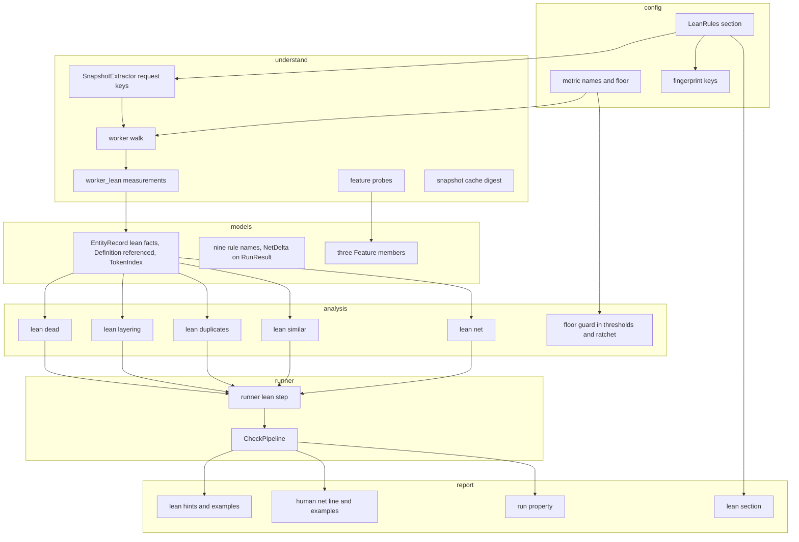
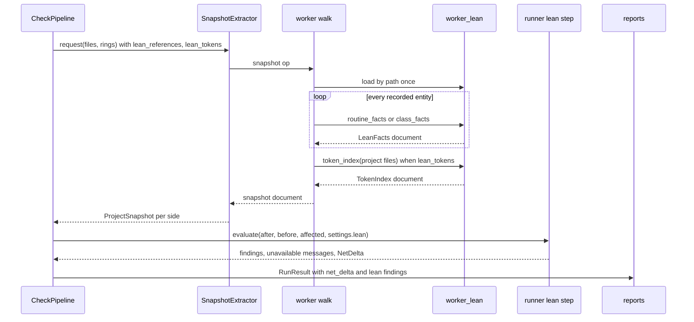
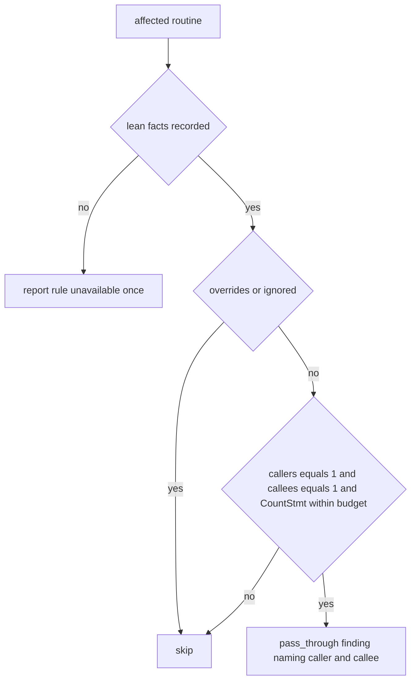

# Design Document: lean-code-rules

## Overview

**Purpose**: This feature gives the Gate a family of rules whose finding is not "too complex" but "should not exist" or "should be shorter": dead parameters, classes and variables; routines that only forward; abstractions with one implementation; files that hold one definition for one importer; copied blocks and renamed twins; comment volume and verbosity; and a net logical-lines figure per change. Each rule is answered from Understand's references, metrics and token streams, so one rule holds for every language Understand parses, and each finding carries a hint in ponytail's one-line tag form with a worked example of the shorter form.

**Users**: Coding agents checking their own change before staging, the reviewers reading the Gate's report, and the operator who turns rules on from measurement.

**Impact**: Extends the configuration with one `[lean]` section, the worker with a sibling measurement module loaded by path, the snapshot with per-entity lean facts and an optional token index, the analysis layer with a `lean` package of six rule modules and one delta, the reports with a net line and examples, `agent-rules` with a lean section (and the four structural rules it omits today), `doctor` with three rows, and the four shipped skills. The dependency direction of `tech.md` is unchanged; every rule ships off or as a warning.

### Goals
- Dead code beyond routines, with the routine rule's three-state discipline (1.x).
- Pass-through routines, single-implementation abstractions and over-exporting files as structural findings naming their counterpart (2.x, 3.x, 4.x).
- Exact duplicate blocks and similar routines over the whole project, reported against the change (5.x).
- A comment-ratio maximum, a per-routine comment-line metric and a guarded verbosity ratio as ordinary thresholds (6.x).
- `net: ±N lloc` in every output when a before side exists (7.x).
- Hints that open with `delete:`, `yagni:` or `shrink:`, one example per rule, a lean section in `agent-rules`, skills that use it (8.x).
- Availability rows, configuration-time refusal, zero cost while off, a measured cost ceiling (9.x); documentation (10.x).

### Non-Goals
- `stdlib:` and `native:` findings; applying fixes; CodeCheck; semantic clones; duplication across repositories; changing any existing default severity; ponytail as a dependency.
- A per-routine form of Understand's `DuplicateLinesOfCode` (it has none); replacing `structure.unused_routines` or `structure.duplicate_definitions`.

## Boundary Commitments

### This Spec Owns
- The `[lean]` configuration section, its defaults, its template block and its fingerprint keys (`config/models.py`, `config/defaults.py`, `config/template.py`, `config/fingerprint.py`).
- The lean measurement module and its call sites in the extractor (`understand/worker_lean.py`, `understand/worker.py`), the request keys (`understand/snapshot.py`, `models/understand.py`), and the snapshot fields they fill (`models/snapshot.py`).
- The nine rule names and the six rule modules plus the net delta (`models/findings.py`, `analysis/lean/*`), and the floor guard on synthetic metrics (`config/metric_names.py`, `analysis/thresholds.py`, `analysis/ratchet.py`).
- The two shrink metrics: `CountLineComment` in the catalogue path and the `LinesPerStatement` synthetic (`config/metric_names.py`, `understand/worker.py`).
- The two plugin-metric declarations for the duplicate-lines solution (`config/metric_names.py`).
- The lean hints and examples and their rendering (`report/hints.py`, `report/lean_examples.py`, `report/human.py`, `report/sarif.py`), the `NetDelta` field of `RunResult`, the lean section of `agent-rules` and the repair of its structure section (`report/agent_rules.py`).
- The three feature probes and their `doctor` rows (`understand/features.py`, `models/understand.py`).
- The pipeline step that runs the rules and the delta (`runner/lean.py`, `runner/check.py`).
- The four skills, the documentation pages and the contract fixtures for the family.

### Out of Boundary
- The threshold, ratchet, affected-set, cycle, fan, layer and coupling engines of the base specification: consumed unchanged except for the floor guard, which is a two-line read of a declaration.
- `structure.unused_routines` and `structure.duplicate_definitions`: unchanged; the design records them as the family's elder members.
- Understand's own duplicate-lines algorithm: adopted as the definition of a duplicate line, not re-implemented as a plugin.
- The Gate's SARIF result schema: one run-level property is added; results are untouched.
- Licensing, the network boundary, the release process, the hook shim, `init --detect`'s exclusion logic (a `[scope.tests]` proposal is documented, not built).

### Allowed Dependencies
- Layer order from `tech.md`: `config -> models -> understand, git -> analysis -> report -> runner -> cli`; `analysis/lean/*` imports only `config`, `models` and, for the net delta's signature pairing, `analysis/ratchet`.
- `understand/worker.py` and `understand/worker_lean.py` import nothing from the package; the sibling is loaded by path and receives the two helpers it needs (`project_path`, the `understand` module) as arguments. Both files are hashed into the snapshot cache's worker digest.
- `report/` and `analysis/` stay free of filesystem, git and `understand` access.
- External: Understand 8.0 (Build 1262) reference kinds, `Lexer`/`Lexeme`, `Metric.lookup`, as recorded in `research.md`.

### Revalidation Triggers
- A change to `EntityRecord`, `Definition` or `ProjectSnapshot` (new optional fields here) requires re-running the base specification's snapshot contract suite and the snapshot cache tests.
- A change to `RunResult` (the `net_delta` field) requires re-running the JSON, SARIF and e2e output tests; `schema_version` stays 2 because the field is additive.
- A change to `StructureRuleName` requires re-running the severity-map, SARIF rule-id and hint tests.
- A change to the worker digest inputs (a second file) invalidates every cached before snapshot once, by design.
- A change to `SyntheticMetric` (the `floor` field) requires re-running the threshold and ratchet suites.

## Architecture

### Existing Architecture Analysis
- Structural rules are pure functions over `ProjectSnapshot` and `AffectedSet`, called from `CheckPipeline._structure`, named through `StructureRuleName`, hinted through a flat catalogue, and configured as `Severity | None` fields. Every layer has a fixture-backed test and a contract test.
- The worker is the only module that touches the API; it walks every entity once per side and records per-entity facts. It measures 1 060 of 1 200 code lines and 119 of 130 functions and may import nothing from the package.
- Snapshot metrics are only what the configured thresholds request; the before side is served from a cache keyed on the analysis fingerprint and the worker's source digest.
- `agent-rules` describes six structural rules and omits four.

### Architecture Pattern & Boundary Map



**Architecture Integration**:
- Selected pattern: the existing one. A rule is a pure function over the snapshot; measurement is the worker's; configuration is a typed section; reporting reads `RunResult`. The one new shape is the worker sibling loaded by path, chosen because the worker has 140 lines of budget and a second op would cost a second database walk.
- Domain boundaries: `worker_lean.py` measures and never judges; `analysis/lean/*` judges and never measures; `runner/lean.py` orders the calls and carries the "not measured" messages; `report/` renders.
- Existing patterns preserved: `Severity | None` is off; three-state facts; whole-project decision, affected-entity report; hint by rule name; feature probe then refusal; fingerprint keys for extraction switches.
- New components rationale: `worker_lean.py` (budget), `analysis/lean/` (six rules and a delta are a package, not a module), `runner/lean.py` (keeps `CheckPipeline` under its own limits), `report/lean_examples.py` (examples are text, kept apart from the hint logic).
- Steering compliance: layer order unchanged; `analysis` and `report` remain pure; the worker rule is extended to two files rather than broken.

### Technology Stack

| Layer | Choice / Version | Role in Feature | Notes |
| --- | --- | --- | --- |
| Analysis engine | SciTools Understand 8.0 Build 1262, Python API | references (`callby`, `useby`, `setby`, `modifyby`, `overrides`, inheritance kinds), `Ent.ref("end")`, `Ent.lexer(False)`, `Metric.lookup` | no CodeCheck; kinds per language in `research.md` |
| Runtime | Python 3.14 (`uv`), `upython` for the worker | unchanged | `worker_lean.py` runs under both, stdlib only |
| Data | JSON snapshot documents in the cache | lean facts and token index ride on the snapshot | additive fields; cache schema unchanged, digest changes |
| Output | JSON (`schema_version` 2), SARIF 2.1.0, human text, Markdown rules snippet | `net_delta` field, run property, net line, examples | additive |

## File Structure Plan

### Directory Structure
```
src/scitools_hook/
├── understand/
│   ├── worker_lean.py          # NEW: every lean measurement; zero package imports; loaded by path
│   ├── worker.py               # + load sibling when asked; call it per record and once for tokens; LinesPerStatement synthetic
│   ├── snapshot.py             # + lean_references / lean_tokens request keys from settings.lean
│   ├── snapshot_cache.py       # + worker digest covers worker_lean.py
│   └── features.py             # + three probes, ASKED_BY entries
├── analysis/
│   ├── lean/
│   │   ├── __init__.py         # NEW: package marker, re-exports nothing
│   │   ├── dead.py             # NEW: unused_parameter, unused_class, unused_variable
│   │   ├── layering.py         # NEW: pass_through, single_implementation, over_export
│   │   ├── duplicates.py       # NEW: duplicate_block over the token index
│   │   ├── similar.py          # NEW: similar_routine over the token index
│   │   └── net.py              # NEW: NetDelta over affected files, net_growth finding
│   ├── thresholds.py           # + floor guard
│   └── ratchet.py              # + floor guard
├── config/
│   ├── models.py               # + LeanRules, Settings.lean, DEFAULT_LEAN_* ignore lists
│   ├── metric_names.py         # + SyntheticMetric.floor, LinesPerStatement, two PLUGIN_METRICS
│   ├── defaults.py             # + shrink threshold defaults (warning), no comment maximum
│   ├── template.py             # + [lean] block
│   └── fingerprint.py          # + lean_references, lean_tokens
├── models/
│   ├── snapshot.py             # + LeanFacts, TokenIndex, EntityRecord.lean, Definition.referenced, ProjectSnapshot.tokens
│   ├── change.py               # + NetDelta
│   ├── findings.py             # + nine StructureRuleName members, RunResult.net_delta
│   └── understand.py           # + ExtractRequest keys, Feature members
├── report/
│   ├── lean_examples.py        # NEW: the worked examples, keyed <rule>/example
│   ├── hints.py                # + _LEAN_HINTS, HintCatalogue.example()
│   ├── human.py                # + net line, lean-already line, example in verbose output
│   ├── sarif.py                # + runs[0].properties.net_delta
│   └── agent_rules.py          # + _lean_section, _structure_section lists all structural rules
├── runner/
│   ├── lean.py                 # NEW: runs the six rules and the delta; carries unavailable messages
│   └── check.py                # + one call into runner/lean, net_delta into RunResult
├── cli/doctor.py               # rows follow the Feature enum; no change expected
└── skills/*/SKILL.md           # four edits
docs/
├── reference/rules.md          # + the family, per rule: reports, does not report, default, measurement
├── reference/features.md       # + rows
├── reference/cli.md            # + doctor rows, net line
├── guide/configuration.md      # + [lean] keys and template excerpt
├── guide/lean-code.md          # NEW: the ladder, the tags the Gate emits and the two it does not, tests policy
└── guide/agents.md             # + lean section of the snippet
tests/
├── understand/api_fakes.py     # + FakeLexer, FakeLexeme, FakeEnt.lexer()
├── understand/test_worker_lean.py          # NEW
├── analysis/lean/test_*.py                 # NEW, one per rule module
├── report/test_lean_hints.py               # NEW
├── runner/test_lean_step.py                # NEW
├── contract/contract_project.py            # + cases per rule, Python and C++
├── contract/test_lean_contract.py          # NEW: kinds, counts, cost
├── e2e/test_lean_rules.py                  # NEW
└── test_import_direction.py                # + worker_lean entry and isolated-interpreter test
```

### Modified Files
- `understand/worker.py`: in `_plan`, two booleans; in `_Extractor.build`, a token pass when asked; in `_record`, a `lean` key from the sibling; `_definitions` fills `referenced` when asked; one synthetic in `SYNTHETICS["routine"]`. Budget: the additions are calls, not logic; the sibling holds the logic.
- `config/models.py`: `LeanRules` and `Settings.lean`; the file is in `[scope.schemas]` for this reason.
- `analysis/thresholds.py`, `analysis/ratchet.py`: read `SYNTHETIC_METRICS[metric].floor` before judging an entity.
- `runner/check.py`: `_structure` gains one call to `runner.lean.evaluate`; `run` sets `net_delta`.
- `report/agent_rules.py`: `_structure_section` names `unused_routines`, `duplicate_definitions`, `call_cycles`, `reachable_complexity` (8.5).

## System Flows

### A check with lean rules on



Flow decisions: the sibling is loaded only when either request key is true, so a run with every lean rule off never touches it (9.4). The token pass runs after the entity walk so routine line ranges are known. The before side comes from the cache when its key matches, and the fingerprint keys make a switched-on rule a cache miss (9.6, no stale "unavailable" path).

### Deciding a routine under the layering rules



## Requirements Traceability

| Requirement | Summary | Components | Interfaces | Flows |
| --- | --- | --- | --- | --- |
| 1.1 | unused classes and module variables | worker_lean.class_facts, worker `_definitions`, analysis/lean/dead | `LeanFacts.referrers`, `Definition.referenced` | check flow |
| 1.2 | unused parameters located at the routine | worker_lean.routine_facts, dead | `LeanFacts.unused_parameters` | check flow |
| 1.3 | whole-project decision | worker_lean (refs of the entity, project files only) | `project_path` argument | |
| 1.4 | override and receiver exclusion | worker_lean (`overrides`), `DEFAULT_LEAN_PARAMETER_IGNORE` | `LeanFacts.overrides` | |
| 1.5 | off, warning, ignore lists | `LeanRules`, template | `unused_*`, `*_ignore` | |
| 1.6 | not measured reported once | runner/lean | `LeanOutcome.unavailable` | check flow |
| 1.7 | deleted entities never reported | dead (after-side records only) | | |
| 1.8 | resolution floor before any dead-code finding | runner/lean, `CallResolution` | `lean.resolution_floor` | check flow |
| 1.9 | interface methods excluded without an inheritance edge | worker_lean.class_facts, dead | declaring-class count per method name | |
| 1.10 | each dead-code rule measured on two repositories before shipping enabled | tasks 6.3, 6.4 | | |
| 2.6 | pass-through gated on the same floor | runner/lean | `CallResolution` | |
| 2.1 | pass-through with caller and callee named | layering | `LeanFacts.callers/callees/forwards_to`, `pass_through_max_statements` | layering flow |
| 2.2 | one caller alone is not a finding | layering | `callees == 1` and statement budget | layering flow |
| 2.3 | external caller, overrides, ignore | worker_lean, layering | `overrides`, `pass_through_ignore` | |
| 2.4 | off, warning | `LeanRules.pass_through` | | |
| 2.5 | unavailable once | runner/lean | | |
| 3.1 | single derived, no other referrer | worker_lean.class_facts, layering | `LeanFacts.derived`, `referrers` | |
| 3.2 | evaluated when base or derived affected | layering | affected keys joined with `derived` | |
| 3.3 | exclusions and ignore list | layering, `single_implementation_ignore` | | |
| 3.4 | off, warning | `LeanRules.single_implementation` | | |
| 4.1 | one definition, one dependant | layering.over_export | file metrics, `file_edges`, `definitions` | |
| 4.2 | exclusions | layering, `DEFAULT_LEAN_OVER_EXPORT_IGNORE` | | |
| 4.3 | off, warning | `LeanRules.over_export` | | |
| 5.1 | duplicate blocks with other locations | worker_lean.token_index, analysis/lean/duplicates | `TokenIndex.files`, `duplicates_min_lines`, `NAMED_LOCATIONS` | |
| 5.2 | similar routines with measured similarity | worker_lean.token_index, analysis/lean/similar | `TokenIndex.routines`, `similar_threshold`, `similar_min_statements` | |
| 5.3 | whole project, affected report | duplicates, similar | affected keys as the only query set | |
| 5.4 | normalisation | worker_lean.token_index | token class map | |
| 5.5 | configurable, off, warning, path ignore | `LeanRules` | `duplicates_ignore`, `similar_ignore` | |
| 5.6 | duplicate-lines metric as threshold | `PLUGIN_METRICS`, catalogue, arch-scope decision (task 5.6) | `DuplicateLinesOfCode`, `DuplicateLinesOfCodePercent` | |
| 5.7 | measured defaults recorded | contract test, docs | measurement task | |
| 5.8 | unreadable token stream | worker_lean (skip and note), runner/lean | `TokenIndex.unreadable` | |
| 6.1 | comment maximum accepted, off | `Limit.max` on `file.RatioCommentToCode`, defaults | | |
| 6.2 | `CountLineComment` per routine | catalogue path (native metric) | threshold name | |
| 6.3 | verbosity ratio with floor | `LinesPerStatement` synthetic, floor guard | `SyntheticMetric.floor` | |
| 6.4 | warnings by default | `_SOFT_THRESHOLDS` | | |
| 6.5 | docstring accounting recorded | research.md, docs | measured: docstrings are comment lines | |
| 6.6 | unavailable per language | existing catalogue path | | |
| 7.1 | delta in human, JSON, SARIF | analysis/lean/net, human, sarif | `RunResult.net_delta` | check flow |
| 7.2 | deletions negative, additions positive | net | before-only records of affected and deleted files | |
| 7.3 | `net: +N lloc` form with lines and count | human `_net_line` | `NetDelta` | |
| 7.4 | omitted without before side | net returns None | | |
| 7.5 | never blocks; optional maximum | `LeanRules.max_net_growth`, net_growth finding | | |
| 7.6 | lean-already line | human `_lean_already_line` | `RunResult.net_delta`, lean findings, `settings.lean` | |
| 8.1 | tag-form hints | `_LEAN_HINTS` | `hint()` | |
| 8.2 | one example per rule, in verbose and JSON | `report/lean_examples.py`, `HintCatalogue.example`, `_finish` | `Finding.details["example"]` | |
| 8.3 | never `stdlib:`/`native:`; snippet says so | agent_rules `_lean_section` | | |
| 8.4 | lean section in agent-rules | `_lean_section` | | |
| 8.5 | all structural rules listed | `_structure_section` repair | | |
| 8.6 | hint and example overrides | `[hints]` keys `<rule>` and `<rule>/example` | | |
| 8.7 | four skills | `skills/*/SKILL.md` | | |
| 9.1 | off or warning, measured defaults | defaults, docs, contract test | | |
| 9.2 | doctor rows | `Feature.LEAN_REFERENCES/LEAN_TOKENS/DUPLICATE_METRIC`, probes | `_feature_rows` | |
| 9.3 | refusal at configuration time | `ASKED_BY`, `refuse_unavailable` | | |
| 9.4 | nothing extracted while off | request keys false, sibling not loaded | | check flow |
| 9.5 | cost ceiling recorded | contract cost test | 6.5 s bound | |
| 9.6 | scopes, severity map, ignore, ratchet unchanged | rule names in `structure.` category; thresholds path for metrics | | |
| 9.7 | no CodeCheck | worker_lean uses refs, metrics, lexer only | | |
| 10.1 | every rule in the rules reference with its measurement | `docs/reference/rules.md` | | |
| 10.2 | configuration keys and template excerpt | `docs/guide/configuration.md`, `config/template.py` | | |
| 10.3 | feature-list rows | `docs/reference/features.md` | | |
| 10.4 | why `stdlib:` and `native:` are not findings | `docs/guide/lean-code.md` | | |
| 10.5 | per-language blind spots, measured | `docs/reference/rules.md`, contract test | | |

## Components and Interfaces

| Component | Domain/Layer | Intent | Req Coverage | Key Dependencies (P0/P1) | Contracts |
| --- | --- | --- | --- | --- | --- |
| LeanRules | config | the `[lean]` section | 1.5, 2.4, 3.4, 4.3, 5.5, 7.5 | StrictModel (P0) | State |
| LinesPerStatement and floor | config, understand, analysis | verbosity metric with a statement floor | 6.3, 6.4 | SYNTHETIC_METRICS (P0) | Service |
| worker_lean | understand | every lean measurement | 1.1–1.4, 2.1, 2.3, 3.1, 5.1, 5.2, 5.4, 5.8, 9.4, 9.7 | understand API (P0), worker walk (P0) | Batch |
| Snapshot lean fields | models | carry the facts | 1.6, 2.5 | ProjectSnapshot (P0) | State |
| analysis/lean/dead | analysis | three dead-code rules | 1.1–1.7 | LeanFacts, Definition (P0) | Service |
| analysis/lean/layering | analysis | pass_through, single_implementation, over_export | 2.x, 3.x, 4.x | LeanFacts, file_edges (P0) | Service |
| analysis/lean/duplicates | analysis | duplicate_block | 5.1, 5.3, 5.5 | TokenIndex (P0) | Service |
| analysis/lean/similar | analysis | similar_routine | 5.2, 5.3, 5.5 | TokenIndex (P0) | Service |
| analysis/lean/net | analysis | NetDelta and net_growth | 7.1–7.5 | ratchet.record_of pairing (P1) | Service |
| runner/lean | runner | order the rules, carry unavailable messages | 1.6, 2.5, 5.8, 7.4 | CheckPipeline (P0) | Service |
| Hints and examples | report | tag-form hints, examples, overrides | 8.1, 8.2, 8.6 | HintCatalogue (P0) | State |
| Reports | report | net line, lean-already line, run property, snippet | 7.1, 7.3, 7.6, 8.3–8.5 | RunResult (P0) | State |
| Feature probes | understand | availability and refusal | 9.2, 9.3 | features.py (P0) | Service |
| Plugin metric declarations | config | duplicate-lines metric as threshold | 5.6 | catalogue (P1) | State |

### config

#### LeanRules

| Field | Detail |
| --- | --- |
| Intent | One typed section holding every lean rule's switch, severity, numbers and ignore list |
| Requirements | 1.5, 2.1, 2.3, 2.4, 3.3, 3.4, 4.2, 4.3, 5.5, 7.5 |

**Responsibilities & Constraints**
- Follows `StructureRules.unused_routines`: a rule is `Severity | None`, `None` is off. Ignore lists are validated with `compile_patterns` (names) or `compile_path_pattern` (paths).
- Exposes two derived booleans the extractor reads: `wants_references` (any of the **five** rules that need the per-entity reference walk: `unused_parameters`, `unused_classes`, `unused_variables`, `pass_through`, `single_implementation`) and `wants_tokens` (either token rule on). **`over_export` is deliberately not among them**: it is answered from file metrics, `file_edges` and the definitions walk that today's snapshot already carries, so it asks for no reference walk and has no feature of its own. An `over_export`-only configuration that flipped `wants_references` would pay for a per-entity `refs` call on every recorded entity and read none of it, which requirement 9.4 forbids and requirement 9.5 charges for. What `over_export` does turn on is the definitions walk, through the fingerprint's `definitions` key below.

##### State Management
```python
class LeanRules(StrictModel):
    unused_parameters: Severity | None = None
    unused_parameters_ignore: list[str]      # default DEFAULT_LEAN_PARAMETER_IGNORE: r"^(self|cls|this)$", r"^_", r"^(args|kwargs)$"
    # A decorator-registered handler is the fourth shape requirement 1.5 names and no pattern
    # here covers it, because the name of such a routine or class says nothing. Task 4.1 owns
    # the answer: it is a reference the decorator makes, so it is visible to the reference walk
    # where the decorator is in the project, and invisible where it is not.
    unused_classes: Severity | None = None
    unused_classes_ignore: list[str]         # default: r"(^|\.)Test", r"Error$", r"Exception$"
    unused_variables: Severity | None = None
    unused_variables_ignore: list[str]       # default: r"^__\w+__$", r"^(log|logger|pytestmark)$"
    pass_through: Severity | None = None
    pass_through_max_statements: int = Field(default=2, ge=1)
    pass_through_ignore: list[str]           # default: DEFAULT_UNUSED_IGNORE (entry points, tests, dunders)
    single_implementation: Severity | None = None
    single_implementation_ignore: list[str]  # default: r"Error$", r"Exception$"
    over_export: Severity | None = None
    over_export_ignore: list[str]            # path patterns; default: "**/__init__.py", "**/index.*", "**/mod.rs", "**/__main__.py"
    duplicates: Severity | None = None
    duplicates_min_lines: int = Field(default=12, ge=3)
    duplicates_ignore: list[str]             # path patterns; default []
    similar_routines: Severity | None = None
    similar_min_statements: int = Field(default=6, ge=2)
    similar_threshold: float = Field(default=0.9, gt=0.0, le=1.0)
    similar_ignore: list[str]                # path patterns; default []
    max_net_growth: int | None = Field(default=None, ge=0)
    net_growth_severity: Severity = "warning"

    @property
    def wants_references(self) -> bool: ...
    @property
    def wants_tokens(self) -> bool: ...
```
- Invariants: every default severity is `None`; the numbers above are the design's starting values and are re-measured with Understand's lexer before the docs record them (5.7, 9.1).
- `analysis_fingerprint` gains `"lean_references": settings.lean.wants_references` and `"lean_tokens": settings.lean.wants_tokens`. Its existing `definitions` key becomes `structure.duplicate_definitions is not None or lean.over_export is not None`, because over-export reads the definitions walk.
- `config/template.py` gains `_lean_body`, one commented line per off rule, in the style of `_unused`.

#### LinesPerStatement and the floor

| Field | Detail |
| --- | --- |
| Intent | `CountLineCode / CountStmt` per routine, judged only above a statement floor |
| Requirements | 6.3, 6.4 |

```python
@dataclass(frozen=True, slots=True)
class SyntheticMetric:
    id: str
    scope: Scope
    description: str
    requires: tuple[str, ...] = ()
    floor: tuple[str, int] | None = None   # (metric, DEFAULT minimum): below it the entity is not judged on this metric

# Requirement 6.3 asks for a *configurable* minimum, so the declaration carries the default
# and the operator can move it. The key lives in `[lean]` beside the other numbers of this
# family rather than in `[thresholds.routine]`, because it is not a limit on anything: it
# says which routines the ratio is meaningful for at all.
class LeanRules(StrictModel):
    ...
    verbosity_min_statements: int = Field(default=5, ge=1)

SYNTHETIC_METRICS["LinesPerStatement"] = SyntheticMetric(
    id="LinesPerStatement", scope="routine",
    description="Source lines per statement: CountLineCode / CountStmt, undefined when CountStmt is 0.",
    requires=("CountLineCode", "CountStmt"), floor=("CountStmt", 5))
```
- Worker: `SYNTHETICS["routine"]["LinesPerStatement"]` answers the ratio, `None` only when `CountStmt` is absent or zero (then the existing unavailable path applies, which is the truthful answer).
- Guard: `analysis.thresholds._judge` and `analysis.ratchet._compare` call `below_floor(record, metric, minimum) -> bool` from `config.metric_names`, and return without a finding and without an unavailable record when it is true. The `minimum` is resolved from `settings.lean.verbosity_min_statements`, falling back to the declaration's default when no settings are in hand, so an operator whose routines are legitimately small can move it (requirement 6.3). An earlier draft hard-coded it, which task 1.3's review caught: the requirement says *configurable* and a constant would have shipped it unsatisfied.
- Defaults: `routine.LinesPerStatement = 3.0` and `routine.CountLineComment = 20`, both in `_SOFT_THRESHOLDS` (warnings); `file.RatioCommentToCode` keeps `{"min": 0.1}` and accepts `max` (6.1); no `max` is shipped (docstrings are comment lines, `research.md`).

#### Plugin metric declarations

| Field | Detail |
| --- | --- |
| Intent | Offer `DuplicateLinesOfCode` and `DuplicateLinesOfCodePercent` as file, arch and project thresholds where the build's tags allow |
| Requirements | 5.6 |

- **Arch scope is declared and not yet served, and that is a silent no-op this design must not ship.** Measured during task 1.3: file scope is served end to end, project scope is served through the population path `CorePercentage` already takes, and arch scope is never requested at all, because `ArchNode` carries no metrics and `_population_metrics` excludes `arch` by design. The hole is pre-existing and metric-agnostic rather than anything this family introduced, but requirement 5.6 names architecture, and accepting a threshold that is never evaluated is exactly the "read, ignored and quietly measured as something else" behaviour the Understand 8.0 specification refused. Task 5.6 owns the decision: extract arch metrics, or refuse an arch-scope threshold at configuration time with a reason.
- Two `PluginMetric` entries with `scopes=("file", "arch", "project")` and the language tuple the tags name (`Language: Any`); the catalogue's tag check decides per build. The `Feature.DUPLICATE_METRIC` probe asks `Metric.lookup("DuplicateLinesOfCode")` through the existing `catalogue` op and reports `not on this build` when it answers nothing, with the detail that the solution may be present but disabled in the Plugin Manager.

### understand

#### worker_lean

| Field | Detail |
| --- | --- |
| Intent | Every lean measurement, as plain functions over API objects, in a file the worker loads by path |
| Requirements | 1.1–1.4, 2.1, 2.3, 3.1, 5.1, 5.2, 5.4, 5.8, 9.4, 9.7 |

**Responsibilities & Constraints**
- Imports only the standard library. Receives the `understand` module and the worker's `_project_path` as arguments in a small context object, so nothing is duplicated between the two files.
- Never judges: it counts, lists and hashes. Thresholds and ignore lists are the analysis layer's.
- Loaded by `worker._lean_module()` through `importlib.util.spec_from_file_location` on `Path(__file__).with_name("worker_lean.py")`, once per process, only when the plan asks for references or tokens.

**Dependencies**
- Inbound: `worker._record`, `worker._definitions`, `worker._Extractor.build` (P0).
- External: Understand API (`refs`, `ents`, `ref("end")`, `lexer(False)`, `Lexeme.token/text/line_begin`) (P0).

**Contracts**: Batch [x]

##### Batch Contract
```python
class LeanContext:            # built by worker.py, plain attributes
    api: Any                  # the understand module
    project_path: Callable[[Any, str], str | None]
    root: str

REFERENCE_KINDS = (                                              # what counts as use, any language
    "callby, useby, setby, modifyby, typedby, "
    "inheritby, derive, extendby, implementby"                   # inheritance IS use -- see below
)
CALLER_KINDS = "callby"
CALLEE_KINDS = "call"
OVERRIDE_KINDS = "overrides"
DERIVED_KINDS = "derive, inheritby, extendby, implementby"        # contract test decides Java's couple kinds
PARAMETER_KINDS = "parameter ~catch"
PARAMETER_USE = "useby, setby, modifyby, callby"                 # a called parameter is used

# **`callby` belongs in PARAMETER_USE, and leaving it out was the same defect as the
# inheritance one, one member set over.** Measured on the contract project: a parameter used
# only as `return cls()` has `useby`, `setby` and `modifyby` all empty and a single `Call`
# reference. Without `callby` it reads as unused. The fixture masks it because the parameter
# is named `cls` and the shipped ignore list excuses that name, but `def apply(fn): return
# fn()` is the same shape with no ignore to hide behind, and a callback parameter reported as
# dead is exactly the false finding that makes an agent delete working code.

def routine_facts(ent, ctx: LeanContext) -> dict[str, object]:
    """{'callers': int, 'callees': int, 'forwards_to': str | None, 'overrides': bool,
        'unused_parameters': list[str]} -- callers and callees are distinct project routines;
    forwards_to is the callee's longname when callees == 1; a parameter is unused when no
    PARAMETER_USE reference to it comes from a project file."""

# **Inheritance counts as a reference, and leaving it out was a defect.** Task 1.6 planted a
# base class whose only inbound project reference is the inheritance reference from its one
# subclass. Without the inheritance kinds above, `unused_class` reports it as dead while
# `single_implementation` reports the same class as an abstraction with one implementation --
# two findings on one class telling the agent to delete it and to fold it into its
# implementation. The rules must not contradict each other, and the honest reading is that a
# class its subclass inherits from is used. `single_implementation` still reports it, because
# `referrers` deliberately excludes the derived class; `unused_class` no longer does.
#
# Two things measured about that fix, recorded so it is not mistaken for more than it is.
# **Which kind fires is per language**, measured on the contract project on Build 1262 once
# task 1.7 gave it a C++ base class as well as a Python one: Python answers `Python Inheritby`
# and C++ answers `C Public Derive`, both recorded ON THE BASE CLASS and naming the derived
# one. `inheritby` matches nothing on the C++ side and `derive` nothing on the Python side, so
# a set holding either alone would answer "dead" for the other language's base class -- which
# is why both are in `REFERENCE_KINDS` and `DERIVED_KINDS` rather than one of them. `extendby`
# and `implementby` match nothing on this fixture at all and are carried for the languages the
# contract project does not build. The C++ derived class carries `C Public Base` back to its
# base, which is in neither set on purpose: it would make a subclass count as a *user* of its
# base and take every base class out of `single_implementation`. Both kinds that do fire are
# OUTBOUND kinds sitting in an otherwise inbound set: on a class they answer that class's
# subclasses rather than its users, which gives the same boolean here only because "has a
# subclass" and "is inherited by something" coincide.
# And the fix has a cost: `unused_class` can now never reach a base class that has any
# subclass, including an abstract base whose whole subtree is dead. That is accepted as the
# cheaper error than two rules contradicting each other on one class.

def class_facts(ent, ctx: LeanContext) -> dict[str, object]:
    """{'referenced': bool, 'derived': list[str], 'referrers': int} -- derived are the
    longnames of DERIVED_KINDS targets in project files; referrers counts distinct project
    entities referencing the class other than itself, its members, its derived classes
    and their members; referenced is any project reference at all."""

VARIABLE_USE = "useby, callby, typedby"                          # a WRITE is not a use

def variable_referenced(ent, ctx: LeanContext) -> bool:
    """Whether a project file READS the variable: a VARIABLE_USE reference, not a write.

    **`REFERENCE_KINDS` is the wrong set here, and task 1.7's review caught it.** That set
    holds `setby`, and a module-level binding's own defining assignment is a `Set Init`
    reference to it, so every variable in every project would answer True and the rule would
    report nothing, ever. The contract fixture discriminates only by accident: its dead
    variables happen to have no `Use` either.

    Writes are excluded rather than merely the defining one, which is a deliberate second
    decision. A variable that something assigns and nothing reads is dead too, and this is
    also how Understand defines its own `CountUnusedVariable` -- declare, initialise and
    assign all count as writes, so a write-only variable counts as unused there as well.
    """

def token_index(file_ents: Mapping[str, Any], routines: Mapping[str, tuple[Any, str]],
                ctx: LeanContext) -> dict[str, object]:
    """{'vocabulary': list[str], 'files': {path: [[line, hash16], ...]},
        'routines': {token: {'path': str, 'start': int, 'end': int, 'shape': [int, ...]}},
        'unreadable': [path, ...]}
    Line hashes: lexeme texts of one line with Whitespace, Comment, Newline, Indent, Dedent
    **and every lexeme whose text is empty** dropped, joined, SHA-256 truncated to 16 hex
    characters; blank results skipped.

    The empty-text rule is not tidiness, and task 1.7 measured what it costs to omit it.
    Clipping a FILE's lexeme stream to a routine's line range picks up a trailing end-of-file
    lexeme carrying the empty string, which is an artefact of reading the stream rather than a
    token of the routine. Kept, it adds one free MATCHING token to both sides of every
    comparison and inflates every ratio: the contract project's cross-language twin pair
    measures 0.637 with it and 0.631 without. The rule is written on text rather than on a
    token-class name because the documented `Lexeme.token()` values do not include such a
    class, so a name-based drop would be guessing at an undocumented spelling.
    Shapes: every remaining lexeme mapped to a vocabulary index, where Identifier -> 'ID',
    String and Literal -> 'LIT', Keyword/Operator/Punctuation -> their text; the routine's
    range is ref('definein').line() .. ref('end').line() in the same file, else absent.
    A file whose lexer raises is listed under 'unreadable' and contributes nothing."""
```
- Preconditions: the database is open; `file_ents`/`routines` are the extractor's own maps.
- Postconditions: documents are JSON-serialisable; no `None` for a fact that was measured; a routine without an `end` reference is absent from `routines` and counted nowhere.
- Idempotency: pure over the database.

**Implementation Notes**
- Integration: `worker._record` adds `"lean": lean.routine_facts(...)` for routines and `class_facts` for classes when `plan.lean_references`, else `None`; `_definitions` adds `"referenced"`; `build` adds `"tokens"` when `plan.lean_tokens`. `snapshot_cache.worker_digest()` hashes both files.
- Validation: `tests/understand/test_worker_lean.py` with `FakeLexer`/`FakeLexeme` added to `api_fakes.py`; `tests/test_import_direction.py` gains the sibling with an empty allowance, the parse test, and an isolated-interpreter load test.
- Risks: caller undercount under unresolved calls (recorded in `research.md`); Java inheritance kinds unverified; the token pass cost is measured by the contract cost test against the 6.5 s bound.

#### Snapshot request and feature probes

| Field | Detail |
| --- | --- |
| Intent | Ask for the facts a configuration needs, and refuse a configuration the build cannot serve |
| Requirements | 1.6, 2.5, 9.2, 9.3, 9.4 |

- `ExtractRequest.lean_references: bool = False`, `lean_tokens: bool = False`, set in `SnapshotExtractor.request` from `settings.lean.wants_references/wants_tokens`; `_plan` copies them to `_Plan.lean_references/lean_tokens`.
- `Feature.LEAN_REFERENCES` (hard-coded available, as `UNUSED_RULE` is: every build reports references), `Feature.LEAN_TOKENS` (probe: `file.lexer(False)` on doctor's scratch database, through a `lexer_probe` request on the existing `catalogue` op), `Feature.DUPLICATE_METRIC` (probe: lookup as above). `ASKED_BY` maps `lean.unused_parameters`, `lean.unused_classes`, `lean.unused_variables`, `lean.pass_through`, `lean.single_implementation` to `LEAN_REFERENCES` and `lean.duplicates`, `lean.similar_routines` to `LEAN_TOKENS`; a threshold on `DuplicateLinesOfCode*` goes through the plugin-metric refusal that exists.
- `over_export` asks for no reference walk and has no feature; it needs only `include_definitions`, which the fingerprint's `definitions` key already carries. This is the same statement as the `wants_references` note above, and the two must stay in agreement: an earlier draft said "six reference rules" here and five in `ASKED_BY`, which task 1.1's review caught before the extractor could pay for it.

### models

#### Snapshot lean fields

| Field | Detail |
| --- | --- |
| Intent | Carry the measured facts with the three-state discipline |
| Requirements | 1.6, 2.5, 5.8 |

```python
class LeanFacts(DataModel):
    callers: int | None = None
    callees: int | None = None
    forwards_to: str | None = None
    overrides: bool | None = None
    unused_parameters: list[str] | None = None
    referenced: bool | None = None
    derived: list[str] | None = None
    referrers: int | None = None

class EntityRecord(DataModel):
    ...
    lean: LeanFacts | None = None          # None: not asked

class Definition(DataModel):
    ...
    referenced: bool | None = None         # None: not asked

class RoutineShape(DataModel):
    path: str
    start: int
    end: int
    shape: list[int]

class TokenIndex(DataModel):
    vocabulary: list[str]
    files: dict[str, list[tuple[int, str]]]
    routines: dict[str, RoutineShape]      # keyed by EntityKey.token
    unreadable: list[str] = []

class ProjectSnapshot(DataModel):
    ...
    tokens: TokenIndex | None = None       # None: not asked

class NetDelta(DataModel):                 # models/change.py
    statements: int
    lines: int
    routines: int = Field(ge=0)

class RunResult(DataModel):
    ...
    net_delta: NetDelta | None = None      # None: no before side
```
- `StructureRuleName` gains `unused_parameter`, `unused_class`, `unused_variable`, `pass_through`, `single_implementation`, `over_export`, `duplicate_block`, `similar_routine`, `net_growth`.
- `schema_version` stays 2: additive fields, per the policy in `report/json_out.py`.

### analysis

#### The resolution gate, and why the dead-code rules need one

Measured on facdrone 2026-09-10, 417 source files and about 101 800 lines, analysis resolving
at 26%: the reference-based dead-code predicate answers **830 routines, ~6160 lines**, and it
is wrong almost every time. The names give it away -- `.load`, `.decide`, `.commit`, a
dashboard callback, a CLI subcommand. That codebase uses structural typing, so an
implementation holds **no reference at all** to the interface it satisfies, and exactly **one**
of the 830 carried an `overrides` reference. Requirement 1.4's override exclusion catches
inheritance and misses duck typing entirely.

Two consequences this design must carry, or the rules ship as a machine for deleting working
code:

1. **A resolution gate.** No reference-based rule may report while the call resolution for
   that language is below a floor. The snapshot already carries `CallResolution` per language.
   Below the floor the rules report **nothing** and say so once per run, exactly as the gate
   already refuses to evaluate a metric Understand has no value for. "Nothing references this"
   is a measurement only when references were mostly resolved; otherwise it is a statement
   about the analysis, and reporting it as a property of the code is the same class of error
   as a below-floor `before` value excusing a violation (task 1.4).

2. **An interface-method exclusion that does not need an inheritance edge.** A method name
   declared on two or more project classes is an interface method under structural typing,
   whether or not any `Overrides` or inheritance reference exists. `class_facts` must record
   the declaring-class count per method name so `dead` can apply it.

The same evidence reorders the family's value. **Duplication needs no reference resolution at
all**: on the same codebase, token-based detection finds 76 exact 12-line windows and 51
mergeable twins, about **1220 lines** that are defensibly reducible, and every one of those
findings is independent of how much the analyser resolved. The largest reliable mass in
model-written code is the same logic written repeatedly under different names, which is
ponytail's reuse rung, not its dead-code rung.

#### analysis/lean/dead

| Field | Detail |
| --- | --- |
| Intent | One finding per affected parameter, class or module variable nothing in the project uses |
| Requirements | 1.1–1.7 |

```python
class LeanOutcome(NamedTuple):
    findings: list[Finding]
    unavailable: tuple[str, ...] = ()      # one message per rule that could not be evaluated

def find_unused_parameters(after: ProjectSnapshot, affected: Collection[EntityKey],
                           severity: Severity, ignore: Sequence[str]) -> LeanOutcome
def find_unused_classes(after: ProjectSnapshot, affected: Collection[EntityKey],
                        severity: Severity, ignore: Sequence[str]) -> LeanOutcome
def find_unused_variables(after: ProjectSnapshot, affected_files: Collection[str],
                          severity: Severity, ignore: Sequence[str]) -> LeanOutcome
```
- Preconditions: `after` is the after side; the rules read after-side records only, so a deleted entity cannot appear (1.7).
- Postconditions: a routine whose `lean.overrides` is true contributes no parameter finding (1.4); a `lean` of `None` on any affected record of the scope yields the rule's unavailable message and no findings (1.6); a parameter finding is located at the routine with `details["parameter"]` (1.2); a class finding requires `lean.referenced is False`; a variable finding requires `Definition.referenced is False`, and is reported once per definition.
- Hints: `delete:` for all three.

#### analysis/lean/layering

| Field | Detail |
| --- | --- |
| Intent | pass_through, single_implementation, over_export |
| Requirements | 2.1–2.5, 3.1–3.4, 4.1–4.3 |

```python
def find_pass_through(after: ProjectSnapshot, affected: Collection[EntityKey], severity: Severity,
                      max_statements: int, ignore: Sequence[str]) -> LeanOutcome
def find_single_implementations(after: ProjectSnapshot, affected: Collection[EntityKey],
                                severity: Severity, ignore: Sequence[str]) -> LeanOutcome
def find_over_exports(after: ProjectSnapshot, affected_files: Collection[str], severity: Severity,
                      ignore: Sequence[str]) -> list[Finding]
```
- `pass_through`: `lean.callers == 1 and lean.callees == 1 and metrics["CountStmt"] <= max_statements and not lean.overrides`; the finding names `forwards_to` and the caller in `details`; a routine with a body of its own is never reported because `callees == 1` with a budget of 2 leaves no room for one (2.2). Hint `yagni:`.
- `single_implementation`: for every class `c` such that `c` or one of `c.lean.derived` is affected (3.2): `len(derived) == 1 and referrers == 0` (3.1); names the derived class. Hint `yagni:`.
- `over_export`: from today's snapshot: file record with `CountDeclFunction + CountDeclClass == 1`, no other module-level `Definition` in that file, and exactly one inbound `file_edges` source (4.1); initialisers and ignored paths excluded (4.2). Hint `yagni:`. Needs `definitions` recorded: the extractor sets `include_definitions` when `over_export` is on.

#### analysis/lean/duplicates and analysis/lean/similar

| Field | Detail |
| --- | --- |
| Intent | Duplicate blocks and renamed twins, decided over the project and reported against the change |
| Requirements | 5.1–5.5, 5.8 |

```python
NAMED_LOCATIONS = 3

def find_duplicate_blocks(after: ProjectSnapshot, affected_files: Collection[str],
                          severity: Severity, min_lines: int, ignore: Sequence[str]) -> LeanOutcome
def find_similar_routines(after: ProjectSnapshot, affected: Collection[EntityKey], severity: Severity,
                          threshold: float, min_statements: int, ignore: Sequence[str]) -> LeanOutcome
```
- `duplicate_block`: builds a map from each `min_lines`-window of line hashes to its locations over every indexed file; for every affected file, each maximal run of windows occurring elsewhere becomes one finding with the file's line range and up to `NAMED_LOCATIONS` other locations in `details["also_at"]`; ignored paths contribute neither side. Hint `delete:`.
- `similar_routine`: 4-gram shingles over `shape` indexed for the whole project; for each affected routine with at least `min_statements` (`CountStmt`) a candidate list from the index; `difflib.SequenceMatcher(None, a.shape, b.shape, autojunk=False).ratio() >= threshold` decides; the finding names the twin and `details["similarity"]`, and sets `details["construct"] = "same_file"` when the twin is in the same file. Only affected routines are queried, so the cost is linear in the change. Hint `delete:`, or `shrink:` through the same-file variant.
- Both: `tokens is None` yields the unavailable message; `tokens.unreadable` is reported once per run as a note (5.8).

#### analysis/lean/net

| Field | Detail |
| --- | --- |
| Intent | The net LLOC delta of a change, and the optional `net_growth` finding |
| Requirements | 7.1–7.5 |

```python
def net_delta(after: ProjectSnapshot, before: ProjectSnapshot | None,
              affected: AffectedSet) -> NetDelta | None
def net_growth_finding(delta: NetDelta, limit: int, severity: Severity) -> Finding | None
```
- `None` when `before` is `None` (7.4). Otherwise, over every routine record whose path is in `affected.files | affected.deleted_files`, on either side, paired by `EntityKey` and then by signature family (the ratchet's `pair_changed_signatures`): `statements += after.CountStmt - before.CountStmt`, `lines` likewise for `CountLineCode`, a missing side counting as 0 (7.2). `routines` counts the paired set.
- `net_growth`: `delta.statements > limit` yields a project-scope structural finding at `severity`, never blocking unless the operator chose `error` (7.5).

### runner

#### runner/lean

| Field | Detail |
| --- | --- |
| Intent | Run the six rules and the delta in one place, and hand `CheckPipeline` findings, notes and the delta |
| Requirements | 1.6, 2.5, 5.8, 7.1, 7.4, 9.6 |

```python
class LeanResult(NamedTuple):
    findings: list[Finding]
    notes: list[str]
    net_delta: NetDelta | None

def evaluate(rules: LeanRules, after: ProjectSnapshot, before: ProjectSnapshot | None,
             affected: AffectedSet) -> LeanResult
```
- Calls each rule only when its severity is set; concatenates unavailable messages into `notes`, which `CheckPipeline._report` prints once per run as it does for the unused rule. `CheckPipeline._structure` appends `findings`; `run` stores `net_delta`. Scope overrides, `[ignore]` and the severity map apply afterwards in `_finish` exactly as to any structural finding (9.6).

### report

#### Hints and examples

| Field | Detail |
| --- | --- |
| Intent | One-line tag-form hints and one worked example per rule, overridable |
| Requirements | 8.1, 8.2, 8.6 |

- `_LEAN_HINTS` in `hints.py`, keyed `structure.<rule>`, each beginning with `delete:`, `yagni:` or `shrink:`, stating what to cut and what replaces it, one line. `structure.similar_routine` carries `delete:` and its variant `structure.similar_routine/same_file` carries `shrink:` (the rule sets `details["construct"] = "same_file"` when the twin is in the same file, and the catalogue's existing variant lookup selects it); `structure.net_growth` carries `shrink:`.
- `report/lean_examples.py`: `EXAMPLES: dict[str, str]` keyed `structure.<rule>/example`, merged into `DEFAULT_CATALOGUE`; `HintCatalogue.example(rule) -> str | None` reads the merged dict, so `[hints]` overrides both hint and example at the rule level.
- `CheckPipeline._finish` sets `finding.details["example"]` for lean rules; `human._finding_lines` prints it under the hint at `Verbosity.VERBOSE`; JSON carries it in `details`.
- The examples are written in ponytail's format: a location, a tag, what to cut, what replaces it, then the shorter form in two to five lines, drawn from ponytail's published examples where one fits and written in their style otherwise.

#### Reports

| Field | Detail |
| --- | --- |
| Intent | The net line, the lean-already line, the SARIF run property, the agent-rules sections |
| Requirements | 7.1, 7.3, 7.6, 8.3, 8.4, 8.5 |

- `human._net_line(result)`: `net: +12 lloc (+30 lines) over 7 routines` or `net: -4 lloc (-9 lines) over 3 routines`, printed after the summary line whenever `net_delta` is not `None` (7.3). When `settings.lean` has any rule on, no lean finding was raised and `statements <= 0`: `lean already: nothing to cut, net -4 lloc` (7.6).
- `sarif.render_sarif`: `runs[0]["properties"] = {"net_delta": {...}}` when present (7.1).
- `agent_rules._lean_section(lean, effective)`: each enabled rule with severity and tag; the two tags the Gate never emits and that the agent applies itself; the seven rungs, one line each; how to read `net:` (8.3, 8.4). `_structure_section` gains the four missing sentences (8.5).

## Data Models

### Domain Model
- **LeanFacts** is a value object on an entity record, owned by the worker, read by rules; `None` means "not asked", never "none found".
- **TokenIndex** is a per-side value object over the whole project; the before side's copy lives in the snapshot cache under a key that includes the fingerprint's `lean_tokens`.
- **NetDelta** is a per-run value object; it is not stored.
- Invariant: a finding of any lean rule names an affected entity or file; the whole-project half of every decision lives in the facts, not in the finding.

### Data Contracts & Integration
- JSON: `RunResult.net_delta` (`statements`, `lines`, `routines`) and `Finding.details.example`; `schema_version` stays 2.
- SARIF: `runs[0].properties.net_delta`; rule ids `structure.<rule>` as today.
- Snapshot documents: `entities[].lean`, `definitions[].referenced`, `tokens`; the cache schema constant is unchanged, the worker digest changes.

## Error Handling

### Error Strategy
- A rule that cannot be evaluated says so once (`notes`) and reports nothing; the run's exit code is unaffected by a note.
- A file whose lexer raises is listed in `tokens.unreadable` and reported once; it is never a duplicate of anything.
- A configuration enabling a rule the build cannot serve exits 2 at configuration time with the rule, build and key (existing `refuse_unavailable`).
- A routine without an `end` reference is absent from the token index; the similar-routine rule treats absence as "not measured" for that routine only.
- Hints and examples never raise: an unknown rule falls through to the generic structural hint, and a missing example is `None` and prints nothing.

### Monitoring
- `doctor` rows for the three features; `unavailable_metrics` for the shrink metrics per language; the cost measurement recorded in the contract suite output.

## Testing Strategy

- **Unit (analysis/lean)**: each rule module against hand-built snapshots: 1.4 (an overriding routine contributes no parameter finding), 1.6 (a `None` fact yields the note and nothing else), 2.2 (one caller with two callees is not a finding), 3.2 (the commit that adds the only derived class reports the base), 4.2 (`__init__.py` excluded), 5.1 (a 12-line window in three files reports the affected one with two other locations), 5.2 (renamed twin at 0.95 reported, a 0.7 pair not), 7.2 (a deleted file counts negative; a renamed signature is paired, not counted twice), 7.4 (no before side, `None`).
- **Unit (understand)**: `worker_lean` against `FakeEnt`/`FakeLexer`: parameter use through `setby` counts as use; `self` excluded by the analysis ignore, not by the worker; the token index drops the five token classes and keeps line numbers; an unreadable file is listed. `worker` loads the sibling only when asked (9.4).
- **Unit (config/report)**: `LeanRules` defaults are all off; fingerprint changes when a reference rule is switched on; hints begin with a tag; `[hints]` overrides `<rule>/example`; `_structure_section` names all ten structural rules; `_net_line` formats both signs.
- **Import direction**: `worker_lean.py` has an empty allowance and loads under `python -I -S`.
- **Contract (licensed)**: on the contract project extended with one case per rule in Python and C++: the kind strings answer as designed (Python `Inheritby`, C++ `Derive`, `Overrides` on both); `CountCallby` agrees with `callers` on the fixture; the token index covers every routine with an `end` reference; the cost of a warm check with every lean rule on stays within 6.5 s of today's (9.5); the counts each default produces on this repository's whole-project snapshot are printed and recorded (5.7, 9.1); docstring accounting re-confirmed (6.5).
- **E2E**: `check --staged` on a repository fixture with lean rules on: the human report shows the net line and, with nothing to cut, the lean-already line; `--format json` carries `net_delta` and `details.example`; `--sarif` carries the run property; `agent-rules --write` prints the lean section; `doctor` prints the three rows.

## Performance & Scalability
- Every lean rule off: no request key, no sibling load, no token pass; the warm check costs what it costs today (9.4).
- Reference rules on: one additional `refs` call per recorded entity inside the existing walk.
- Token rules on: one `lexer(False)` per project file per side; the before side is cached. Bound: 6.5 s over today's 13.0 s on this repository, measured by the contract cost test and recorded in the docs (9.5). Similarity work is proportional to the number of affected routines.

## Migration Strategy
- No migration. Existing configurations parse unchanged (`[lean]` absent is every rule off). The worker digest change invalidates cached before snapshots once on upgrade, which is the existing behaviour for any worker edit.
- Delivery order (mirrors `research.md` phases): configuration, models, shrink metrics, over-export, net delta, hints and reports first (no extraction); then the reference rules and `worker_lean`; then the token rules.

## Open Questions / Risks
- Java and C# inheritance kinds cannot be verified on the contract project (Python and C++ only); documented as unverified per language until measured.
- The token index size on large repositories is unmeasured; if the cached JSON grows past what `snapshot_cache` should hold, the index moves to its own cache file under the same key (a change internal to `understand/`).
- `CountLineComment` on the routine kind for Python is unverified on 1262 (`Metric.list` answered 18 routine metrics); if absent it is reported unavailable, which is the designed behaviour.
