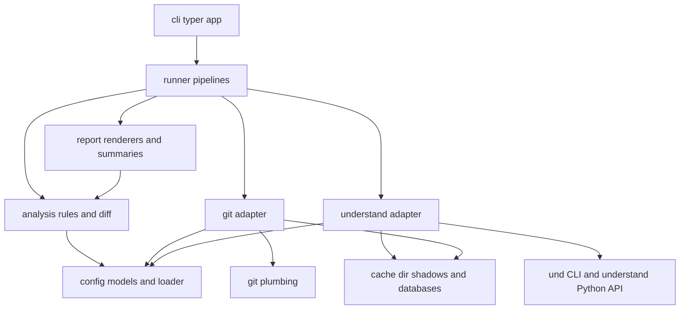
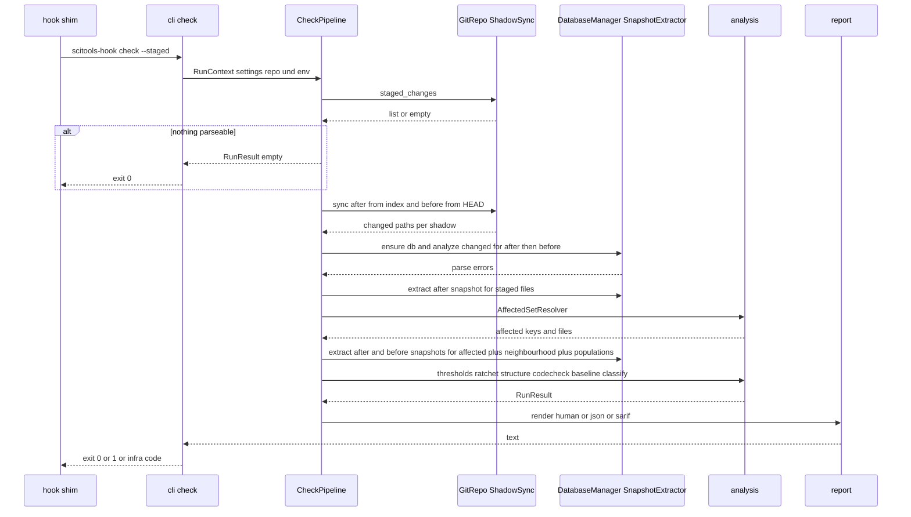
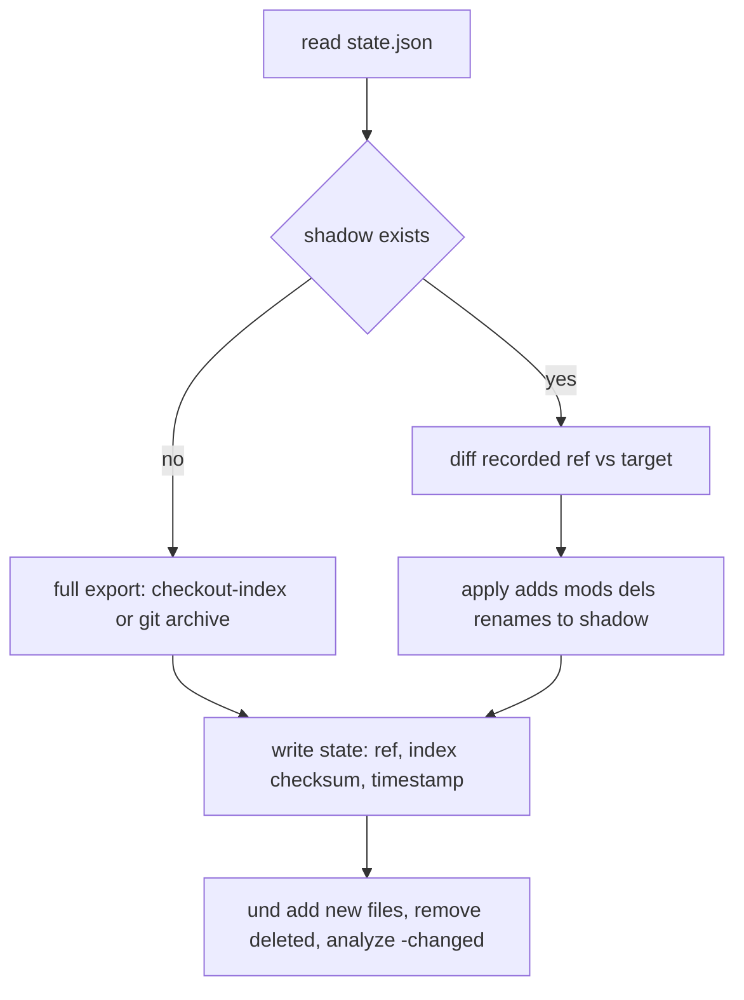

# Design Document — maintainability-gate

## Overview

**Purpose**: `scitools-hook` (the Gate) puts SciTools Understand at the commit boundary. It analyzes only the staged change, compares affected routines/classes/files before and after, blocks commits that break configured limits or make code worse, explains every finding so a coding agent can fix it, and produces structural summaries and graphs so a human can review an agent's change by shape.

**Users**: developers supervising coding agents (hook + `check`), coding agents themselves (`check --format json`, `agent-rules`), reviewers (`explain`), team leads (`baseline`, adaptive limits), CI (`check --all`).

**Impact**: greenfield. Produces one installable `uv` package (`scitools-hook`) with a single console script, a `.pre-commit-hooks.yaml`, and a native hook installer. Nothing is written into a target repository's working tree unless explicitly asked (`init`, `baseline`, `agent-rules --write`).

### Goals
- Staged-mode gate that runs in under 30 s on a warm cache for ≤ 20 changed files (4.11).
- One `Finding` contract shared by thresholds, ratchets, structural rules and CodeCheck, rendered as human text, JSON, SARIF and Markdown.
- Core logic that is unit-testable without an Understand license.
- The tool passes its own default gate.

### Non-Goals
- Installing or licensing Understand; any analysis engine other than Understand.
- Trend dashboards, publishing to SONAR/Jenkins, server-side enforcement.
- Auto-fixing code; IDE integration; a plugin system.

## Boundary Commitments

### This Spec Owns
- Locating and validating an Understand installation; loading its Python API into the running interpreter.
- The per-repository analysis cache: shadow trees, Understand databases, sync state — their layout, lifecycle and invalidation.
- Configuration schema (TOML + env + CLI), defaults, precedence, validation, and the baseline file format.
- Extraction of a `ProjectSnapshot` from an Understand database for a bounded set of entities.
- All rule evaluation: thresholds (with stats prefixes and synthetic metrics), ratchet, structural rules (cycles, layers, fan, new-deps, node coupling), CodeCheck mapping, pre-existing/blocking classification.
- All output contracts: human, JSON (`schema_version`), SARIF 2.1.0, Markdown change summary, agent-rules snippet, exit codes.
- Hook shim content, installation/uninstallation/chaining, `.pre-commit-hooks.yaml`.

### Out of Boundary
- Understand's parsing accuracy, metric definitions, CodeCheck rule content, graph rendering.
- git semantics (index, `HEAD`, hooks path) — consumed via plumbing commands, never reimplemented.
- pre-commit framework orchestration (stashing, file filtering, caching).
- Editing source files to remediate findings; generating agent instruction files beyond the marked snippet.

### Allowed Dependencies
- External processes: `und`, `git`. External modules: `understand` (loaded from `SCITOOLS_HOME`), `typer`, `rich`, `pydantic`, `platformdirs`; stdlib `tomllib`, `json`, `subprocess`, `statistics`.
- Layer direction (enforced by an import-direction test, a violation is a review blocker):
  `config → models → understand | git → analysis → report → runner → cli`
  Allowed-import matrix: every layer may import `config` and `models`; `understand/` and `git/` import nothing from each other nor from `analysis`, `report`, `runner`, `cli`; `analysis` imports only `config`/`models`; `report` imports `config`/`models`/`analysis`; `runner` imports everything below it; `cli` imports `runner` (plus `config`/`models` for option types). `understand/worker.py` imports nothing from `scitools_hook`. `analysis` and `report` never touch the filesystem or subprocesses.

### Revalidation Triggers
- Change to `Finding` or `RunResult` JSON schema (bump `schema_version`; agent-rules text and SARIF writer must be re-checked).
- Change to `EntityKey` composition (ratchet matching, baseline keys, explain diff all depend on it).
- Change to cache layout or `state.json` (`db` commands, `doctor`, tests with fixture caches).
- Change to hook shim environment variables or exit codes (documentation, `.pre-commit-hooks.yaml`, CI users).
- Understand major version change (API/CLI switches used by the adapter).

## Architecture

### Architecture Pattern & Boundary Map

Layered core with two adapters. Analysis works on immutable snapshots extracted from a database, never on live `understand` objects (only one database may be open per process, and the core must be testable without a license).



**Architecture Integration**:
- Selected pattern: layered core + adapters (ports are Python `Protocol`s so tests substitute fakes).
- Domain boundaries: `config` (what is allowed), `models` (the shared vocabulary: snapshots, findings, cache state, git change records — pure data, no behaviour beyond validation), adapters (how to get data), `analysis` (what is wrong), `report` (how to say it), `runner` (in which order), `cli` (how it is invoked).
- Steering compliance: `src/` layout, strict layer direction, small modules, typed models validated at boundaries, lazy `understand` import confined to the adapter.
- Refinement of steering: a `runner` layer is added between `report` and `cli` to hold orchestration; `tech.md`/`structure.md` are updated accordingly.

### Technology Stack

| Layer | Choice / Version | Role in Feature | Notes |
|-------|------------------|-----------------|-------|
| CLI | Python 3.12, `typer` ≥ 0.12, `rich` ≥ 13 | subcommands, help, colour-aware human output | `rich` only in `report/human.py` and `cli/` |
| Core | `pydantic` ≥ 2.7, stdlib `tomllib`, `statistics` | typed config/report models, TOML config, stats prefixes | no `any`-style dicts across layer boundaries |
| Adapters | `subprocess` (`und`, `git`, `upython`), `understand` API (from install), `platformdirs` ≥ 4 | database lifecycle, snapshot extraction, graphs, shadow sync, hooks | `understand` is not a package dependency; the PyPI package named `understand` is unrelated and must never be installed |
| API worker | `src/scitools_hook/understand/worker.py` — stdlib + `understand` only | runs every `understand`-API operation as a subprocess under `<home>/bin/<plat>/upython` by default; in-process only when configured | decouples the `uvx` interpreter from Understand's Python minor; verified that in-process import of a licensed 6.5 module aborts system CPython 3.12 on Linux |
| Packaging | `uv` project, hatchling backend, `requires-python = ">=3.12"` | `uvx scitools-hook` on any 3.12+ default interpreter | `uvx` ignores `requires-python` for PyPI tools, so a `<3.13` pin would break users on 3.13/3.14; the worker fallback makes the pin unnecessary |
| Test | `pytest`, `pytest-cov`, fake adapters, temp git repos | unit + hook tests without license; contract tests with license | `SCITOOLS_HOME` gates contract tests |
| Quality | `ruff`, `mypy --strict` | lint/format/type | the gate runs on itself in CI |

## File Structure Plan

### Directory Structure
```
pyproject.toml                         # uv project, scripts entry, tool config (ruff, mypy, pytest)
.pre-commit-hooks.yaml                 # pre-commit framework hook definition
README.md
src/scitools_hook/
├── __init__.py                        # __version__
├── exit_codes.py                      # ExitCode enum (single source for 1.6)
├── errors.py                          # typed error hierarchy → exit codes
├── config/
│   ├── models.py                      # Settings, ThresholdSpec, StructureRules, LayerRule, CouplingRule, SeverityMap
│   ├── defaults.py                    # built-in thresholds, default exclude patterns, hint catalogue defaults
│   ├── loader.py                      # precedence merge: defaults < user < repo < env < cli; provenance map
│   ├── validate.py                    # metric-name/scope/regex validation against a MetricCatalogue
│   ├── metric_names.py                # parse "PREFIX:Metric", scope↔kind mapping, synthetic metric registry
│   └── template.py                    # `init` output (commented TOML)
├── models/                            # shared pure-data layer (pydantic), importable by every layer above config
│   ├── snapshot.py                    # EntityKey, EntityRef, EntityRecord, DepEdge, ArchNode, ProjectSnapshot, ParseError
│   ├── findings.py                    # Finding, RunResult, EffectiveThreshold, TightenedLimit, HighestValue, rule-name grammar helpers
│   ├── change.py                      # AffectedSet, EntityDelta, DependencyDelta, ImpactSet, GraphFile, GraphTarget, ChangeSummary
│   ├── understand.py                  # UnderstandEnv, AnalyzeResult, LicenseStatus, RawViolation, ExtractRequest
│   ├── git.py                         # StagedChange, SyncTarget variants, SyncDelta
│   ├── cache.py                       # CachePaths, SyncState, repo_id() and cache-root rule
│   ├── baseline.py                    # Baseline, BaselineIssue
│   └── progress.py                    # Progress and CommandLog protocols (+ no-op implementations)
├── understand/
│   ├── locator.py                     # resolve SCITOOLS_HOME (precedence, well-known dirs), verify und + API + upython
│   ├── api_runner.py                  # ApiRunner: run a worker operation in-process or under upython; JSON in/out; error mapping
│   ├── worker.py                      # STDLIB-ONLY worker: snapshot/impact/graphs/catalogue/archs against `understand`; CLI entry for upython
│   ├── und_cli.py                     # subprocess wrapper: create/add/analyze/list/codecheck/license/version with timeouts
│   ├── database.py                    # DatabaseManager: cache layout, create/rebuild/analyze-changed, state.json
│   ├── snapshot.py                    # SnapshotExtractor: builds ExtractRequest, calls ApiRunner, validates → ProjectSnapshot
│   ├── impact.py                      # ImpactExpander: ApiRunner "impact" op → ImpactSet
│   ├── graphs.py                      # GraphExporter: ApiRunner "graphs" op (Ent.draw butterfly / depends-on → SVG)
│   ├── codecheck.py                   # CodeCheckRunner: und codecheck -files … → raw violations (CSV parse)
│   ├── catalogue.py                   # MetricCatalogue: ApiRunner "catalogue" op (understand.Metric.list per language)
│   └── fake.py                        # FixtureUndCli / FixtureApiRunner: fixture-backed adapters behind SCITOOLS_HOOK_FAKE_UNDERSTAND
├── git/
│   ├── repo.py                        # GitRepo: root, HEAD, staged changes, hooks path, plumbing wrappers
│   ├── shadow.py                      # ShadowSync: materialize index/HEAD/commit/worktree into cache shadows incrementally
│   ├── hook_template.sh               # shim (no logic), chained-hook support
│   └── hooks.py                       # HookInstaller: install/uninstall/chain/global
├── analysis/                          # pure logic over models/; no I/O
│   ├── affected.py                    # AffectedSetResolver: staged files + dependents whose deps changed
│   ├── population.py                  # stats-prefix reducers (AVG/MEDIAN/…); ignore-list filtering
│   ├── thresholds.py                  # ThresholdEvaluator (absolute limits, min/max, unavailable metrics)
│   ├── ratchet.py                     # RatchetEvaluator (before/after per EntityKey, pre-existing classification)
│   ├── structure/
│   │   ├── graph.py                   # directed graph utils, Tarjan SCC
│   │   ├── cycles.py                  # new file/arch cycles (before vs after)
│   │   ├── layers.py                  # allowed-dependency rules between architecture nodes
│   │   ├── fan.py                     # fan-in/out thresholds + fan-out ratchet
│   │   └── coupling.py                # new-deps-per-file limit, node-pair reference limits
│   ├── codecheck.py                   # map raw CodeCheck violations → Finding
│   ├── baseline.py                    # apply (min of config/baseline), tighten, capture, parse-from-dict with issues (no file I/O)
│   ├── classify.py                    # blocking / warning / pre-existing decision, strict mode
│   └── change_summary.py              # ChangeSummary builder (entity diffs, dep diffs, rankings, impact)
├── report/
│   ├── hints.py                       # HintCatalogue (defaults + config overrides)
│   ├── human.py                       # grouped/ordered text, agent instruction block, TTY/colour handling
│   ├── json_out.py                    # RunResult → JSON (schema_version 1)
│   ├── sarif.py                       # RunResult → SARIF 2.1.0
│   ├── markdown.py                    # ChangeSummary → Markdown / text
│   └── agent_rules.py                 # deterministic rules snippet; marker insertion into a file
├── runner/
│   ├── context.py                     # RunContext: settings+provenance, repo, understand env, adapters; test seam SCITOOLS_HOOK_FAKE_UNDERSTAND
│   ├── baseline_store.py              # BaselineStore: read/write the baseline file at the configured path
│   ├── check.py                       # CheckPipeline: sync → analyze → snapshots → rules → hints → baseline → RunResult
│   ├── explain.py                     # ExplainPipeline: sync → snapshots → ChangeSummary (+graphs, impact)
│   ├── baseline_cmd.py                # baseline capture pipeline
│   └── doctor.py                      # environment report
└── cli/
    ├── app.py                         # typer app, global options (--scitools-home, --config, --verbose, --format, --output)
    ├── common.py                      # option groups: selection mode, format, exit-code mapping, error handler
    ├── check.py                       # `check`
    ├── explain.py                     # `explain`
    ├── baseline.py                    # `baseline`
    ├── config_cmd.py                  # `init`, `config`
    ├── db.py                          # `db path|rebuild|analyze`
    ├── hooks.py                       # `install-hook`, `uninstall-hook`
    ├── doctor.py                      # `doctor`
    └── agent_rules.py                 # `agent-rules`
tests/
├── conftest.py                        # fixtures: temp git repo builder, contract marker, FakeCommandLog
├── fakes/                             # FakeUndCli, FakeApiRunner, FakeSnapshotExtractor (each added by the task owning the real one)
├── config/ analysis/ report/ git/ runner/ cli/   # mirror src
├── fixtures/                          # sample snapshots (JSON), sample codecheck CSV, sample TOML
└── contract/                          # real Understand tests (skipped without SCITOOLS_HOME + license)
```

### Modified Files
- `.kiro/steering/tech.md`, `.kiro/steering/structure.md` — add the `runner` layer and `platformdirs` (steering sync, not shipped code).

## System Flows

### `check --staged` (hook path)



Flow decisions: the before database is only synced/analyzed in `--staged`, `--worktree`, `--files` and `explain --range` modes; `--all` uses the after database only. Snapshot extraction happens twice (after, then before) because only one database can be open at a time; both extractions use the same `EntityKey` set plus the population metrics named by stats-prefixed thresholds. Progress lines go to stderr when a phase exceeds 5 s (4.11).

### Shadow synchronisation



Targets: `index` (after, default), `worktree` (after, `--worktree`), `HEAD` (before), `<commit>` (explain `--range`). The index checksum is `git write-tree` of the current index; the before ref is the commit hash. A changed target kind (e.g. worktree after index) forces a full re-sync of that shadow.

## Requirements Traceability

| Requirement | Summary | Components | Interfaces | Flows |
|-------------|---------|------------|------------|-------|
| 1.1 | Install dir precedence | Locator | `Locator.resolve` | — |
| 1.2 | Verify und + API | Locator, ApiRunner, worker, UndCli | `verify`, `ApiRunner.run("ping")` | check |
| 1.3 | Not-found exit + tried list | Locator, errors, cli/common | `UnderstandNotFoundError` | — |
| 1.4 | License exit | ApiRunner (worker error envelope), UndCli, errors | `LicenseError` | — |
| 1.5 | doctor report | runner/doctor, cli/doctor | `DoctorReport` | — |
| 1.6 | Exit codes | exit_codes, errors, cli/common | `ExitCode` | — |
| 2.1 | Create DB on first run | DatabaseManager, ShadowSync | `ensure_database` | shadow |
| 2.2 | Never write into worktree | DatabaseManager (cache layout), HookInstaller, cli | — | — |
| 2.3 | Incremental analyze | DatabaseManager | `analyze_changed` | shadow |
| 2.4 | Language detection | DatabaseManager, config | `detect_languages` | — |
| 2.5 | Include/exclude patterns | config/defaults, ShadowSync | `Settings.project` | shadow |
| 2.6 | Parse errors listed, rules still run | UndCli, RunResult, report | `AnalyzeResult.parse_errors` | check |
| 2.7 | Rebuild | DatabaseManager, cli/db | `rebuild` | — |
| 2.8 | DB path | DatabaseManager, cli/db | `paths()` | — |
| 3.1 | Defaults | config/defaults | `DEFAULT_THRESHOLDS` | — |
| 3.2 | Precedence merge | config/loader | `load_settings` | — |
| 3.3 | Scope→metric→max grammar | config/models, metric_names | `ThresholdSpec` | — |
| 3.4 | Stats prefixes | metric_names, population | `parse_metric_name`, `reduce` | check |
| 3.5 | Synthetic metrics | metric_names, snapshot | `SYNTHETIC_METRICS` | — |
| 3.6 | Ignore regexes | config/models, population | `IgnoreRules.filter` | check |
| 3.7 | Severity per rule | config/models, classify | `SeverityMap` | check |
| 3.8 | Config validation errors | config/validate, MetricCatalogue | `validate_settings` | — |
| 3.9 | init | config/template, cli/config_cmd | `render_template` | — |
| 3.10 | config show with provenance | config/loader, cli/config_cmd | `Provenance` | — |
| 4.1 | Index not worktree | ShadowSync (index target) | `sync(target=Index)` | shadow |
| 4.2 | Affected set incl. dependents | AffectedSetResolver | `resolve` | check |
| 4.3 | Before from HEAD | ShadowSync (HEAD target), CheckPipeline | `sync(target=Commit)` | check |
| 4.4 | Ratchet finding | RatchetEvaluator | `evaluate` | check |
| 4.5 | New entity → absolute only | RatchetEvaluator | — | check |
| 4.6 | Pre-existing non-blocking | classify | `classify` | check |
| 4.7 | Strict mode | classify, config | `Settings.ratchet.strict` | check |
| 4.8 | Whole-project mode | CheckPipeline, ThresholdEvaluator | `Selection.All` | check |
| 4.9 | Nothing parseable → exit 0 | CheckPipeline | — | check |
| 4.10 | Deletions only | AffectedSetResolver, structure | — | check |
| 4.11 | ≤30 s, progress messages | CheckPipeline, DatabaseManager | `Progress` | check |
| 5.1 | Routine metrics | defaults, ThresholdEvaluator | — | — |
| 5.2 | Class metrics | defaults, ThresholdEvaluator | — | — |
| 5.3 | File metrics | defaults, ThresholdEvaluator | — | — |
| 5.4 | Project + stats over population | population, ThresholdEvaluator | `reduce` | check |
| 5.5 | Unavailable metrics reported once | MetricCatalogue, ThresholdEvaluator, RunResult | `unavailable_metrics` | check |
| 5.6 | Highest values | ThresholdEvaluator, report/human | `RunResult.highest` | — |
| 6.1 | New file cycles | structure/cycles | `find_new_cycles` | check |
| 6.2 | New arch cycles | structure/cycles | `find_new_cycles(arch)` | check |
| 6.3 | Layer rules | structure/layers | `LayerRule` | check |
| 6.4 | Fan thresholds + fan-out ratchet | structure/fan | `evaluate_fan` | check |
| 6.5 | New deps per file | structure/coupling | `new_dependencies` | check |
| 6.6 | Node-pair coupling | structure/coupling | `CouplingRule` | check |
| 6.7 | Architecture source, dir depth | SnapshotExtractor, config | `ArchNode` | — |
| 6.8 | Unknown arch → config error | SnapshotExtractor, validate | `ArchitectureNotFoundError` | — |
| 6.9 | CodeCheck | CodeCheckRunner, analysis/codecheck | `run_codecheck` | check |
| 7.1 | Finding fields | analysis/models | `Finding` | — |
| 7.2 | Hint catalogue | report/hints | `HintCatalogue` | — |
| 7.3 | Human grouping/order/summary | report/human | `render_human` | — |
| 7.4 | JSON schema | report/json_out | `render_json` | — |
| 7.5 | SARIF | report/sarif | `render_sarif` | — |
| 7.6 | No colour when non-TTY | report/human, cli | `ColorMode` | — |
| 7.7 | stdout vs stderr | cli/common, runner | `Console` split | — |
| 7.8 | Quiet | report/human | `Verbosity` | — |
| 7.9 | Exit by blocking | classify, cli/common | `RunResult.blocking_count` | — |
| 8.1 | baseline capture | runner/baseline_cmd, analysis/baseline | `capture` | — |
| 8.2 | Effective = min(config, baseline) | analysis/baseline | `apply` | check |
| 8.3 | Tighten + report | analysis/baseline, RunResult | `tighten` | check |
| 8.4 | Never raise | analysis/baseline | invariant | — |
| 8.5 | Limit source in finding | Finding.limit_source | — | — |
| 8.6 | Baseline errors non-fatal | analysis/baseline | `BaselineIssue` | — |
| 9.1 | Change summary per file | change_summary | `ChangeSummary` | explain |
| 9.2 | Dependency diff by node | change_summary | `DependencyDelta` | explain |
| 9.3 | Rankings | change_summary | `rank` | explain |
| 9.4 | Graph export | GraphExporter | `export_graphs` | explain |
| 9.5 | Change impact | understand/impact, change_summary | `ImpactSet` | explain |
| 9.6 | text/markdown/json | report/markdown, json_out | — | — |
| 9.7 | Architecture path | EntityRecord.archs | — | — |
| 9.8 | Open-in-GUI command | DatabaseManager.paths, report/markdown | — | — |
| 10.1 | agent-rules snippet | report/agent_rules | `render_rules` | — |
| 10.2 | Deterministic | report/agent_rules | — | — |
| 10.3 | Marker insertion | report/agent_rules | `insert_between_markers` | — |
| 10.4 | Agent block on block | report/human | — | — |
| 10.5 | Worktree mode | ShadowSync (worktree target) | `Selection.Worktree` | shadow |
| 11.1 | Install shim | HookInstaller, hook_template | `install` | — |
| 11.2 | Refuse/force/chain | HookInstaller | `install(force)` | — |
| 11.3 | No logic in shim | hook_template | — | — |
| 11.4 | Infra failure blocks, soft-fail var | hook_template, exit_codes | `SCITOOLS_HOOK_SOFT_FAIL` | — |
| 11.5 | Skip var | hook_template | `SCITOOLS_HOOK_SKIP` | — |
| 11.6 | Uninstall | HookInstaller | `uninstall` | — |
| 11.7 | pre-commit yaml | `.pre-commit-hooks.yaml` | — | — |
| 11.8 | Framework file list | cli/check, Selection.Files | `--files` | check |
| 11.9 | Global hooks path | HookInstaller | `install(global)` | — |
| 12.1 | Subcommands + help | cli/* | typer | — |
| 12.2 | uvx runnable | pyproject | scripts entry | — |
| 12.3 | Selection modes | cli/common | `Selection` | — |
| 12.4 | Formats/output | cli/common | `--format`, `--output` | — |
| 12.5 | Outside git | GitRepo, cli/common | `NotAGitRepositoryError` | — |
| 12.6 | Never prompt | cli | — | — |
| 12.7 | Unexpected errors | cli/common | error handler | — |
| 12.8 | Verbose command tracing | UndCli, GitRepo | `CommandLog` | — |

## Components and Interfaces

| Component | Layer | Intent | Req Coverage | Key Dependencies | Contracts |
|-----------|-------|--------|--------------|------------------|-----------|
| ExitCode / errors | root | one mapping from failure kind to exit code | 1.3, 1.4, 1.6, 12.7 | — | Service |
| Settings + loader + validate | config | typed effective configuration with provenance | 3.1–3.10, 6.8 | MetricCatalogue (P1) | Service, State |
| Locator + ApiRunner + worker | understand | find Understand; run API operations in-process or under `upython` | 1.1–1.4 | filesystem (P0), `upython` (P1) | Service |
| UndCli | understand | run `und` with timeouts, parse results | 1.2, 2.x, 6.9, 12.8 | `und` (P0) | Service |
| DatabaseManager | understand | cache layout, DB lifecycle, incremental analyze, state | 2.1–2.8, 4.11, 9.8 | UndCli (P0), ShadowSync (P0) | Service, State |
| SnapshotExtractor | understand | ProjectSnapshot from a DB for keys + populations | 3.5, 5.x, 6.7, 9.7 | `understand` API (P0) | Service |
| ImpactExpander | understand | transitive reverse references | 9.5 | `understand` API (P0) | Service |
| GraphExporter | understand | SVG graphs for entities/files | 9.4 | `understand` API (P0) | Service |
| CodeCheckRunner | understand | run CodeCheck on files, parse CSV | 6.9 | UndCli (P0) | Batch |
| MetricCatalogue | understand | available metrics per language | 3.8, 5.5 | `understand` API (P1) | Service |
| GitRepo | git | plumbing wrapper | 4.1, 4.3, 11.x, 12.5 | `git` (P0) | Service |
| ShadowSync | git | materialize index/HEAD/commit/worktree incrementally | 2.2, 2.5, 4.1, 4.3, 10.5 | GitRepo (P0) | Service, State |
| HookInstaller + shim | git | install/uninstall/chain | 11.1–11.6, 11.9 | GitRepo (P0) | Service |
| models | models | EntityKey, Snapshot, Finding, RunResult, EffectiveThreshold, cache/git/understand records | 7.1 | — | State |
| BaselineStore | runner | read/write the baseline file | 8.1, 8.6 | filesystem (P0) | State |
| AffectedSetResolver | analysis | affected entities and files | 4.2, 4.10 | — | Service |
| ThresholdEvaluator + population | analysis | absolute + stats limits | 3.3–3.6, 5.1–5.6 | — | Service |
| RatchetEvaluator | analysis | before/after comparison | 4.4, 4.5 | — | Service |
| Structure evaluators | analysis | cycles, layers, fan, coupling | 6.1–6.6 | — | Service |
| CodeCheck mapper | analysis | raw violation → Finding | 6.9 | — | Service |
| BaselineManager | analysis | apply/tighten/persist rules | 8.1–8.6 | — | Service, State |
| classify | analysis | blocking / pre-existing / strict | 4.6, 4.7, 7.9 | — | Service |
| ChangeSummaryBuilder | analysis | explain data | 9.1–9.3, 9.5, 9.7 | — | Service |
| HintCatalogue | report | remediation text | 7.2 | — | Service |
| Renderers (human/json/sarif/markdown) | report | output contracts | 7.3–7.8, 9.6, 10.4 | — | Service |
| AgentRulesRenderer | report | rules snippet + marker insert | 10.1–10.3 | — | Service |
| CheckPipeline / ExplainPipeline / BaselineCmd / Doctor | runner | orchestration | 1.5, 4.8, 4.9, 4.11, 8.x, 9.x | all adapters (P0) | Service |
| cli | cli | typer commands, options, exit mapping | 12.1–12.8, 7.6, 7.7 | runner (P0) | — |

### Root

#### ExitCode and errors

| Field | Detail |
|-------|--------|
| Intent | One enum and one error hierarchy so every failure has exactly one exit code |
| Requirements | 1.3, 1.4, 1.6, 12.7 |

```python
class ExitCode(IntEnum):
    OK = 0; VIOLATIONS = 1; CONFIG_ERROR = 2; UNDERSTAND_NOT_FOUND = 3
    LICENSE_UNAVAILABLE = 4; ANALYSIS_FAILED = 5; NOT_A_GIT_REPO = 6; UNEXPECTED = 70

class GateError(Exception): exit_code: ExitCode; hint: str | None
class ConfigError(GateError): file: Path | None; key: str | None
class UnderstandNotFoundError(GateError): tried: list[str]
class LicenseError(GateError): und_output: str
class AnalysisFailedError(GateError): command: list[str]; stderr: str
class NotAGitRepositoryError(GateError)
class ArchitectureNotFoundError(ConfigError): available: list[str]
```
- Postcondition: `cli/common.handle()` maps `GateError → exit_code`, any other exception → `UNEXPECTED` with traceback under `--verbose`.

### Config

#### Settings, loader, validation

| Field | Detail |
|-------|--------|
| Intent | Effective, validated configuration with the source of every value |
| Requirements | 3.1–3.10, 6.7, 6.8, 2.4, 2.5 |

```python
class Limit(BaseModel):            # scalar in TOML means {max: x}
    max: float | None = None
    min: float | None = None

Scope = Literal["routine", "class", "file", "project", "arch"]

class ThresholdSpec(BaseModel):
    scope: Scope
    metric: str                    # raw name, may carry "PREFIX:" (3.4) — parsed by metric_names
    limit: Limit
    severity: Literal["error", "warning"] = "error"
    ratchet: bool = True

class LayerRule(BaseModel):  name: str; node: str; may_depend_on: list[str]
class CouplingRule(BaseModel): from_node: str; to_node: str; max_refs: int
class StructureRules(BaseModel):
    architecture: str = "Directory Structure"; depth: int = 2
    file_cycles: Severity = "error"; arch_cycles: Severity = "error"
    max_new_dependencies_per_file: int | None = 5
    fan: dict[str, Limit]          # keys: file_fan_in, file_fan_out, class_fan_in, class_fan_out
    layers: list[LayerRule] = []; coupling: list[CouplingRule] = []
class CodeCheckSettings(BaseModel): config: str | None; severity: Severity = "warning"
class BaselineSettings(BaseModel): file: Path = Path("scitools-hook.baseline.json"); adaptive: bool = False
class IgnoreRules(BaseModel): files: list[str]; classes: list[str]; routines: list[str]  # regex
class ProjectSettings(BaseModel): include: list[str]; exclude: list[str]; languages: list[str] | None
class UnderstandSettings(BaseModel): home: Path | None; db_location: Literal["cache", "gitdir"] = "cache"; api_mode: Literal["auto", "inprocess", "upython"] = "auto"   # auto = upython when present, else in-process (verified: in-process crashes on Linux 6.5 once licensed)
class OutputSettings(BaseModel): graphs_max: int = 20; impact_depth: int = 3; show_highest: bool = False
class RatchetSettings(BaseModel): strict: bool = False        # TOML [ratchet] strict = …
class Settings(BaseModel):
    understand: UnderstandSettings; project: ProjectSettings; thresholds: list[ThresholdSpec]
    ratchet: RatchetSettings; ignore: IgnoreRules; structure: StructureRules
    codecheck: CodeCheckSettings; baseline: BaselineSettings; hints: dict[str, str]; output: OutputSettings

class Provenance(BaseModel): values: dict[str, str]   # dotted key → "default|user:<path>|repo:<path>|env:<VAR>|cli"

def load_settings(repo_root: Path | None, cli_overrides: dict[str, object], env: Mapping[str, str]) -> tuple[Settings, Provenance]
class MetricAvailability(Protocol):            # declared in config so config never imports understand/
    def available(self, language: str, scope: Scope) -> set[str]
def validate_settings(settings: Settings, availability: MetricAvailability | None) -> None   # raises ConfigError; understand/catalogue.MetricCatalogue satisfies the protocol
```
- Preconditions: TOML files parse; unknown top-level keys are a `ConfigError` (3.8). Regexes compile at load.
- Postconditions: `thresholds` is flattened from the TOML tables `[thresholds.routine] Metric = 10` / `Metric = {max = 10}` / `"AVG:Metric" = 3`; provenance covers every leaf.
- Invariants: precedence `defaults < user file < repo file < env (SCITOOLS_HOOK_*) < cli`; a source overrides only keys it defines (deep merge on tables, replace on lists).
- Validation against `MetricCatalogue` is optional at load (catalogue needs Understand); when present, unknown metric names or scopes fail with file+key (3.8); `structure.architecture` existence is validated later by `SnapshotExtractor` (6.8).

#### metric_names

```python
STATS_REDUCERS: dict[str, Callable[[Sequence[float]], float]]  # AVG, MEDIAN, MEDIANHIGH, MEDIANLOW, MEDIANGROUPED, MODE, STDEV, VARIANCE
SYNTHETIC_METRICS: dict[str, SyntheticMetric]   # CountParams (routine), CountDeclMethodNonStub (class)
class MetricRef(NamedTuple): prefix: str | None; metric: str
def parse_metric_name(raw: str) -> MetricRef        # exactly one ':' allowed; unknown prefix → ConfigError
SCOPE_KINDS: dict[Scope, str]   # routine → "function ~unknown ~unresolved, method ..., procedure ..., classmethod ..."; class → "class ~unknown ~unresolved, interface ..., struct ..."; file → "file ~unknown ~unresolved"
```

### Understand adapter

#### Locator and ApiRunner

| Field | Detail |
|-------|--------|
| Intent | Resolve `SCITOOLS_HOME`, verify `und`, `upython` and the Python API; execute API operations in whichever interpreter can load the module |
| Requirements | 1.1, 1.2, 1.3, 1.4 |

```python
class UnderstandEnv(BaseModel):
    home: Path; und: Path; upython: Path | None; python_api_dir: Path; version: str
    source: str                                  # which precedence step matched
    api_mode: Literal["inprocess", "upython"]    # decided by verify()
class Locator(Protocol):
    def resolve(self, cli_home: Path | None, env: Mapping[str, str], settings_home: Path | None) -> UnderstandEnv  # raises UnderstandNotFoundError(tried)
def candidates(env, cli_home, settings_home) -> list[tuple[str, Path]]   # ordered (source, path) incl. PATH lookup of `und` and per-OS well-known dirs
class Probes(Protocol):                       # injected so the locator has no dependency on UndCli/ApiRunner and is testable with stubs
    def und_version(self, und: Path) -> str
    def inprocess_import(self, api_dir: Path, bin_dir: Path) -> str | None      # API version or None with reason logged
    def upython_ping(self, upython: Path, worker: Path) -> str | None
def verify(env: UnderstandEnv, preferred: Literal["auto","inprocess","upython"], probes: Probes) -> UnderstandEnv
    # runs und_version; with preferred="auto": upython_ping first (default mode when <home>/bin/<plat>/upython exists),
    # in-process import (sys.path += <home>/bin/<plat>/Python) only as fallback or when preferred="inprocess" — the in-process
    # probe runs in a *subprocess* of the host interpreter because a failing import can abort the process (Perl XS symbol lookup);
    # neither usable → UnderstandNotFoundError with both reasons
    # runner wires the real probes: UndCli.version, ApiRunner in-process import, ApiRunner upython "ping"

class ApiRunner:
    """Executes worker operations. Same code path for both modes: worker functions take/return JSON-serializable dicts."""
    def __init__(self, env: UnderstandEnv, log: CommandLog, timeout_s: int = 600): ...
    def run(self, op: Literal["ping","catalogue","archs","snapshot","impact","graphs"], request: dict[str, object]) -> dict[str, object]
        # inprocess: import scitools_hook.understand.worker; call worker.dispatch(op, request)
        # upython:   subprocess [upython, worker.py, op] with request JSON on stdin, result JSON on stdout; stderr → diagnostics
        # worker error envelope {"error": {"type": "NoApiLicense"|"DBUnableOpen"|..., "message": ...}} → LicenseError / AnalysisFailedError
```
- `worker.py` imports only the standard library and `understand`; it never imports `scitools_hook.*` (it must run under `upython`, which has no third-party packages). Its `dispatch()` is the single implementation used by both modes.
- Well-known dirs: Linux `~/scitools`, `/opt/scitools`, `/usr/local/scitools`; macOS `/Applications/Understand.app/Contents/MacOS`; Windows `C:\Program Files\SciTools`. Platform bin subdir: `linux64`, `macosx`, `pc-win64`.
- `doctor` reports both probes (in-process import result with interpreter version, `upython` ping result) and the chosen `api_mode`. Setting `understand.api_mode` in config or `--api-mode` forces one.

#### UndCli

```python
class CommandLog(Protocol): def record(self, argv: list[str], seconds: float, rc: int) -> None
class UndCli:
    def __init__(self, env: UnderstandEnv, log: CommandLog, timeout_s: int = 900): ...
    def version(self) -> str
    def license_status(self) -> LicenseStatus            # parses `und license`; ok | missing(text)
    def create(self, db: Path, languages: list[str], local: bool = True) -> None
    def add(self, db: Path, root: Path, exclude: list[str]) -> None
    def remove_files(self, db: Path, files: list[Path]) -> None
    def analyze(self, db: Path, files: list[Path] | None, all: bool = False) -> AnalyzeResult   # -files @list | -changed | -all; parses errors/warnings
    def list_metrics(self, db: Path) -> list[str]
    def codecheck(self, db: Path, config: str, files: list[Path], out_dir: Path) -> Path      # returns violations CSV
class AnalyzeResult(BaseModel): parse_errors: list[ParseError]; warnings: int; seconds: float
class ParseError(BaseModel): path: Path; line: int | None; message: str
```
- Every call: `subprocess.run` with timeout, global switches (`-quiet`, `-db`) placed **before** the subcommand (verified: `und create … -quiet` is rejected as an unused argument), stderr captured; non-zero rc → `AnalysisFailedError(command, stderr)`; "No Und License Found" / "NoApiLicense" text → `LicenseError`. `und -isundlicensed` (prints `1`/`0`) backs `license_status()`.

#### DatabaseManager

| Field | Detail |
|-------|--------|
| Intent | Own the cache directory: shadows, databases, `state.json`; keep analysis incremental |
| Requirements | 2.1–2.8, 4.11, 9.8 |

```python
class CachePaths(BaseModel):
    root: Path                      # <user_cache>/scitools-hook/<repo_id>/  or <gitdir>/scitools-hook/
    before_tree: Path; after_tree: Path; before_db: Path; after_db: Path; state: Path; graphs: Path
class SyncState(BaseModel):
    after_target: Literal["index", "worktree", "commit"] | None
    after_tree_id: str | None      # git write-tree of index, content hash for worktree, commit hash for commit (explain --range)
    before_commit: str | None; languages: list[str]; created_with: str            # understand version
class DatabaseManager:
    def __init__(self, paths: CachePaths, und: UndCli, shadow: ShadowSync, settings: Settings, progress: Progress): ...
    def ensure_side(self, side: Literal["before", "after"], target: SyncTarget) -> AnalyzeResult
        # sync shadow → create db if missing (2.1, 2.4) → und add root with excludes (2.5) → remove deleted → analyze -files changed (2.3) or -all on first run
    def rebuild(self) -> None                                # 2.7: delete dbs + state, keep shadows, full analyze on next ensure
    def paths(self) -> CachePaths                            # 2.8, 9.8
    def detect_languages(self, files: Iterable[Path]) -> list[str]   # by extension map → Understand language names
```
- `repo_id = sha1(realpath(git common dir))[:16]`; `db_location = "gitdir"` places the cache under `.git/scitools-hook/` (still outside the working tree, 2.2).
- Databases are created with `-local` so Understand keeps analysis data beside the `.und` inside the cache rather than in the user profile.
- Progress: any phase > 5 s emits `phase: elapsed` lines to stderr (4.11).

#### SnapshotExtractor

| Field | Detail |
|-------|--------|
| Intent | Turn a database into an immutable `ProjectSnapshot` for a bounded entity set plus population metrics |
| Requirements | 3.5, 5.1–5.5, 6.1–6.7, 9.7 |

```python
class ExtractRequest(BaseModel):               # fully self-describing: the worker needs nothing from config
    files: set[str]                        # repo-relative paths of interest (affected + neighbourhood)
    kinds_by_scope: dict[Scope, str]       # Understand kind strings per scope (from config/metric_names.SCOPE_KINDS)
    metrics_by_scope: dict[Scope, list[str]]   # plain metric names (prefix stripped), synthetic included
    synthetic: list[str]                   # synthetic metric ids the worker must compute
    population_metrics: dict[Scope, list[str]] # for stats-prefixed thresholds: whole-project population
    ignore: dict[Scope, list[str]]         # regex ignore lists per scope, applied to populations and entity lists
    architecture: str; depth: int
    include_edges: bool = True
class SnapshotExtractor:
    def __init__(self, runner: ApiRunner, ignore: IgnoreRules, catalogue: MetricCatalogue): ...
    def extract(self, db_path: Path, req: ExtractRequest) -> ProjectSnapshot
        # runner.run("snapshot", {...}) → validated into ProjectSnapshot. The worker:
        # opens db, reads entities defined in req.files via SCOPE_KINDS + container file (ref "definein, declarein"),
        # computes synthetic metrics (CountParams = len(ent.ents("Define","Parameter ~Catch")); CountDeclMethodNonStub),
        # file edges via Ent.depends()/dependsby() with ref counts for files in req.files and their direct neighbours,
        # class edges likewise for classes in req.files, arch membership via Db.archs(container_file) trimmed to depth
        # (verified: Db.archs() is empty for routines/classes — only files are architecture members),
        # population metric vectors per scope (ignore rules applied), unavailable metrics per language, closes db.
```
- Preconditions: no other database open in the process. Postconditions: snapshot contains every entity in `req.files` that Understand resolved; unresolved/unknown kinds excluded; library entities excluded.
- Architecture lookup failure → `ArchitectureNotFoundError(available=[a.longname() for a in db.root_archs()])` (6.8).

#### ImpactExpander, GraphExporter, CodeCheckRunner, MetricCatalogue

```python
class ImpactExpander:  def expand(self, db_path: Path, keys: list[EntityKey], depth: int) -> dict[EntityKey, ImpactSet]
class ImpactSet(BaseModel): by_depth: dict[int, list[EntityRef]]; total: int
class GraphExporter:   def export(self, db_path: Path, targets: list[GraphTarget], out_dir: Path) -> list[GraphFile]
class GraphTarget(BaseModel): key: EntityKey; graph: Literal["Butterfly", "Depends On"]
class GraphFile(BaseModel): key: EntityKey; graph: str; path: Path
class CodeCheckRunner: def run(self, db_path: Path, config: str, files: list[str], out_dir: Path) -> list[RawViolation]
class RawViolation(BaseModel): check_id: str; check_name: str; path: str; line: int; column: int | None; message: str; entity: str | None
class MetricCatalogue: def __init__(self, api): ...; def available(self, language: str, scope: Scope) -> set[str]; def describe(self, metric: str) -> str
```
- Graph names map to Understand GUI names — verified on 6.5: routines `Butterfly`, `Calls`, `Called By`; files `Depends On`, `Depended On By`, `Butterfly` (`File Dependencies` is not a graph). A failed `draw` for one target is recorded as a warning, not a failure.

### Git adapter

#### GitRepo and ShadowSync

| Field | Detail |
|-------|--------|
| Intent | Read git state through plumbing; materialize sources into cache shadows without touching the worktree |
| Requirements | 4.1, 4.3, 10.5, 2.2, 2.5, 12.5, 12.8 |

```python
class StagedChange(BaseModel): status: Literal["A", "M", "D", "R"]; path: str; old_path: str | None
class GitRepo:
    @classmethod
    def discover(cls, cwd: Path, log: CommandLog) -> "GitRepo"     # raises NotAGitRepositoryError
    root: Path; git_dir: Path; common_dir: Path
    def head(self) -> str | None                                      # None on unborn branch → before side skipped, all entities "new"
    def staged_changes(self) -> list[StagedChange]                    # git diff --cached --name-status -M -z
    def index_tree_id(self) -> str                                    # git write-tree (read-only wrt index content)
    def diff_names(self, a: str, b: str) -> list[StagedChange]        # git diff --name-status -M -z a b
    def export_index(self, dest: Path, paths: list[str] | None) -> None   # git checkout-index -f --prefix=dest/ (-a | -z --stdin with paths); prefix must end with "/"
    def export_commit(self, commit: str, dest: Path, paths: list[str] | None) -> None   # git archive commit [paths] | tar -x
    def hooks_dir(self, global_: bool = False) -> Path                # core.hooksPath / rev-parse --git-path hooks / global hooks path
    def tracked_files(self) -> list[str]                              # git ls-files -z
SyncTarget = IndexTarget | WorktreeTarget | CommitTarget(commit: str)
class ShadowSync:
    def __init__(self, repo: GitRepo, paths: CachePaths, project: ProjectSettings): ...
    def sync(self, side: Literal["before","after"], target: SyncTarget, state: SyncState) -> SyncDelta   # incremental; returns added/modified/deleted paths and new state
class SyncDelta(BaseModel): added: list[str]; modified: list[str]; deleted: list[str]; full: bool
```
- Include/exclude patterns filter what is exported and what is `und add`-ed; default excludes: `.git`, `node_modules`, `venv*/.venv*`, `build`, `dist`, `target`, `__pycache__`, `*.min.js`, `*.generated.*`, lockfiles (2.5).
- Worktree target copies tracked + staged-new files from the working tree (10.5); index/commit targets never read the working tree (4.1).

#### HookInstaller and shim

```python
class HookInstaller:
    def __init__(self, repo: GitRepo): ...
    def install(self, force: bool = False, global_: bool = False) -> InstallReport   # 11.1, 11.2, 11.9
    def uninstall(self) -> InstallReport                                              # 11.6
class InstallReport(BaseModel): path: Path; chained: Path | None; action: Literal["installed","refused","uninstalled","restored"]
```
- Shim (`hook_template.sh`, POSIX sh): honours `SCITOOLS_HOOK_SKIP` (prints notice, exit 0 — 11.5); runs `scitools-hook check --staged` if on PATH else `uvx scitools-hook check --staged` (works on any default Python ≥ 3.12 thanks to the worker fallback; the installer records the exact command it chose in the shim header); if neither exists prints the message and exits 3; for rc ≥ 2 and `SCITOOLS_HOOK_SOFT_FAIL` set, prints a warning and continues (11.4); violations (rc 1) always block; finally `exec`s `pre-commit.scitools-hook-chained` if present (11.2). Marker line `# scitools-hook-shim v1` identifies shims for uninstall.
- `.pre-commit-hooks.yaml`: `id: scitools-hook`, `entry: scitools-hook check --files`, `language: python`, `pass_filenames: true`, `require_serial: true` (mandatory: without it pre-commit shards the file list across parallel invocations, each of which would build/analyze the database), `types: [file]` (11.7/11.8). No `language_version` pin: the worker fallback lets the hook run under whatever Python ≥ 3.12 pre-commit provides.

### Models (shared data layer)

#### Models

| Field | Detail |
|-------|--------|
| Intent | The shared vocabulary of the whole package (`models/`); adapters produce these, analysis consumes them |
| Requirements | 7.1, 4.2, 9.7 |

```python
class EntityKey(BaseModel, frozen=True):
    scope: Scope; path: str; longname: str; parameters: str | None    # path repo-relative; parameters for overloads
class EntityRef(BaseModel): key: EntityKey; kind: str; name: str; line: int | None
class EntityRecord(BaseModel):
    ref: EntityRef; language: str; metrics: dict[str, float]; archs: list[str]; is_new: bool = False
class DepEdge(BaseModel): src: str; dst: str; refs: int; crosses_arch: bool   # src/dst = file path or class key string
class ArchNode(BaseModel): path: str; members: list[str]                      # longname path at configured depth; member files
class ProjectSnapshot(BaseModel):
    side: Literal["before","after"]; languages: list[str]
    entities: dict[EntityKey, EntityRecord]
    file_edges: list[DepEdge]; class_edges: list[DepEdge]
    arch_nodes: list[ArchNode]; arch_edges: list[DepEdge]
    populations: dict[Scope, dict[str, list[float]]]          # metric → values (ignore applied)
    unavailable: dict[str, list[str]]                          # language → metrics not available
    parse_errors: list[ParseError]
class Finding(BaseModel):
    kind: Literal["threshold","ratchet","structural","codecheck"]
    rule: str                    # e.g. "routine.CyclomaticStrict", "structure.file_cycle", "codecheck.<id>"
    metric: str | None; scope: Scope
    entity: EntityRef | None; path: str; line: int | None
    value: float | None; before: float | None; limit: float | None
    limit_source: Literal["config","baseline","rule"]; severity: Severity
    blocking: bool; preexisting: bool
    message: str; hint: str
    details: dict[str, object] = {}   # cycles: members+closing refs; layers: rule name, src/dst nodes
class EffectiveThreshold(BaseModel):
    spec: ThresholdSpec; metric: MetricRef; limit: Limit; source: Literal["config","baseline"]   # produced by baseline.apply, consumed by all evaluators and agent-rules
RULE_NAME = "<scope>.<metric>" | "structure.<file_cycle|arch_cycle|layer|fan_in|fan_out|new_dependencies|coupling>" | "codecheck.<check_id>"   # grammar shared by hints, SARIF rule ids, severity map keys
class RunResult(BaseModel):
    schema_version: Literal[1] = 1; tool_version: str; understand_version: str
    repo_root: str; selection: str; started_at: str; seconds: float
    effective_thresholds: list[ThresholdSpec]; findings: list[Finding]
    ignored_counts: dict[Scope, int]; unavailable_metrics: dict[str, list[str]]
    parse_errors: list[ParseError]; tightened: list[TightenedLimit]; highest: list[HighestValue]
    analyzed_files: int; blocking_count: int; warning_count: int; preexisting_count: int
```

### Analysis

#### AffectedSetResolver
```python
def resolve(staged: list[StagedChange], after: ProjectSnapshot, before: ProjectSnapshot | None) -> AffectedSet   # StagedChange from models/git.py, AffectedSet from models/change.py
class AffectedSet(BaseModel): files: set[str]; deleted_files: set[str]; keys: set[EntityKey]; neighbourhood: set[str]   # models/change.py
```
- `files` = staged non-deleted paths; plus files whose `depends()` set differs between before and after (4.2). Deleted-only changes yield `files = ∅`, `neighbourhood` = former dependents (4.10). Neighbourhood = direct dependents/dependencies of `files` (needed for cycles/fan).

#### ThresholdEvaluator and population
```python
@dataclass(frozen=True, slots=True)
class ThresholdOutcome:                # RunResult needs all of this, not just findings
    findings: list[Finding]; highest: list[HighestValue]
    ignored_counts: dict[Scope, int]; unavailable: dict[str, list[str]]
    reducer_failures: dict[str, str]   # rule name -> why the population could not be reduced (one entry per rule;
                                       # keyed by rule, not metric, because project.AVG:X and routine.AVG:X differ)
def evaluate_thresholds(snapshot: ProjectSnapshot, keys: set[EntityKey], specs: list[EffectiveThreshold], catalogue_unavailable: dict[str, list[str]], ignore: IgnoreRules | None = None) -> ThresholdOutcome
def reduce(prefix: str, values: Sequence[float]) -> float | None   # None on StatisticsError → reported once
```
- Element-scope specs: every key in scope; `value > max` or `value < min` → threshold finding. Stats-prefixed specs: `reduce(prefix, populations[scope][metric])` against the limit; `entity=None`, `path=""` (project-level). Project scope: `Db.metric()` values captured in populations as single-element vectors.
- Metric missing for an entity's language → skipped and recorded in `unavailable` (5.5). `highest` tracks max per metric among `keys` (5.6). Reducer failures and unavailable metrics are deduped: reported once per metric, never once per entity.
- Population vectors in the snapshot are already ignore-filtered by the extractor (`ExtractRequest.ignore`); `evaluate_thresholds` applies ignore rules to entity keys only. Plain (non-prefixed) `project`-scope metrics are read from their single-element population vector, so the extractor MUST populate those vectors or those thresholds never fire.
- `CheckPipeline` surfaces `reducer_failures` as a stderr diagnostic; they are not part of the JSON `RunResult`.

#### RatchetEvaluator and classify
```python
def evaluate_ratchet(after: ProjectSnapshot, before: ProjectSnapshot, keys: set[EntityKey], specs: list[EffectiveThreshold]) -> list[Finding]
def classify(findings: list[Finding], strict: bool, severities: SeverityMap) -> list[Finding]   # strict = settings.ratchet.strict
```
- Worse = higher for `max` limits, lower for `min` limits. New entities (`key ∉ before`) get no ratchet finding (4.5). `evaluate_thresholds` sees only the after snapshot and leaves `Finding.before = None`; `evaluate_ratchet` additionally **populates `before`** on every threshold finding whose key exists on both sides, so that `classify` can decide pre-existing status: a threshold finding whose before value already exceeded the limit and did not worsen is `preexisting=True, blocking=False` unless `strict` (4.6/4.7). `blocking = severity == "error" and (strict or not preexisting)` — strict mode (4.7) is precisely what lets a pre-existing error block.
- A limit carrying BOTH `max` and `min` is treated as a max limit *and* a min limit: movement in either direction is "worse", and the finding names the bound it moved toward.
- `classify` has no access to specs, so it infers the broken bound from the finding (`value < limit` ⇒ a `min` bound). That inference is valid only for `kind="threshold"`; a ratchet finding's value may legitimately sit inside its limit, so ratchet findings are never pre-existing.
- `preexisting` is additive: `classify` never clears a flag an evaluator already set (a structural evaluator may declare a pre-existing cycle itself), so strict mode applies to those too.
- `CheckPipeline` MUST call `attach_before(threshold_findings, before)` before `classify`, or no threshold finding can ever be pre-existing.

#### Structure evaluators
```python
def find_new_cycles(before_edges: Sequence[DepEdge] | None, after_edges: Sequence[DepEdge], severity: Severity, level: Literal["file","arch"]) -> list[Finding]
def evaluate_layers(after_edges: list[DepEdge], before_edges: list[DepEdge] | None, node_of: Callable[[str], str | None], rules: list[LayerRule]) -> list[Finding]
def evaluate_fan(after: ProjectSnapshot, before: ProjectSnapshot | None, keys_files: set[str], keys_classes: set[EntityKey], fan: dict[str, Limit]) -> list[Finding]
def new_dependencies(before_edges, after_edges, files: set[str], max_new: int) -> list[Finding]
def evaluate_coupling(after_arch_edges: list[DepEdge], rules: list[CouplingRule]) -> list[Finding]
```
- Cycles: Tarjan SCC over edges (iterative — file graphs can be deep enough to exceed the recursion limit); a cycle is an SCC of size >= 2 (a self-dependency is a parse artefact, not a cycle); it is *new* if its SCC (as a frozenset of nodes) is not a subset of any before-SCC, so a cycle that GREW is new while one that shrank is not; finding `details = {"members": [...], "closing_refs": ["a.py -> b.py (2 refs)", ...]}` (6.1/6.2). `before_edges=None` (whole-project mode, 4.8) reports every cycle as an inventory with `preexisting=False`.
- **`Finding.path` is not always a file path.** For arch-level structural findings it is an architecture node path; renderers (5.1, 5.2, 5.3) must not assume a repo-relative file. For file-level cycles it is the first member in sorted order.
- Layers: a finding per new edge `(src,dst)` where `node_of(src)` has a rule and `node_of(dst)` is not in `may_depend_on` and the edge was absent before (6.3).
- Fan: thresholds on `len(dependsby)`/`len(depends)`; fan-out growth on affected entities → ratchet finding (6.4). New-deps: `|after.deps(f) − before.deps(f)| > max_new` (6.5). Coupling: sum of refs on arch edges per rule pair (6.6).

#### BaselineManager
```python
class Baseline(BaseModel): version: Literal[1]; captured_at: str; values: dict[str, float]   # models/baseline.py; key "scope.metric" (prefix kept)
def parse_baseline(raw: object, specs: list[ThresholdSpec]) -> tuple[Baseline | None, list[BaselineIssue]]   # tolerant: bad entries → issues (8.6); no file I/O.
    # Takes `object` so BaselineStore can hand it json.loads output directly and a non-object document
    # becomes an issue rather than a TypeError. Returns (None, issues) only when no usable `values` map exists.
def apply(specs: list[ThresholdSpec], baseline: Baseline | None) -> tuple[list[EffectiveThreshold], list[BaselineIssue]]   # effective limit = min(config, baseline) for max-limits (max for min-limits); source recorded (8.2, 8.5, 8.6)
def tighten(baseline: Baseline, observed: dict[str, float]) -> tuple[Baseline, list[TightenedLimit]]   # never raises a value (8.3, 8.4)
    # `tighten` receives no specs, so it cannot know a limit's bound direction: it only ever LOWERS.
    # A `min`-only entry therefore re-tightens solely through an operator `capture`, never automatically.
    # `observed` MUST come from a full-snapshot `capture`, never from `ThresholdOutcome.highest`, which is a
    # maximum over the affected element subset only and would tighten a project-wide baseline from a partial view.
def capture(snapshot: ProjectSnapshot, specs, captured_at: str | None = None) -> Baseline                 # 8.1
    # Records the WORST value with respect to the bound direction: the maximum for a limit with a
    # `max`, the MINIMUM for a `min`-only limit. Recording the maximum of a `min` metric would set the
    # floor to the best file and fail every other one on the next run, and would break the round-trip
    # property that capturing a snapshot and applying it flags nothing on that same snapshot.
class BaselineStore:   # runner/baseline_store.py — the only place that reads/writes the baseline file
    def __init__(self, path: Path): ...
    def load(self, specs) -> tuple[Baseline | None, list[BaselineIssue]]    # missing file → (None, []); unreadable → issue
    def save(self, baseline: Baseline) -> None
```

#### ChangeSummaryBuilder
```python
class EntityDelta(BaseModel): ref: EntityRef; status: Literal["added","removed","modified"]; before: dict[str,float]; after: dict[str,float]; delta: dict[str,float]
class DependencyDelta(BaseModel): src: str; dst: str; status: Literal["added","removed"]; src_node: str | None; dst_node: str | None; crosses_arch: bool
class ChangeSummary(BaseModel):
    files: dict[str, list[EntityDelta]]; dependencies: list[DependencyDelta]
    top_by_delta: list[EntityDelta]; top_by_value: list[EntityDelta]
    impact: dict[EntityKey, ImpactSet]; graphs: list[GraphFile]; db_path: str; open_command: str
def build_summary(before: ProjectSnapshot | None, after: ProjectSnapshot, affected: AffectedSet, impact, graphs, paths: CachePaths, top_n: int) -> ChangeSummary
```

### Report

#### HintCatalogue, renderers, AgentRulesRenderer
```python
class HintCatalogue: def __init__(self, overrides: dict[str, str]): ...; def hint(self, rule: str, finding: Finding) -> str   # rule-specific, metric-specific, generic fallback
def render_human(result: RunResult, verbosity: Verbosity, color: ColorMode, show_agent_block: bool) -> str   # grouped by file, severity then overshoot ratio; summary line; agent block when blocking (7.3, 7.8, 10.4)
def render_json(result: RunResult) -> str                      # 7.4, exactly one document
def render_sarif(result: RunResult, tool_version: str) -> str  # 7.5
def render_summary(summary: ChangeSummary, fmt: Literal["text","markdown","json"]) -> str   # 9.6
def render_rules(settings: Settings, effective: list[EffectiveThreshold]) -> str             # 10.1, 10.2 (sorted, no timestamps)
def insert_between_markers(existing: str, snippet: str) -> str                               # 10.3; markers "<!-- scitools-hook:begin -->" / "<!-- scitools-hook:end -->"
```
- SARIF: one `rule` per distinct `Finding.rule`; `level` = `error|warning`; `preexisting` findings map to `note`.
- Colour: `rich` console with `force_terminal` only under `--color`; disabled when stdout is not a TTY or `NO_COLOR` is set (7.6). Findings → stdout, diagnostics/progress → stderr (7.7).

### Runner

#### CheckPipeline
```python
class Selection(BaseModel): mode: Literal["staged","worktree","all","files"]; files: list[str] = []
class CheckPipeline:
    def __init__(self, ctx: RunContext, dbm: DatabaseManager, extractor: SnapshotExtractor, codecheck: CodeCheckRunner | None, baseline_store: BaselineStore): ...
    def run(self, selection: Selection) -> RunResult
```
- Steps: (1) determine staged/selected changes; empty → empty `RunResult` (4.9). (2) `ensure_side("after", target)`; if mode needs before and `head()` exists → `ensure_side("before", CommitTarget(head))`. (3) Extract after snapshot for selected files; resolve affected set (needs before edges → extract before snapshot for the same files first when available); re-extract after/before for `affected ∪ neighbourhood` with configured metrics and populations. (4) `BaselineStore.load` → `baseline.apply` → `EffectiveThreshold`s. (5) Evaluators in order thresholds → ratchet → structure → codecheck; classify; **attach hints** (`HintCatalogue.hint` per finding — the evaluators leave `hint` empty; the pipeline fills it so JSON/SARIF carry it too). (6) Adaptive tighten + `BaselineStore.save` when enabled. (7) Assemble `RunResult`.
- `RunContext` builds real adapters by default; when `SCITOOLS_HOOK_FAKE_UNDERSTAND=<dir>` is set it substitutes the fixture-backed adapters shipped in `understand/fake.py` (`FixtureUndCli`, `FixtureApiRunner`), which answer `analyze` with `<dir>/analyze.json` and worker ops with `<dir>/<op>.<side>.json`. This is the documented test seam used by end-to-end hook tests (which re-point the variable at a different fixture directory to simulate "fixed" code) and by agents developing the tool without a license. `tests/fakes` reuse these classes.
- `--all`: no before side; keys = all entities; ratchet/structure "new" checks skipped; cycles reported as absolute inventory with `preexisting=False` (4.8).
- Extraction request bounding: the second extraction lists only affected + neighbourhood files, so cost scales with the change, not the repo; population vectors only for stats-prefixed metrics.

#### ExplainPipeline, BaselineCmd, Doctor
```python
class ExplainPipeline: def run(self, selection: Selection | CommitRange, graphs: bool, impact: bool, out_dir: Path | None) -> ChangeSummary
class CommitRange(BaseModel): base: str; head: str   # shadows synced to both commits
class DoctorReport(BaseModel): understand: UnderstandEnv | None; und_version: str | None; api_ok: bool; license: LicenseStatus; python: str; git: GitStatus; cache: CachePaths | None; state: SyncState | None; settings_provenance: Provenance; problems: list[str]
```

### CLI
- `app.py` builds the typer application; global options `--scitools-home`, `--config PATH`, `--verbose`, `--color/--no-color`, `--quiet`.
- `check`/`explain` share the selection group (`--staged | --worktree | --all | --files ...`, mutually exclusive; default staged when `GIT_INDEX_FILE`/hook env or `--hook` is present, else all) and `--format` / `--output`.
- `check` extra: `--strict`, `--adaptive/--no-adaptive`, `--show-highest`, `--sarif PATH`.
- `explain` extra: `--range A..B`, `--graphs`, `--impact`, `--out DIR`.
- `agent-rules` extra: `--write FILE`. `install-hook`: `--force`, `--global`. `db`: `path|rebuild|analyze`.
- Error handler maps `GateError`; `doctor` and `config` work outside a repo (12.5); nothing prompts (12.6); `--verbose` prints every external command with timing via `CommandLog` to stderr (12.8).

## Data Models

### Domain Model
- **Aggregate: Run** — `Settings` (+ `Provenance`) → `Selection` → snapshots (`before?`, `after`) → `Finding[]` → `RunResult`. Immutable once built.
- **Aggregate: Cache** — `CachePaths`, `SyncState`, shadows, `.und` databases; owned by `DatabaseManager`; invalidated by `rebuild`, Understand version change, target-kind change.
- **Baseline** — key `scope.metric` → value; monotonically non-increasing for max-limits.
- Invariants: `EntityKey` equality across sides is the only join; `Finding.blocking ⇒ severity == error` (the model enforces this; whether a pre-existing finding blocks is decided by `analysis/classify` from strict mode, so `¬preexisting` is NOT a model-level invariant — see 4.7); `RunResult.blocking_count == |{f : f.blocking}|`.

### Data Contracts & Integration
- **JSON (`--format json`)**: `RunResult` serialized with `model_dump(mode="json")`; `schema_version` bumps on breaking change; documented in README.
- **SARIF**: 2.1.0, `$schema` `https://docs.oasis-open.org/sarif/sarif/v2.1.0/os/schemas/sarif-schema-2.1.0.json`; `artifactLocation.uri` repo-relative with forward slashes and `uriBaseId: "%SRCROOT%"` (declared in `run.originalUriBaseIds`); `region.startLine` ≥ 1.
- **Baseline file**: `{"version":1,"captured_at":"…","values":{"routine.CyclomaticStrict":9,…}}`.
- **state.json**: `SyncState` as above.
- **Config TOML** (excerpt of the `init` template):
```toml
[understand]            # home = "/home/me/scitools"
[project]
include = ["**"]
exclude = ["node_modules/**", "build/**", "dist/**", ".venv/**"]
[thresholds.routine]
CyclomaticStrict = 10
MaxNesting = 3
CountLineCode = 60
CountParams = 5
[thresholds.class]
CountDeclMethodNonStub = 15
CountClassCoupled = 12
PercentLackOfCohesion = 70
[thresholds.file]
CountLineCode = 500
RatioCommentToCode = { min = 0.1 }
[thresholds.project]
"AVG:CyclomaticStrict" = 3
[ratchet]
strict = false
[structure]
architecture = "Directory Structure"
depth = 2
max_new_dependencies_per_file = 5
[structure.fan]
file_fan_out = { max = 20 }
[[structure.layers]]
name = "cli"
node = "Directory Structure/src/scitools_hook/cli"
may_depend_on = ["runner"]
[baseline]
adaptive = false
```

## Error Handling

### Error Strategy
Fail fast at boundaries (config, environment) with a typed `GateError` and a distinct exit code; degrade gracefully inside analysis (unavailable metric, failed graph, unreadable baseline entry) by recording the issue in `RunResult` and continuing.

### Error Categories and Responses
- **Configuration** (exit 2): unknown key/metric/scope/regex, unknown architecture (with the list of existing ones), invalid selection combination.
- **Environment** (exit 3/4/6): Understand not found (lists tried locations and the option/env to set), license unavailable (`und` output quoted), not a git repository.
- **Analysis** (exit 5): `und` non-zero exit or timeout (command + stderr), database corrupt/old version (suggest `db rebuild`), unexpected API exception.
- **Findings** (exit 1): only when `blocking_count > 0`.
- **Unexpected** (exit 70): one line with exception type; traceback under `--verbose`.
- Hook shim: exit 1 always blocks; exits ≥ 2 block unless `SCITOOLS_HOOK_SOFT_FAIL`; `SCITOOLS_HOOK_SKIP` bypasses with a notice.

### Monitoring
`--verbose` prints every external command with duration; progress lines for phases > 5 s; `doctor` aggregates environment state. No telemetry.

## Testing Strategy

### Unit Tests (fake adapters, no license)
- `config`: precedence and provenance (3.2, 3.10); scalar vs `{max}/{min}` limits; `"AVG:X"` parsing and rejection of double prefixes (3.4); invalid regex/unknown key → `ConfigError` with file+key (3.8); `init` refuses overwrite without `--force` (3.9).
- `analysis/thresholds`: max and min limits; stats reducers incl. `MODE` failure recorded once (5.4, 5.5); highest tracking (5.6); ignore lists reduce population and count (3.6).
- `analysis/ratchet` + `classify`: worse/not-worse/new entity/pre-existing/strict matrix (4.4–4.7, 7.9).
- `analysis/structure`: synthetic graphs — new SCC vs pre-existing SCC (6.1/6.2); layer rule with allowed/forbidden new edge (6.3); fan thresholds and fan-out growth (6.4); new-deps count (6.5); node-pair refs (6.6).
- `analysis/baseline`: `min(config, baseline)`, tighten never raises, malformed entries produce issues not failures (8.2–8.6).
- `report`: human ordering (severity then overshoot), quiet mode, agent block presence (7.3, 7.8, 10.4); JSON single document round-trips to `RunResult` (7.4); SARIF validates against the 2.1.0 schema fixture (7.5); markdown/JSON summary (9.6); agent-rules determinism and marker insertion idempotence (10.2, 10.3).

### Integration Tests (temporary git repos, fake Understand)
- `ShadowSync`: index vs worktree divergence — unstaged edit must not reach the after shadow (4.1); incremental delta after a second commit; rename handling; deletions-only change (4.10).
- `DatabaseManager` with `FakeUndCli`: first run creates + full analyze, second run `-files` only (2.1, 2.3); rebuild (2.7); cache under gitdir vs user cache (2.2).
- `CheckPipeline` end-to-end on fixture snapshots: staged/all/files/worktree selections, empty staged → exit 0 (4.8, 4.9, 11.8).
- `HookInstaller`: install, refuse, force+chain, uninstall+restore, global path (11.1, 11.2, 11.6, 11.9); shim executed with `SCITOOLS_HOOK_SKIP` / `SOFT_FAIL` and a stub `scitools-hook` on PATH returning 1 vs 3 (11.4, 11.5).
- CLI: exit codes for each `GateError` (1.6); `doctor`/`config` outside a repo (12.5); `--format json` prints nothing else on stdout (7.4, 7.7).
- Import-direction test: parses every module's imports and checks them against the allowed-import matrix in Boundary Commitments; `worker.py` additionally imported under `python -I` with no package on the path.

### Contract Tests (real Understand; skipped without `SCITOOLS_HOME` + license)
- `ApiRunner` in both modes returns identical `snapshot` output for the same database (worker parity); `upython` mode works when the host interpreter cannot import the module.
- Two tiny repos → two databases → `EntityKey` matching for functions, methods, overloads, classes, files (the design's key assumption).
- `SnapshotExtractor` metric availability per language (Python, C++), synthetic metrics, `Directory Structure` at depth 2, `depends()` edges.
- `GraphExporter` produces SVG for a routine and a file (9.4); `CodeCheckRunner` parses a real CSV (6.9).
- Timing: warm-cache staged run on the tool's own repo < 30 s (4.11).

### E2E paths
- Developer: `install-hook` → commit with a too-deep routine → blocked with hint → fix → commit passes.
- Agent: `agent-rules --write CLAUDE.md` → edit → `check --worktree --format json` → stage → commit.
- Reviewer: `explain --staged --graphs --impact --format markdown --out review/`.

## Security Considerations
- Shadow trees and databases contain source code; cache dir permissions default to user-only (0700). `doctor` prints paths, never file contents. No network access. The shim never evaluates user-controlled strings.

## Performance & Scalability
- Targets: warm staged run ≤ 30 s for ≤ 20 files (4.11); first run bounded by Understand's full analysis (progress shown).
- Levers: incremental shadow sync + `analyze -files`; two-stage extraction bounded by affected ∪ neighbourhood; population vectors only for prefixed metrics; graphs and impact only in `explain`.
- Known cost: two `analyze` invocations (before and after) per staged run; the before side is only re-analyzed when `HEAD` moved.

## Supporting References
- `research.md` — API/CLI findings, alternatives (`-gitcommit` databases, Understand metric plugins), synthesis decisions.
