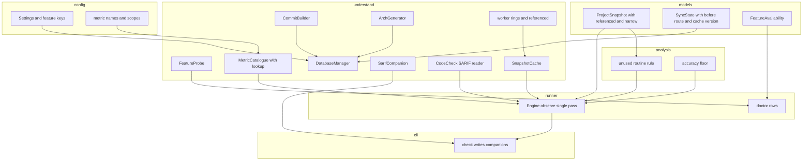
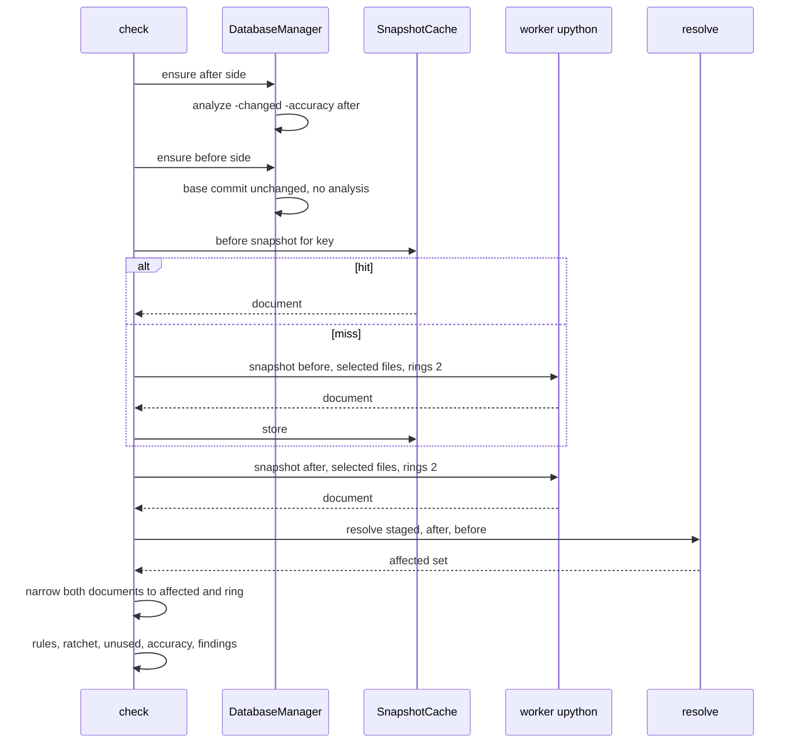
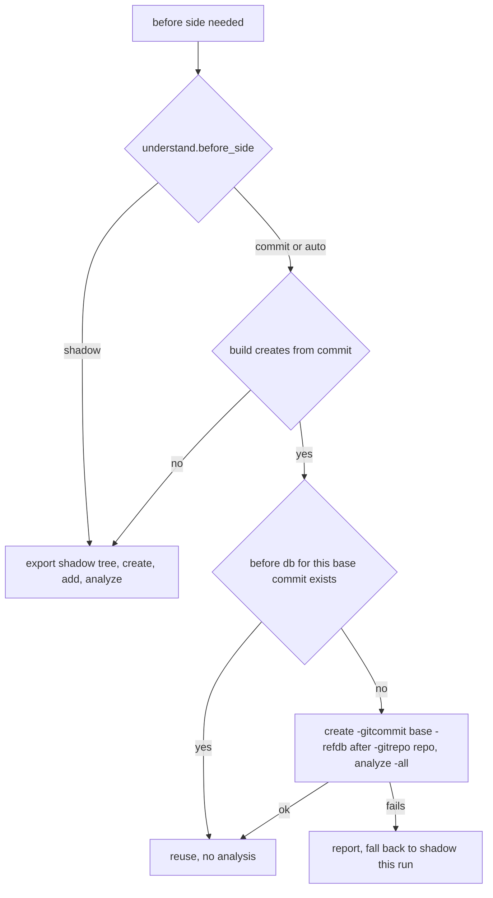

# Design Document: understand-8-features

## Overview

**Purpose**: This feature lets the Gate use what Understand 8.0 (Build 1262) added -- its own SARIF, databases built from a commit, generated architectures, plugin metrics, a reference-based unused-routine rule and the analysis accuracy figure -- and lowers the cost of a warm check from the measured 32.6 s to under 15 s on this repository, without changing what a check reports.

**Users**: The operator running the Gate as a pre-push hook on facdrone and on this repository, the coding agents that run it for them, and reviewers reading the review aids and GitHub code scanning.

**Impact**: Extends the `understand` adapter (new commands and readers), the worker (one more ring of recorded entities, a `referenced` flag, plugin-metric discovery), the database manager (a second before-side route, architecture generation, a snapshot cache), the analysis layer (one structural rule, one accuracy finding), the SARIF output (companion files) and `doctor` (feature rows, cache rows). The dependency direction of `tech.md` is unchanged; every feature is off on 6.5 and measured for availability on the installed build.

### Goals
- Understand's analysis and CodeCheck SARIF beside the Gate's, re-rooted on the repository (2.x).
- The before side from the base commit through `und create -gitcommit -refdb`, interchangeable with the shadow tree (3.x).
- Generated architectures as node source through the existing declared-architecture plumbing (4.x).
- Plugin metrics discovered through `Metric.lookup` and tags, offered wherever their tags say (5.x).
- `structure.unused_routine` as a warning-level rule over affected routines (6.x).
- The accuracy figure per side in output and diagnosis (7.x).
- A warm check under 15 s on this repository, findings identical to today (8.x).
- Availability rows in `doctor` and configuration errors for features the build lacks (1.x); documentation and the contributors' note (9.x).

### Non-Goals
- `undmcp` and `und ai` (contribution candidates, documented only).
- CodeCheck licensing; verifying `results.sarif` against a real inspection.
- Rust; multi-threading Understand's analysis; changing the Gate's own SARIF content; uploading to GitHub.
- Comparison metrics as metric ids: none exist on 1262 (measured); the pair is registered and nothing is offered until a build ships such ids.

## Boundary Commitments

### This Spec Owns
- Feature availability: the probe, the `doctor` rows and the configuration-time refusal (`understand/features.py`, `runner/doctor.py`, `config/validate.py`).
- The companion SARIF files: which Understand documents are copied, how their URIs are re-rooted, how they are named beside the Gate's file (`understand/sarif_companion.py`, `cli/check.py`).
- The CodeCheck SARIF reader producing `RawViolation` (`understand/codecheck_sarif.py`).
- The commit-built before route and its reuse (`understand/commit_db.py`, `understand/database.py`, `models/cache.py`).
- Architecture generation and its skip rule (`understand/und_arch.py`, `understand/database.py`).
- Plugin-metric discovery in the catalogue and the worker (`understand/catalogue.py`, `understand/worker.py`, `config/metric_names.py`).
- The unused-routine rule and the `referenced` flag that feeds it (`understand/worker.py`, `models/snapshot.py`, `analysis/structure/unused.py`).
- The accuracy figure end to end (`understand/und_cli.py`, `models/understand.py`, `analysis/accuracy.py`, `report/*`, `cli/doctor.py`).
- The snapshot cache and the single-pass extraction with in-process narrowing (`understand/snapshot_cache.py`, `models/snapshot.py`, `runner/pipeline.py`).
- The documentation pages for all of the above.

### Out of Boundary
- The threshold, ratchet, structural-rule and review-aid engines of the base specification: they consume the same `ProjectSnapshot`, `ArchNode`, `Finding` and `RawViolation` types and are not modified except where a row is added to a report.
- The Gate's own SARIF writer (`report/sarif.py`): untouched.
- Licensing, the network boundary, the release process, the hook shim.
- Understand's behaviour: the design records it and does not work around it beyond what is measured.

### Allowed Dependencies
- Layer order from `tech.md`: `config -> models -> understand, git -> analysis -> report -> runner -> cli`. New modules sit in the layer of the concern they serve and import only leftwards.
- `understand/worker.py` stays stdlib-plus-`understand` only; new request keys are plain JSON.
- `analysis/` and `report/` stay free of filesystem, git and `understand` access; the SARIF companion (file I/O) is therefore an `understand/` adapter, and the CLI writes what it returns.
- External: Understand 8.0 commands and API as measured in `research.md`; git for the base commit and for the history the generated architectures read; SARIF 2.1.0.

### Revalidation Triggers
- A change to `ProjectSnapshot` (the `referenced` flag, `narrow()`) or to `SyncState` (new fields, the cache schema version) requires re-running the base specification's contract suite and every consumer of the sync state.
- A change to `ArchNode` production (generated architectures) requires re-running the architecture and structure contracts.
- A change to `AnalyzeResult` (accuracy) requires re-running the doctor, JSON-output and e2e tests.
- A change to the companion file names or their re-rooting rule is a change to the documented GitHub upload step.

## Architecture

### Existing Architecture Analysis
- `DatabaseManager` (`understand/database.py`) owns both sides: shadow-tree sync, `und create/add/analyze`, the declared architecture, the sync state. It is already over the class limits (27 methods, coupling 24, both pre-existing), so new concerns are new modules it calls rather than new methods.
- `Engine.observe` (`runner/pipeline.py`) extracts each side twice; `resolve()` (`analysis/affected.py`) needs only file edges and entity keys of the selected files to compute the affected set and its ring.
- The worker records entities only for `plan.files` and bounds file edges to their neighbourhood; populations, call resolution and architecture edges walk the whole project on every call.
- `MetricCatalogue` answers from `Metric.list(kind)`; the 8.0 metrics never appear there.
- `report/sarif.py` renders the Gate's findings; `cli/check.py` writes it at `--sarif PATH`.
- `doctor` already runs an analysis probe on a scratch project and opens it through the API; the feature probe extends that scratch run.

### Architecture Pattern & Boundary Map



**Architecture Integration**:
- Selected pattern: extend the existing adapters in place, one new module per new concern, no facade (see `research.md`, pattern evaluation).
- Domain boundaries: `understand/` talks to Understand and the cache; `analysis/` decides; `runner/` orders; `cli/` writes files the runner hands back.
- Existing patterns preserved: worker purity; typed errors with exit codes; declared architecture as `ArchNode`; unavailable metrics reported once per run; `doctor` reports and never raises.
- New components rationale: each corresponds to one Understand capability or one measured cost centre; none exists for a hypothetical build.
- Steering compliance: dependency direction, module size limits (the gate runs on every commit of this work), contract tests for every real-Understand interaction.

### Technology Stack

| Layer | Choice / Version | Role in Feature | Notes |
|-------|------------------|-----------------|-------|
| CLI | typer (existing) | `--sarif` writes companions; `doctor` rows | no new dependency |
| Adapter | Understand 8.0 Build 1262 `und` and `understand` API | `create -gitcommit -refdb -gitrepo`, `arch -list/-generate`, `analyze -sarif -accuracy`, `settings -GitRepositoryDirectory`, `Metric.lookup`, `Db.comparison_db` | each measured on 2026-09-05; 6.5 keeps today's paths |
| Data | JSON under the cache root (existing `CachePaths`) | snapshot cache, sync state | schema version bumped |
| Output | SARIF 2.1.0 | companion files | `originalUriBaseIds` rewritten |

## File Structure Plan

### Directory Structure
```
src/scitools_hook/
├── config/
│   ├── models.py                 # new keys: understand.sarif, understand.before_side, understand.snapshot_cache,
│   │                             #   structure.unused_routines, structure.unused_ignore, analysis.accuracy_floor
│   ├── metric_names.py           # the 8.0 metric ids with their scopes and languages
│   └── validate.py               # refuses a feature the build lacks (1.2) using FeatureAvailability
├── models/
│   ├── understand.py             # AnalyzeResult.accuracy; FeatureAvailability
│   ├── cache.py                  # SyncState.before_route, before_db_commit, generated_archs, CACHE_SCHEMA
│   └── snapshot.py               # EntityRecord.referenced; ProjectSnapshot.narrow(files)
├── understand/
│   ├── features.py               # FeatureProbe: measures availability on the scratch project
│   ├── commit_db.py              # CommitBuilder: create -gitcommit -refdb -gitrepo, reuse rule
│   ├── und_arch.py               # list_generated(), generate(): arch -list/-generate parsing
│   ├── und_cli.py                # analyze(-accuracy, -sarif), set_git_repository(), arch commands
│   ├── catalogue.py              # lookup-and-tags source beside Metric.list
│   ├── worker.py                 # catalogue lookup/tags; neighbourhood_rings; referenced flag
│   ├── snapshot_cache.py         # SnapshotCache: key, read, write, prune, listing for doctor
│   ├── sarif_companion.py        # copies and re-roots Understand SARIF beside the Gate's
│   ├── codecheck_sarif.py        # results.sarif -> RawViolation
│   └── database.py               # before route decision, generation step, accuracy carried through
├── analysis/
│   ├── accuracy.py               # the floor finding
│   └── structure/unused.py       # structure.unused_routine over affected routines
├── report/
│   ├── json_out.py               # analysis.accuracy per side; companions listed
│   └── human.py                  # accuracy line in verbose; companions named
├── runner/
│   ├── pipeline.py               # single-pass observe; cache use; timings per phase
│   ├── check.py                  # unused rule and accuracy finding wired in
│   └── doctor.py                 # feature rows, cache rows, accuracy row
└── cli/
    ├── check.py                  # writes the companion files beside --sarif
    └── doctor.py                 # renders the new rows
docs/
├── reference/understand-8.md     # each feature with its measurement; contributors' note
├── guide/configuration.md        # the new keys
└── reference/cli.md              # doctor rows, companion files
tests/                            # mirrors the above; contract tests in tests/contract/
```

### Modified Files
- `understand/database.py` -- chooses the before route, calls `CommitBuilder`, calls `ArchGenerator` after analysis, skips the before analysis when the base commit is unchanged, passes accuracy through. Method count must not grow: new behaviour lives in the new modules and is called from existing methods.
- `understand/worker.py` -- three request keys (`neighbourhood_rings`, `record_referenced`, `plugin_metrics`), plus `Metric.lookup` in the catalogue op. Stays stdlib-only.
- `runner/pipeline.py` -- `Engine.observe` becomes one extraction per side plus `narrow()`; cache lookups around the before extraction.
- `tests/contract/contract_project.py` -- the fixture project gains a git history (two commits) so git architectures and the commit-built route can be measured.

## System Flows

### A warm check after this feature



Gating decisions: the cache key includes the selection, so a different set of changed files misses; a miss on the before side costs one extraction, as today's first pass did. The after side is never cached.

### Choosing the before route



## Requirements Traceability

| Requirement | Summary | Components | Interfaces | Flows |
|-------------|---------|------------|------------|-------|
| 1.1 | doctor rows per feature | FeatureProbe, doctor | `probe() -> FeatureAvailability` | -- |
| 1.2 | config error for an absent feature | validate, FeatureProbe | `refuse_unavailable(settings, availability)` | -- |
| 1.3 | 6.5 unchanged, features off by default | Settings defaults | config keys | -- |
| 1.4 | availability measured, not inferred | FeatureProbe | scratch-project probes | -- |
| 2.1 | analysis SARIF beside the Gate's | UndCli.analyze(sarif=), SarifCompanion, check | `companions(run) -> list[CompanionFile]` | -- |
| 2.2 | Gate's SARIF unchanged | report/sarif.py untouched | -- | -- |
| 2.3 | CodeCheck violations from results.sarif | CodeCheck SARIF reader, CodeCheckRunner | `read_sarif_violations(path) -> list[RawViolation]` | -- |
| 2.4 | missing companion reported, exit code unchanged | SarifCompanion, check | `CompanionFile.problem` | -- |
| 2.5 | documented upload step | docs | -- | -- |
| 2.6 | unverified, xfail contract | tests/contract | -- | -- |
| 3.1 | before from base commit, same file set | CommitBuilder, DatabaseManager | `build(base, ref_db, repo) -> Path` | before route |
| 3.2 | parity with shadow route | contract test | -- | -- |
| 3.3 | 6.5 keeps shadow route | DatabaseManager | route decision | before route |
| 3.4 | failure reported, fallback this run | CommitBuilder, DatabaseManager | `CommitBuildError` | before route |
| 3.5 | reuse across runs, rebuild on key change | SyncState.before_db_commit, DatabaseManager | -- | before route |
| 3.6 | doctor reports route and commit | doctor | -- | -- |
| 4.1 | generated architecture as node source | ArchGenerator, DatabaseManager | `generate(cli, db, name, options)` | -- |
| 4.2 | unknown generated name refused | ArchGenerator, validate | `list_generated(cli, db)` | -- |
| 4.3 | generated from the repository's history | UndCli.set_git_repository, ArchGenerator | `GeneratedEmptyError` | -- |
| 4.4 | timing reported, regeneration skipped | SyncState.generated_archs, pipeline phase | -- | -- |
| 4.5 | nodes in explain and review aids | existing ArchNode plumbing | -- | -- |
| 5.1 | 8.0 metrics offered where computed | MetricCatalogue lookup source, worker catalogue, metric_names | `catalogue` op `lookup` answer | -- |
| 5.2 | unavailable reported once | existing 5.5 path | -- | -- |
| 5.3 | recommend measures them | recommend via catalogue | -- | -- |
| 5.4 | no unmeasured blocking default | defaults | -- | -- |
| 5.5 | comparison pair registered; ids offered when they exist | CommitBuilder (-refdb), catalogue | `Db.comparison_db` | -- |
| 6.1 | unused affected routine reported | worker referenced flag, unused rule | `evaluate_unused(after, affected, settings)` | -- |
| 6.2 | decided over the whole project | worker call pass | -- | -- |
| 6.3 | warning, ignore list | Settings structure.unused_* | -- | -- |
| 6.4 | unavailable reported once | unused rule | -- | -- |
| 6.5 | deleted routines not reported | affected set construction | -- | -- |
| 7.1 | accuracy per side in verbose and JSON | UndCli.analyze, AnalyzeResult.accuracy, json_out, human | -- | -- |
| 7.2 | doctor reports accuracy | doctor | -- | -- |
| 7.3 | floor finding, never blocking | analysis/accuracy.py | `evaluate_accuracy(results, floor)` | -- |
| 7.4 | relation to resolution rate recorded | research task | -- | -- |
| 8.1 | baseline measured on both repositories | research log | -- | -- |
| 8.2 | before snapshot not re-extracted | SnapshotCache, pipeline | `get(key) / put(key, doc)` | warm check |
| 8.3 | one extraction per side | worker rings, narrow, pipeline | `ProjectSnapshot.narrow(files)` | warm check |
| 8.4 | under 15 s on this repository | all of 8 | measured script | warm check |
| 8.5 | no selection, no work | existing | -- | -- |
| 8.6 | invalidation, doctor lists cache | SnapshotCache key, doctor | `entries() -> list[CacheEntry]` | -- |
| 8.7 | findings identical with and without cache | contract and e2e tests | -- | -- |
| 9.1 | docs per feature | docs | -- | -- |
| 9.2 | contributors' note | docs | -- | -- |
| 9.3 | doctor rows documented | docs | -- | -- |

## Components and Interfaces

| Component | Domain/Layer | Intent | Req Coverage | Key Dependencies (P0/P1) | Contracts |
|-----------|--------------|--------|--------------|--------------------------|-----------|
| FeatureProbe | understand | measure what the installed build offers | 1.1, 1.2, 1.4 | UndCli (P0), ApiRunner (P0) | Service |
| SarifCompanion | understand | copy and re-root Understand's SARIF | 2.1, 2.4 | filesystem (P0) | Service |
| CodeCheck SARIF reader | understand | `results.sarif` to `RawViolation` | 2.3, 2.6 | SARIF 2.1.0 (P0) | Service |
| CommitBuilder | understand | before database from the base commit | 3.1, 3.4, 3.5, 5.5 | UndCli (P0), git (P0) | Service |
| ArchGenerator | understand | list and generate architectures | 4.1, 4.2, 4.3, 4.4 | UndCli (P0) | Service |
| MetricCatalogue lookup source | understand | plugin metrics by lookup and tags | 5.1, 5.3 | worker catalogue op (P0) | Service |
| worker extensions | understand | rings, referenced flag, plugin metrics | 5.1, 6.2, 8.3 | understand API (P0) | Batch |
| SnapshotCache | understand | before snapshot per key | 8.2, 8.6, 8.7 | CachePaths (P0) | State |
| unused rule | analysis | affected routines nothing references | 6.1, 6.3, 6.4, 6.5 | ProjectSnapshot (P0) | Service |
| accuracy | understand, analysis, report | the figure end to end | 7.1, 7.2, 7.3 | AnalyzeResult (P0) | Service |
| Engine.observe | runner | one pass per side, narrowed | 8.3, 8.4 | worker, cache, resolve (P0) | Service |
| doctor rows | runner, cli | availability, route, cache, accuracy | 1.1, 3.6, 7.2, 8.6 | FeatureProbe (P0) | -- |

### understand

#### FeatureProbe

| Field | Detail |
|-------|--------|
| Intent | Decide, by running things, which features of this specification the installed build offers |
| Requirements | 1.1, 1.2, 1.4 |

**Responsibilities & Constraints**
- Runs inside `doctor`'s existing scratch project: `und arch -list` (generated names), `und create -gitcommit HEAD -refdb probe.und` in the scratch directory turned into a one-commit git repository, `und analyze -sarif -accuracy`, and the catalogue op with `lookup` for one plugin metric.
- Never runs a licence command. Never runs against the repository's own database.
- Answers `unverified` with the reason when a probe cannot run (no git on PATH, no scratch directory), never `not on this build`.

**Dependencies**
- Inbound: `runner/doctor.py` (P0), `config/validate.py` (P0, reads a stored availability when a check validates configuration -- see State).
- Outbound: `UndCli` (P0), `ApiRunner` (P0), `ArchGenerator.list_generated` (P0).

**Contracts**: Service [x] / State [x]

##### Service Interface
```python
class Feature(StrEnum):
    UNDERSTAND_SARIF = "understand_sarif"
    COMMIT_BEFORE = "commit_before"
    GENERATED_ARCHS = "generated_archs"
    PLUGIN_METRICS = "plugin_metrics"
    UNUSED_RULE = "unused_rule"
    ACCURACY = "accuracy"

class Availability(DataModel):
    state: Literal["available", "not on this build", "unverified"]
    detail: str = ""            # und's words, or the reason a probe did not run
    generated: list[str] = []   # names arch -list offered, for GENERATED_ARCHS

FeatureAvailability = dict[Feature, Availability]

def probe(cli: UndCli, api: ApiRunner | None, scratch: Path) -> FeatureAvailability: ...
def refuse_unavailable(settings: Settings, availability: FeatureAvailability) -> None:
    """Raises ConfigError naming feature, build and key (1.2)."""
```
- Preconditions: the scratch project has been created and analysed by the doctor's analysis probe.
- Postconditions: every `Feature` has an entry; `UNUSED_RULE` is `available` on any build (reference-based).
- Invariants: no `und` licence switch is ever part of a probe.

##### State Management
- `doctor` stores the last `FeatureAvailability` under the cache root with the build string; a check reads it to validate configuration (1.2) and probes nothing itself. A missing or stale (different build) file makes the check fail closed with "run doctor" when a feature is enabled.

**Implementation Notes**
- Integration: the doctor's analysis probe becomes the probe's host; one extra `und create` and one `arch -list` (about 1.5 s measured).
- Validation: unit tests with the shell-script installation stub answering each probe; a contract test on 8.0 asserting all six `available`.
- Risks: `und arch` may not exist on 6.5 -- an unknown command is `not on this build`, by its own words.

#### SarifCompanion

| Field | Detail |
|-------|--------|
| Intent | Put Understand's SARIF documents beside the Gate's, on repository paths |
| Requirements | 2.1, 2.4 |

**Responsibilities & Constraints**
- Input: the analysis SARIF `und analyze -sarif` wrote for the after side (path from `AnalyzeResult.sarif_path`), and the CodeCheck `results.sarif` when a CodeCheck run happened.
- Rewrites `runs[].originalUriBaseIds.UND_PROJECT.uri` to the repository root as a `file:` URI and leaves artifact URIs (already repository-relative under the shadow root, measured) untouched; adds nothing else.
- Names: `<gate>.understand-analysis.sarif`, `<gate>.understand-codecheck.sarif` next to the Gate's `--sarif PATH`.
- A missing or unparsable source becomes `CompanionFile(problem=...)`; the CLI prints it and writes the others.

**Contracts**: Service [x]

##### Service Interface
```python
class CompanionFile(DataModel):
    kind: Literal["analysis", "codecheck"]
    source: Path | None
    target: Path | None
    problem: str = ""

def companions(analysis_sarif: Path | None, codecheck_sarif: Path | None,
               gate_sarif: Path, repo_root: Path) -> list[CompanionFile]: ...
```
- Postconditions: every returned file with an empty `problem` exists at `target` and parses as SARIF 2.1.0.

**Implementation Notes**
- Validation: unit tests on a synthetic document from the measured shape; the contract test writes a real one on the contract project.
- Risks: GitHub's handling of `originalUriBaseIds` -- the documented upload example is measured once by uploading (the operator's workflow, not a test).

#### CodeCheck SARIF reader

| Field | Detail |
|-------|--------|
| Intent | `results.sarif` to the `RawViolation` list the CodeCheck finding mapper already consumes |
| Requirements | 2.3, 2.6 |

**Responsibilities & Constraints**
- Reads `runs[].results[]`: `ruleId` -> `check_id`; `message.text` -> `message`; `locations[0].physicalLocation.artifactLocation.uri` joined to its base -> `path`; `region.startLine/startColumn` -> `line`, `column`; rule `name` from `tool.driver.rules[ruleIndex]` -> `check_name` (id when absent); `logicalLocations[0].fullyQualifiedName` -> `entity`.
- Chosen by `CodeCheckRunner` when `results.sarif` exists in the output directory; the CSV reader stays for 6.5.

**Contracts**: Service [x]

##### Service Interface
```python
def read_sarif_violations(path: Path) -> list[RawViolation]: ...
```
- Error envelope: a document that is not SARIF 2.1.0, or has no `runs`, is `AnalysisFailedError` quoting the file, as the CSV reader does for a header-less file.

**Implementation Notes**
- Validation: unit tests on synthetic documents following the analysis SARIF's measured shape; the contract test expected-fails with the CodeCheck-licence reason (2.6).

#### CommitBuilder

| Field | Detail |
|-------|--------|
| Intent | The before database from the base commit, reused while its key holds |
| Requirements | 3.1, 3.4, 3.5, 5.5 |

**Responsibilities & Constraints**
- `und create -db before.und -gitrepo <repo> -gitcommit <base> -refdb after.und -languages ...`, then `analyze -all -accuracy`. `-refdb` copies the after side's file set and settings and registers the comparison pair (5.5).
- Key recorded in `SyncState`: base commit, languages, analysis-affecting settings hash, Understand build. Same key: reuse without analysis. Different key: remove and rebuild.
- Failure of any step raises `CommitBuildError` carrying und's words; `DatabaseManager` reports it and takes the shadow route for the run (3.4).

**Contracts**: Service [x]

##### Service Interface
```python
class BeforeKey(DataModel):
    commit: str
    languages: list[str]
    settings_hash: str
    build: str

def build(cli: UndCli, paths: CachePaths, repo: Path, key: BeforeKey) -> AnalyzeResult: ...
def reusable(state: SyncState, key: BeforeKey, paths: CachePaths) -> bool: ...
```
- Preconditions: the after database exists and is analysed (the reference).
- Postconditions: `before.und` holds the base commit's file set; `SyncState.before_route == "commit"` and `before_db_commit == key.commit`.

**Implementation Notes**
- Integration: `DatabaseManager.ensure_side("before", ...)` decides the route (flow above); the shadow route is untouched.
- Validation: unit tests on the argv and the reuse rule with the stubbed `und`; contract test 3.2 compares the two routes' snapshots and findings on the contract project (whose fixture gains a git history).
- Risks: the after database as `-refdb` is itself built over a shadow tree; its recorded file set is the shadow's. Measured: `-refdb` rescans the file set against the pinned commit, so paths resolve within the repository. If a build stops doing that, the fallback is `und add <repo>` after creation.

#### ArchGenerator

| Field | Detail |
|-------|--------|
| Intent | List the architectures a database can generate, generate one, know when it is empty |
| Requirements | 4.1, 4.2, 4.3, 4.4 |

**Responsibilities & Constraints**
- `list_generated` parses `und arch -list <db>` (name, status). `generate` runs `und arch -generate <name> [-name <instance>] [-options ...] -force <db>`, ignores the exit status (measured: 1 on success), exports the architecture and reads it back; zero members raise `GeneratedEmptyError` naming the likely cause (no repository known to the database).
- Before generating a git-based architecture on the after database, `UndCli.set_git_repository(db, repo)` records `GitRepositoryDirectory`; the first implementation task measures whether that suffices on a shadow-tree database (see Open Questions).
- Skip rule: `SyncState.generated_archs[name] == (repo head, after tree id)` means no regeneration.

**Contracts**: Service [x]

##### Service Interface
```python
class GeneratedArch(DataModel):
    name: str
    status: Literal["active", "available"]

def list_generated(cli: UndCli, db: Path) -> list[GeneratedArch]: ...
def generate(cli: UndCli, db: Path, name: str, options: Mapping[str, str] = {}) -> ArchNode: ...
```
- Error envelope: `ConfigError` for a name not in the list (4.2); `GeneratedEmptyError(AnalysisFailedError)` for an empty export (4.3).

**Implementation Notes**
- Integration: `DatabaseManager._declare_architecture` runs the generation step when `structure.architecture` names a generated one, then the existing export-and-read-back; the rest of the Gate sees an `ArchNode`.
- Validation: unit tests on the list parser and the argv; contract test on the contract project with two commits expecting `Git Stability` members equal to the file set.

#### MetricCatalogue lookup source and worker extensions

| Field | Detail |
|-------|--------|
| Intent | Offer plugin metrics where their tags say; record two rings and a referenced flag in one pass |
| Requirements | 5.1, 5.3, 6.2, 8.3 |

**Responsibilities & Constraints**
- Catalogue op, new request key `lookup: [ids]`: answers `{id: {"targets": [...], "languages": [...]}}` from `Metric.lookup(id).tags()`; absent id -> `null`. `MetricCatalogue.available(language, scope)` unions the built-in list with the lookup answers whose tags name the language (or `Any`) and the scope's target.
- Snapshot op, new keys: `neighbourhood_rings` (0 = today; 2 = record entities of the selected files and two rings), `record_referenced` (routine records carry `referenced: bool`, true when any `callby, useby` reference originates in a project file), `plugin_metrics` (ids to read through `Ent.metric` for recorded entities only, never for populations).
- `config/metric_names.py` declares the 8.0 ids with scope and languages so `recommend` and the defaults know them.

**Contracts**: Batch [x]

##### Batch / Job Contract
- Trigger: every catalogue and snapshot request (existing).
- Input: the three keys above, validated like every other request key (unknown or ill-typed -> `BadRequest` envelope).
- Output: the snapshot document as today plus `referenced` on routine records; the catalogue document plus `lookup`.
- Idempotency: unchanged; the worker is pure per request.

**Implementation Notes**
- Validation: unit tests with `FakeMetrics8` gaining `tags()`; unit test that a population request never asks a plugin metric; contract test that `CountGlobalsModified` is available for Python on 8.0 and `CognitiveComplexity` is not.
- Risks: plugin metrics at 2 ms per routine -- the recorded set is bounded by the change, so a 300-routine change costs 0.7 s.

#### SnapshotCache

| Field | Detail |
|-------|--------|
| Intent | Serve the before snapshot without extracting it |
| Requirements | 8.2, 8.6, 8.7 |

**Contracts**: State [x]

##### State Management
- State model: one JSON document per key under `<cache root>/snapshots/<key>.json`; key = SHA-256 over (side, base commit, selection set, settings hash, worker source hash, Understand build, `CACHE_SCHEMA`).
- Persistence: written after a successful extraction; read before one; pruned to the newest 8 entries.
- Concurrency: written to a temporary file and renamed; a concurrent writer of the same key produces the same document.

```python
class CacheEntry(DataModel):
    key: str
    commit: str
    written_at: datetime
    size_bytes: int

class SnapshotCache:
    def get(self, key: str) -> ProjectSnapshot | None: ...
    def put(self, key: str, document: ProjectSnapshot) -> None: ...
    def entries(self) -> list[CacheEntry]: ...
```

**Implementation Notes**
- Validation: unit tests for the key (every component changes the key), for pruning, and for `doctor` listing; e2e test that a cached and an uncached run report identical findings (8.7).

### analysis

#### unused rule

| Field | Detail |
|-------|--------|
| Intent | `structure.unused_routine` over the affected routines whose `referenced` is false |
| Requirements | 6.1, 6.3, 6.4, 6.5 |

##### Service Interface
```python
def evaluate_unused(after: ProjectSnapshot, affected: AffectedSet, settings: StructureSettings) -> list[Finding]: ...
```
- Preconditions: `after` records carry `referenced` (else the rule reports itself unavailable once, 6.4).
- Postconditions: one warning per affected routine with `referenced == False` whose long name matches no `unused_ignore` pattern; deleted routines are absent from `after` by construction (6.5).
- Defaults for `unused_ignore`: `__*__`, `test_*`, `main`, `*.setup`, `*.teardown`.

#### accuracy

##### Service Interface
```python
def read_accuracy(text: str) -> float | None:   # in und_cli, from "N of M parsed files ... (P%)"
def evaluate_accuracy(analyses: Mapping[Side, AnalyzeResult], floor: float | None) -> list[Finding]: ...
```
- A finding of rule `analysis.accuracy`, severity warning, never blocking; absent when no floor is configured or no figure was reported.

### runner

#### Engine.observe, single pass

- Extracts `after` and `before` once with `neighbourhood_rings=2` and the selected files; runs `resolve()` on them (its inputs -- file edges and entity keys of the selected files -- are present); computes `wanted` as today; returns `after.narrow(wanted)` and `before.narrow(wanted)`.
- `ProjectSnapshot.narrow(files)` keeps entities whose path is in `files`, file and class edges whose endpoints are inside the worker's edge scope for `files` (the one ring around them), and everything project-wide (populations, call graph resolution, arch nodes and edges, parse errors, unavailable metrics) untouched. The rule mirrors `worker._collect_edges` and is pinned by the parity contract test.
- Before extracting `before`, asks `SnapshotCache.get(key)`; after a miss, `put`.
- Each phase's time is printed in verbose output, with `served from cache` when it was.

#### doctor rows
- `feature <name>`: `available` / `not on this build` / `unverified: <reason>` (1.1).
- `before route`: `commit (<hash>)` or `shadow` (3.6).
- `snapshot cache`: `<n> entries, newest <age>` (8.6).
- `accuracy`: the after database's figure (7.2).

## Data Models

### Domain Model
- `FeatureAvailability`: value object, produced by `doctor`, consumed by configuration validation.
- `BeforeKey`, cache key: value objects; the before database and the before snapshot are immutable per key.
- `EntityRecord.referenced: bool | None`: `None` on documents from a worker that did not record it (older cache entries cannot occur: the schema version is in the key).
- `AnalyzeResult.accuracy: float | None`, `AnalyzeResult.sarif_path: Path | None`.
- `SyncState` additions: `before_route: Literal["shadow", "commit"] | None`, `before_db_commit: str | None`, `generated_archs: dict[str, str]` (name -> "head:treeid"), `schema: int` (`CACHE_SCHEMA`, bumped by this feature; an older state is discarded with a note, as today's `created_with` mismatch is).

### Data Contracts & Integration
- JSON output gains `analysis: {after: {accuracy, sarif}, before: {...}}` and `companions: [CompanionFile]`; both additive, schema version unchanged for readers that ignore unknown keys, `schema_version` bumped as the base specification requires for additions.
- Configuration keys (all default off or unset):
  - `[understand] sarif = false`, `before_side = "auto" | "commit" | "shadow"`, `snapshot_cache = true`
  - `[structure] unused_routines = "warning" | false`, `unused_ignore = [...]`
  - `[analysis] accuracy_floor = <0..1>`
  - `[structure] architecture = "<generated name>"` (existing key, generated names accepted; `architecture_options = {name = value}` new)

## Error Handling

### Error Strategy
- Configuration-time: a feature the build lacks, an unknown generated name, an unknown plugin metric -> `ConfigError`, exit 2, naming key and build.
- Run-time, degrading: a missing companion SARIF, a failed commit build (fallback to shadow), an empty generated architecture when a declared one exists (report, evaluate with the declared one) -> printed problem, findings unaffected, exit code unaffected.
- Run-time, failing: an empty generated architecture with no fallback, a cache document that fails validation (treated as a miss and deleted), a worker refusing a request key -> as today's `AnalysisFailedError`, exit 5.
- Never: a licence command, a retry on licensing text.

### Monitoring
- Verbose output prints each phase with its time and cache state; `doctor` prints the rows above. Both are the operator's observability; nothing is sent anywhere.

## Testing Strategy

- Unit: `read_accuracy` on the measured line and on 6.5 output (no line); `SarifCompanion` re-rooting on the measured document shape; `read_sarif_violations` on synthetic results; `CommitBuilder.reusable` on every key component; `ArchGenerator.list_generated` on the measured 21-line listing; `evaluate_unused` with ignore patterns and a deleted routine; `SnapshotCache` key sensitivity and pruning; `ProjectSnapshot.narrow` against the fake project versus a second-pass fake extraction; catalogue union of list and lookup with `FakeMetrics8.tags()`.
- Contract (8.0.1262, skipped without a licence): commit-built versus shadow parity on the contract project (3.2); `Git Stability` populated on the contract project with two commits (4.3); single-pass narrowed document equals the two-pass document (8.3); `CountGlobalsModified` available for Python and `CognitiveComplexity` not (5.1); accuracy line parsed from a real analysis (7.1); analysis SARIF written and re-rooted (2.1); all six features `available` in `doctor` (1.1); CodeCheck SARIF read from a real inspection -- expected failure with the licence reason (2.6).
- E2E (installed console script, licensed): `check --sarif out.sarif` writes the Gate's file and the analysis companion, names them, exits by findings alone (2.1, 2.4); a cached and an uncached run of one change report identical JSON (8.7); a configuration enabling `before_side = "commit"` on a stubbed 6.5 exits 2 (1.2).
- Performance: the timing script from `research.md` re-run after each of the three levers on this repository and once on facdrone; the 15 s figure is asserted by the script, recorded in the research log, not by a unit test.

## Performance & Scalability
- Targets: warm check with one changed line on this repository under 15 s wall (8.4); no run may spend more than one whole-project walk per side.
- Measurement: `/usr/bin/time -v` around the console script with `--verbose`, phases read from the output.
- Costs accepted: plugin metrics at 2 ms per recorded routine; one `arch -generate` (about 1 s) when the history changed; the cache directory up to 8 documents.

## Migration Strategy
- `CACHE_SCHEMA` bump: existing sync states are discarded with the existing "rebuilt because" note; both databases rebuild once per repository.
- Every new configuration key defaults to today's behaviour; a repository without configuration changes sees only the cache and the single pass, which do not change findings (8.7).

## Open Questions / Risks
- Whether `GitRepositoryDirectory` set on a shadow-tree database lets the git plugins attribute the shadow's files (paths differ from the checkout). The first task of requirement 4 measures it; if it fails, git architectures are generated on a commit-built database of the after side's tree (needs a commit; the worktree mode has none) and documented as available for staged and range checks only.
- Comparison metrics: none exist as ids on 1262; 5.5 is satisfied by the registration and by documenting the absence. Revisit when a build ships them.
- facdrone's numbers are unmeasured until task 8.1 runs there.
